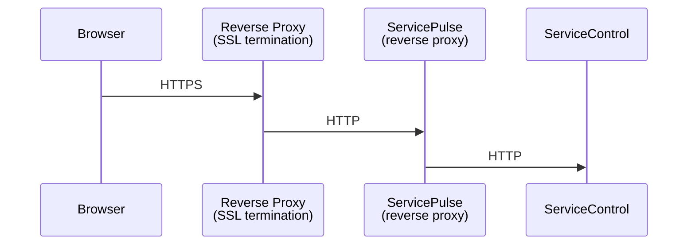
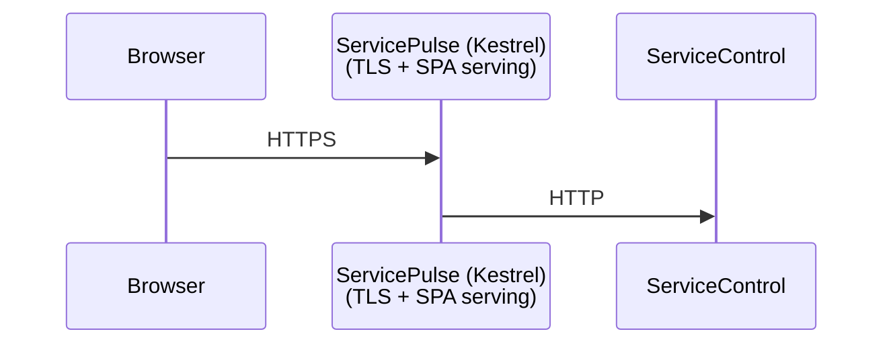
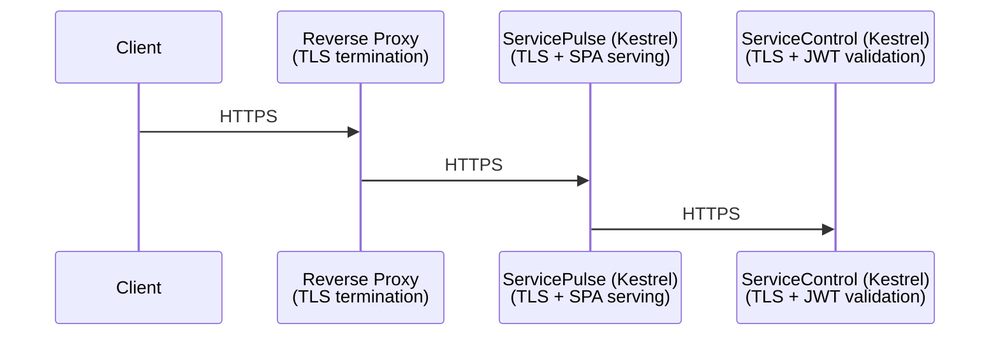

This guide covers hosting and configuration for ServicePulse.

> [!NOTE]
> Authentication for ServicePulse is configured in ServiceControl, not in ServicePulse itself. When authentication is enabled on ServiceControl, ServicePulse automatically retrieves the OIDC configuration from the ServiceControl API and handles the OAuth flow. See the [ServiceControl hosting guide](/servicecontrol/security/hosting-guide.md) for authentication configuration examples. All scenarios assume HTTPS and authentication are required.

## Deployment Scenarios

The below scenarios assume the use of the [Container](/servicepulse/containerization/). For additional details on the use of the windows service, see [Authentication](configuration/authentication.md), [TLS](configuration/tls.md), and [Forward Headers](configuration/forward-headers.md).

### Scenario 0: Default / Backward Compatible Configuration

The default configuration with no additional setup required. Backwards compatible with existing deployments.

#### Security Features

| Feature                | Status                           |
|------------------------|----------------------------------|
| JWT Authentication     | N/A (ServiceControl controlled)  |
| Kestrel HTTPS          | ❌ Disabled                      |
| HTTPS Redirection      | ❌ Disabled                      |
| HSTS                   | ❌ Disabled                      |
| Forwarded Headers      | ✅ Enabled (trusts all)          |
| Restricted Proxy Trust | ❌ Disabled                      |

No additional variables need to be set, however if prefered, the following can be explicity set for the same outcome:

#### Example Configuration

```bash
docker run -e SERVICEPULSE_HTTPS_ENABLED=true \
           -e SERVICEPULSE_FORWARDEDHEADERS_ENABLED=true \
           -e SERVICEPULSE_FORWARDEDHEADERS_TRUSTALLPROXIES=true \
           ...
           particular/servicepulse:latest
```

### Scenario 1: Strict Reverse Proxy with ServicePulse

ServicePulse sits behind a reverse proxy (NGINX, IIS ARR, cloud load balancer) that handles SSL/TLS termination.

#### Architecture



#### Security Features

| Feature                 | Status                        |
|-------------------------|-------------------------------|
| JWT Authentication      | N/A (ServiceControl controlled)                     |
| Kestrel HTTPS           | ❌ Disabled (handled by proxy) |
| HTTPS Redirection       | ✅ Enabled (optional)          |
| HSTS                    | ❌ Disabled (handled by proxy) |
| Forwarded Headers       | ✅ Enabled                     |
| Restricted Proxy Trust  | ✅ Enabled                     |

> [!NOTE]
> HTTPS redirection is optional in this scenario. The reverse proxy typically handles HTTP to HTTPS redirection at its layer, however enabling it at ServicePulse provides defense-in-depth; if an HTTP request somehow bypasses the proxy and reaches ServicePulse directly, it will be redirected to the HTTPS URL. This requires configuring `Https.Port` to specify the external [HTTPS port](configuration/tls.md) used by the proxy.

#### Example Configuration

```bash
docker run -e SERVICEPULSE_FORWARDEDHEADERS_ENABLED=true \
           -e SERVICEPULSE_FORWARDEDHEADERS_TRUSTALLPROXIES=false \
           -e SERVICEPULSE_FORWARDEDHEADERS_KNOWNPROXIES=10.0.0.5 \
           -e SERVICEPULSE_HTTPS_REDIRECTHTTPTOHTTPS=true \
           -e SERVICEPULSE_HTTPS_PORT=443 \
           ...
           particular/servicepulse:latest
```

### Scenario 2: Direct HTTPS with ServicePulse

Kestrel handles TLS directly without a reverse proxy.

#### Architecture



#### Security Features

| Feature                 | Status                |
|-------------------------|-----------------------|
| JWT Authentication      | N/A (ServiceControl controlled)             |
| Kestrel HTTPS           | ✅ Enabled             |
| HSTS                    | ✅ Enabled             |
| Forwarded Headers       | ❌ Disabled (no proxy) |
| Restricted Proxy Trust  | N/A                   |

> [!NOTE]
> HTTPS redirection is not configured in this scenario because clients connect directly over HTTPS. There is no HTTP endpoint exposed that would need to redirect. HTTPS redirection is only useful when a reverse proxy handles SSL termination and ServicePulse needs to redirect HTTP requests to the proxy's HTTPS endpoint.

#### Example Configuration

```bash
docker run -e SERVICEPULSE_HTTPS_ENABLED=true \
           -e SERVICEPULSE_HTTPS_CERTIFICATEPATH=C:\certs\servicepulse.pfx \
           -e SERVICEPULSE_HTTPS_CERTIFICATEPASSWORD=your-password \
           -e SERVICEPULSE_HTTPS_ENABLEHSTS=true \
           -e SERVICEPULSE_HTTPS_HSTSMAXAGESECONDS=31536000 \
           -e SERVICEPULSE_FORWARDEDHEADERS_ENABLED=false \
           -v /path/to/certs:/certs \
           ...
           particular/servicepulse:latest
```

### Scenario 3: End-to-End Encryption with Reverse Proxy and Direct HTTPS

For environments requiring encryption of internal traffic. End-to-end TLS encryption exists where the reverse proxy terminates external TLS and re-encrypts traffic to ServicePulse over HTTPS.

#### Architecture



#### Security Features

| Feature                    | Status                   |
|----------------------------|--------------------------|
| JWT Authentication         | N/A (ServiceControl controlled)                |
| Kestrel HTTPS              | ✅ Enabled                |
| HTTPS Redirection          | N/A (no HTTP endpoint)   |
| HSTS                       | N/A (configure at proxy) |
| Forwarded Headers          | ✅ Enabled                |
| Restricted Proxy Trust     | ✅ Enabled                |
| Internal Traffic Encrypted | ✅ Yes                    |

> [!NOTE]
> HTTPS redirection and HSTS are not applicable in this scenario because ServicePulse only exposes an HTTPS endpoint (Kestrel HTTPS is enabled). There is no HTTP endpoint to redirect from. The reverse proxy is responsible for redirecting external HTTP requests to HTTPS and sending HSTS headers to browsers. Compare this to Scenario 1, where Kestrel HTTPS is disabled and ServicePulse exposes an HTTP endpoint - in that case, HTTPS redirection can optionally be enabled as defense-in-depth.

#### Example Configuration

```bash
docker run -e SERVICEPULSE_HTTPS_ENABLED=true \
           -e SERVICEPULSE_HTTPS_CERTIFICATEPATH=C:\certs\servicepulse.pfx \
           -e SERVICEPULSE_HTTPS_CERTIFICATEPASSWORD=your-password \
           -e SERVICEPULSE_HTTPS_ENABLEHSTS=false \
           -e SERVICEPULSE_FORWARDEDHEADERS_TRUSTALLPROXIES=false \
           -e SERVICEPULSE_FORWARDEDHEADERS_KNOWNPROXIES=10.0.0.5 \
           -v /path/to/certs:/certs \
           ...
           particular/servicepulse:latest
```
