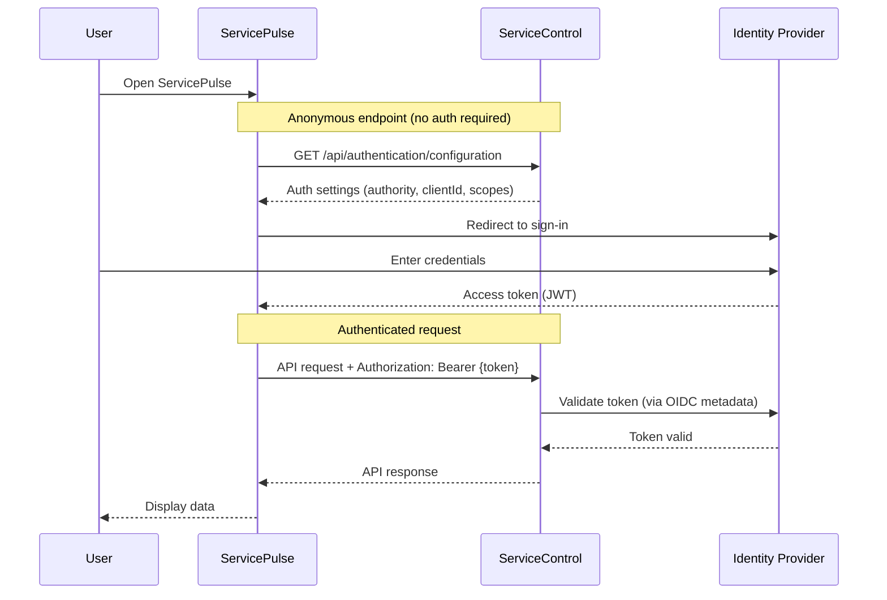

This section covers security features for ServicePulse, including authentication, transport layer security (TLS), and reverse proxy configuration.

## In this section

- Security Configuration - Configuration reference for TLS and forward headers
- [Hosting Guide](hosting-guide.md) - Deployment scenarios with complete configuration examples

## [Authentication](/servicepulse/security/configuration/authentication.md)

ServicePulse supports standards-based authentication using [OAuth 2.0](https://oauth.net/2/) with [JSON Web Tokens (JWT)](https://en.wikipedia.org/wiki/JSON_Web_Token), and [OpenID Connect (OIDC)](https://openid.net/developers/how-connect-works/).

> [!IMPORTANT]
> Authentication is [configured in ServiceControl](/servicecontrol/security/configuration/authentication.md), not in ServicePulse itself. ServicePulse retrieves authentication configuration from the ServiceControl API and handles the OAuth flow automatically.

When authentication is enabled on ServiceControl:

1. ServicePulse retrieves authentication configuration from an anonymous ServiceControl endpoint
2. Users sign in through the configured identity provider
3. API requests to ServiceControl include a JWT bearer token in the `Authorization` header
4. ServiceControl validates the token against the configured authority

## [TLS](/servicepulse/security/configuration/tls.md)

When authentication is enabled, access tokens are exchanged between ServicePulse and ServiceControl. To protect these tokens, TLS must be enabled.

> [!IMPORTANT]
> Without TLS, tokens are transmitted in clear text, exposing the system to interception and unauthorized access. Always use HTTPS in production environments.

ServicePulse supports two approaches for HTTPS:

- **Direct HTTPS**: Configure Kestrel to handle TLS with a certificate
- **Reverse proxy**: Terminate TLS at a reverse proxy (NGINX, IIS, Azure App Gateway, etc.) and forward requests to ServicePulse over HTTP

## [Reverse proxy support](/servicepulse/security/configuration/forward-headers.md)

When ServicePulse runs behind a reverse proxy, forwarded headers ensure ServicePulse correctly interprets client requests. This is important for:

- Determining the original client IP address
- Understanding whether the original request used HTTPS
- Generating correct redirect URLs

## Deployment scenarios

The [Hosting Guide](hosting-guide.md) provides complete configuration examples for common deployment patterns:

- **Default configuration**: No authentication, HTTP only (backward compatible)
- **Reverse proxy with authentication**: TLS termination at proxy
- **Direct HTTPS with authentication**: Kestrel handles TLS directly
- **End-to-end encryption**: TLS at both proxy and Kestrel for internal traffic encryption
