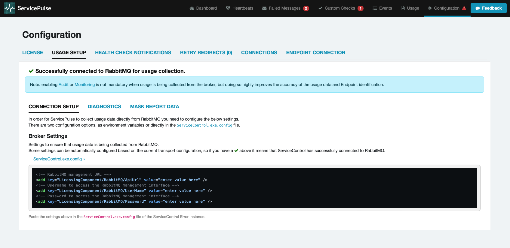
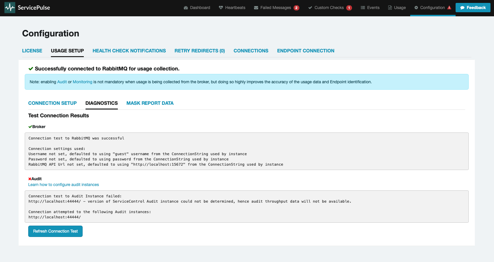
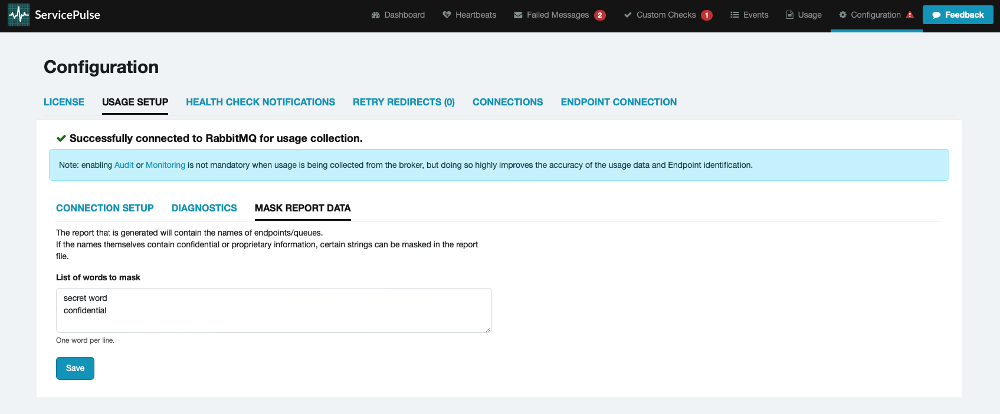

This document describes the settings required for collecting usage data to generate a usage report.

> [!NOTE]
> The usage data collection functionality requires ServicePulse version 1.40 or later, and ServiceControl version 5.4 or later.

## Connection setup

In most scenarios existing ServiceControl error instance connection settings will be used to establish a connection to the broker.



If there is a connection problem, specific usage settings can be provided as environment variables or directly in the [ServiceControl.exe.config](/servicecontrol/servicecontrol-instances/configuration.md) file.
The Usage Setup tab provides easy copy/paste functionality to obtain the required settings in the correct format, based on configuration type.

Refer to the [Diagnostics](#diagnostics) tab to diagnose connection issues.

### Azure Service Bus

Steps:

1. Create an **ApplicationId (aka ClientId)** for ServiceControl
2. Assign it the **Monitoring Reader** role
3. Configure for the ServiceControl instance at minimum:
    - `TenantId`
    - `SubscriptionId`
    - `ClientId`
    - `ClientSecret`


#### Using Azure Portal

To use the Azure Portal, follow these instructions. Alternatively, use the Azure CLI as described below.


1. Create App
    - Native to: **Home > App registrations**
    - Select **➕ New registration**
2. Assign application to role:
    - Navigate to: **Home > Service Bus > {service bus namespace} > Access control (IAM)**
    - Select: **➕ Add**
    - Enter:
      - Role: `Monitoring Reader`
      - Members: Select **➕ Select Members > {application name}**
    - Select: **Review and Assign**

#### Using Azure CLI

To use the Azure CLI or scripting, follow these instructions. Alternatively, use the Azure Portal as described above.

```ps1
# Set context first
az account set --subscription "YourAzureSubscriptionName"

# Create ApplicationId (ClientId)
az ad app create --display-name ServiceControlUsageReporting

# Store your ApplicationId (ClientId)
$applicationId = "<Your Application ID>"

# List subscription ID
az servicebus namespace list

# Store your Subscription ID
$subscriptionId = "<Your Subscription ID>"

# List resource group
az group list

# Store resource group name
$resourceGroupName = "<Your Resource Group Name>"

# Assign role to resource group
$scope = "/subscriptions/$subscriptionId/resourceGroups/$resourceGroupName"

# or to specific resource in resource group
$scope = "/subscriptions/$subscriptionId/resourceGroups/$resourceGroupName/providers/Microsoft.ServiceBus/namespaces/$namespaceName"
# end alternative

# assign Monitoring Reader role to ApplicationId
New-AzRoleAssignment -ApplicationId $applicationId -RoleDefinitionName "Monitoring Reader" -Scope $scope
```

#### Settings

Refer to the [Usage Reporting when using the Azure Service Bus transport](/servicecontrol/servicecontrol-instances/configuration.md#usage-reporting-when-using-the-azure-service-bus-transport) section of the ServiceControl config file for an explanation of the Azure Service Bus-specific settings.

#### Minimum Permissions

The built-in role [`Monitoring Reader`](https://learn.microsoft.com/en-us/azure/azure-monitor/roles-permissions-security#monitoring-reader) is sufficient to access the required Azure Service Bus metrics.

To restrict permissions to the minimal required set, create a custom role with the following permissions:

```json
{
    "properties": {
        "roleName": "myrolename",
        "description": "",
        "assignableScopes": [
            "/subscriptions/xxxxxxxxxxxxxxxxxxxxx"
        ],
        "permissions": [
            {
                "actions": [
                    "Microsoft.ServiceBus/namespaces/read",
                    "Microsoft.ServiceBus/namespaces/providers/Microsoft.Insights/metricDefinitions/read",
                    "Microsoft.ServiceBus/namespaces/queues/read",
                    "Microsoft.Resources/subscriptions/read",
                    "Microsoft.Resources/subscriptions/resources/read"
                ],
                "notActions": [],
                "dataActions": [],
                "notDataActions": []
            }
        ]
    }
}
```


The `Microsoft.ServiceBus` permissions are required to read queue names and metric data from Azure Monitor. The `Microsoft.Resources/subscriptions` permissions are required in order to locate the Service Bus namespace within the Azure subscription.

### Amazon SQS

#### Settings

Refer to the [Usage Reporting when using the Amazon SQS transport](/servicecontrol/servicecontrol-instances/configuration.md#usage-reporting-when-using-the-amazon-sqs-transport) section of the ServiceControl config file for an explanation of the Amazon SQS-specific settings.

#### Minimum Permissions

```json
{
    "Version": "2012-10-17",
    "Statement": [
        {
            "Sid": "VisualEditor0",
            "Effect": "Allow",
            "Action": "cloudwatch:GetMetricStatistics",
            "Resource": "*"
        },
        {
            "Sid": "VisualEditor1",
            "Effect": "Allow",
            "Action": "sqs:ListQueues",
            "Resource": "*"
        }
    ]
}
```

### SQLServer

#### Settings

Refer to the [Usage Reporting when using the SqlServer transport](/servicecontrol/servicecontrol-instances/configuration.md#usage-reporting-when-using-the-sqlserver-transport) section of the ServiceControl config file for an explanation of the SQL Server-specific settings.

#### Minimum Permissions

User with rights to query [INFORMATION_SCHEMA].[COLUMNS] table.

### PostgreSQL

#### Settings

Refer to the [Usage Reporting when using the PostgreSQL transport](/servicecontrol/servicecontrol-instances/configuration.md#usage-reporting-when-using-the-postgresql-transport) section of the ServiceControl config file for an explanation of the PostgreSQL Server-specific settings.

#### Minimum Permissions

User with rights to query [INFORMATION_SCHEMA].[COLUMNS] table.

### RabbitMQ

#### Settings

Refer to the [Usage Reporting when using the RabbitMQ transport](/servicecontrol/servicecontrol-instances/configuration.md#usage-reporting-when-using-the-rabbitmq-transport) section of the ServiceControl config file for an explanation of the RabbitMQ-specific settings.

#### Minimum permissions

User with monitoring tag and read permission.

### IBM MQ

#### Settings

Refer to the [Usage Reporting when using the IBM MQ transport](/servicecontrol/servicecontrol-instances/configuration.md#usage-reporting-when-using-the-ibm-mq-transport) section of the ServiceControl config file for an explanation of the IBM MQ-specific settings.

> [!NOTE]
> Broker-side throughput collection on IBM MQ is most useful as a **fallback** for environments where ServiceControl Monitoring is not deployed or where some endpoints cannot enable NServiceBus metrics. When every NServiceBus endpoint is configured with metrics (see [Monitoring NServiceBus endpoints](/monitoring/) and [Configure metrics](/monitoring/metrics/)) and a [Monitoring instance](/servicecontrol/monitoring-instances/) is running, the monitoring source already provides per-day throughput data for the usage report — without requiring any queue manager configuration changes. In that case, enabling IBM MQ statistics events adds operational overhead (`STATQ` administration, `MAXDEPTH` tuning, additional permissions on the connecting user) for limited additional value.

The following section applies when broker-side collection is needed. ServiceControl reads broker-side throughput data from IBM MQ statistics events. Before enabling broker-side usage reporting, run the following on the queue manager (one-time setup):

```mqsc
ALTER QMGR STATQ(ON) STATINT(1800)
```

Queues created with the default `STATQ(QMGR)` setting will then participate automatically. Queues that were created with `STATQ(OFF)` or `STATQ(ON)` explicitly set need to be reset to inherit. The following bash snippet enables statistics for all non-system user queues on a queue manager:

```bash
QM=QM1   # queue manager name

# 1. Enable queue-manager-wide statistics with a 30-minute interval
echo "ALTER QMGR STATQ(ON) STATINT(1800)" | runmqsc "$QM"

# 2. Reset every user queue with an explicit STATQ override back to QMGR-inherit.
#    Skips SYSTEM.* queues; lets the queue manager setting take effect everywhere.
echo "DISPLAY QLOCAL(*) WHERE(STATQ NE QMGR)" | runmqsc "$QM" \
    | grep -oP 'QUEUE\(\K[^)]+' \
    | grep -v '^SYSTEM\.' \
    | while read -r q; do
        echo "ALTER QLOCAL($q) STATQ(QMGR)" | runmqsc "$QM"
    done
```

The same effect can be achieved per queue with `ALTER QLOCAL(QUEUE.NAME) STATQ(QMGR)` (inherit from queue manager) or `STATQ(ON)` (force on regardless of QMGR setting).

If another tool already drains `SYSTEM.ADMIN.STATISTICS.QUEUE`, ServiceControl can either:

- read from a dedicated queue populated by an external forwarder, MQ topic subscription, or cluster channel — set `LicensingComponent/IBMMQ/StatisticsQueue` to that queue name; or
- own the system statistics queue and forward a copy of each consumed message to the other tool's queue — set `LicensingComponent/IBMMQ/StatisticsForwardingQueue` to that queue name. The forwarding happens inside the same transactional unit as the read, so each statistics message is delivered exactly once to the downstream consumer.

When statistics are not enabled on the queue manager, ServiceControl still starts and runs; audit-based throughput collection acts as the fallback.

#### Minimum permissions

User with `+connect` on the queue manager, `+get +inq +browse` on the configured statistics queue, `+put +inq` on `SYSTEM.ADMIN.COMMAND.QUEUE`, `+put +get +browse +dsp` on `SYSTEM.DEFAULT.MODEL.QUEUE`, and `+inq` on user queues. If a forwarding queue is configured, also `+put` on that queue.

### MSMQ & Azure Storage Queues

MSMQ and Azure Storage Queues do not support querying of metrics. To enable the automatic usage reporting functionality for these systems, auditing and/or monitoring must be set up:

- Auditing
  - install the [Audit](./../servicecontrol/audit-instances) instance
  - configure [auditing](./../nservicebus/operations/auditing.md) on all NServiceBus endpoints
- Monitoring
  - install the [Monitoring](./../monitoring) instance
  - configure [metrics](./../monitoring/metrics) on all NServiceBus endpoints

## Diagnostics

The Diagnostics tab helps to diagnose any connection issues to the broker, as well as the audit and monitoring instances.



After making any setting changes, press the `Refresh Connection Test` button to verify whether the problem is resolved.
If unable to resolve the issue, open a [non-critical support case](https://particular.net/support) and include the diagnostic output.

## Report masks

Information that is considered sensitive can be obfuscated in the usage report.
All words to be redacted can be specified in the `Mask Report Data` tab. Specify one word per line.


