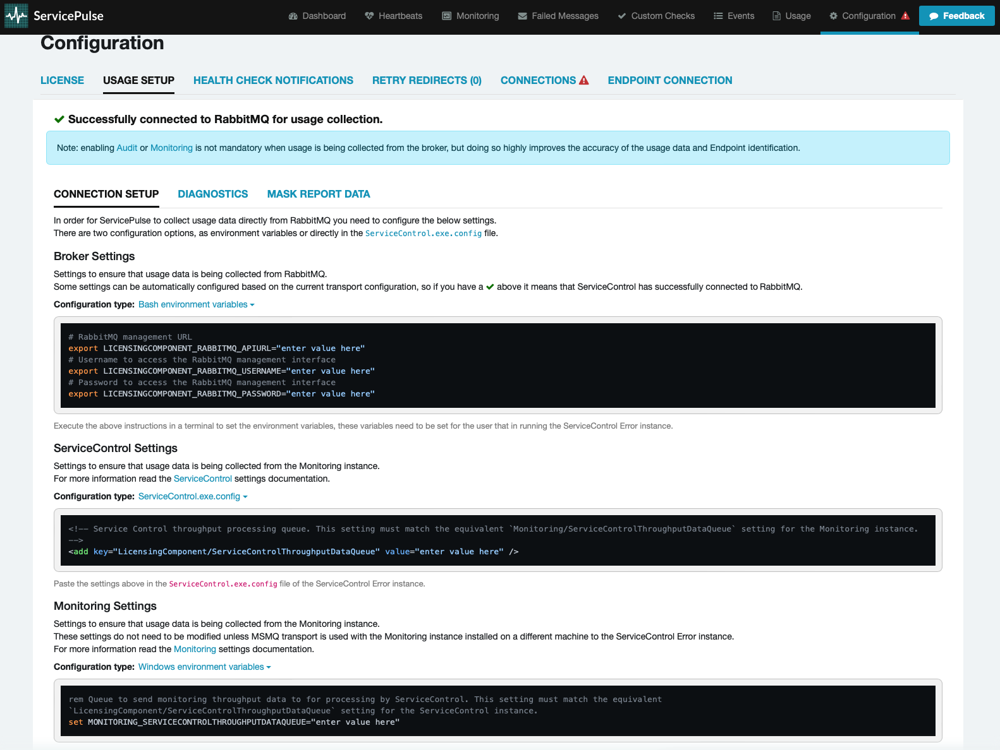

Specific settings for collecting usage data to generate a usage report.

> [!NOTE]
> The usage data collection functionality requires ServicePulse version 1.40 or later, and ServiceControl version 5.4 or later.

## Connection setup

In most scenarios existing ServiceControl error instance connection settings will be used to establish a connection to the broker.



If there is a connection problem, specific usage settings can be provided as environment variables or directly in the [ServiceControl.exe.config](/servicecontrol/servicecontrol-instances/configuration.md) file.
The Usage Setup tab provides easy copy/paste functionality to obtain the required settings in the correct format, based on configuration type.

Look at the [Diagnostics](#diagnostics) tab to diagnose connection issues.

### Azure Service Bus

#### Settings

Refer to the [Usage Reporting when using the Azure Service Bus transport](/servicecontrol/servicecontrol-instances/configuration.md#usage-reporting-when-using-the-azure-service-bus-transport) section of the ServiceControl config file for an explanation of the Azure Service Bus-specific settings.

#### Minimum Permissions

The built-in role [Monitoring Reader](https://learn.microsoft.com/en-us/azure/azure-monitor/roles-permissions-security#monitoring-reader) is sufficient to access the required Azure Service Bus metrics.

To lock it down even further to the minimally required permissions, create a custom role with the following permissions:

```json
{
    "properties": {
        "roleName": "myrolename",
        "description": "",
        "assignableScopes": [
            "/subscriptions/xxxxxxxxxxxxxxxxxxxxx"
        ],
        "permissions": [
            {
                "actions": [
                    "Microsoft.ServiceBus/namespaces/read",
                    "Microsoft.ServiceBus/namespaces/providers/Microsoft.Insights/metricDefinitions/read",
                    "Microsoft.ServiceBus/namespaces/queues/read",
                    "Microsoft.Resources/subscriptions/resources/read"
                ],
                "notActions": [],
                "dataActions": [],
                "notDataActions": []
            }
        ]
    }
}
```

### Amazon SQS

#### Settings

Refer to the [Usage Reporting when using the Amazon SQS transport](/servicecontrol/servicecontrol-instances/configuration.md#usage-reporting-when-using-the-amazon-sqs-transport) section of the ServiceControl config file for an explanation of the Amazon SQS-specific settings.

#### Minimum Permissions

```json
{
    "Version": "2012-10-17",
    "Statement": [
        {
            "Sid": "VisualEditor0",
            "Effect": "Allow",
            "Action": "cloudwatch:GetMetricStatistics",
            "Resource": "*"
        },
        {
            "Sid": "VisualEditor1",
            "Effect": "Allow",
            "Action": "sqs:ListQueues",
            "Resource": "*"
        }
    ]
}
```

### SQLServer

#### Settings

Refer to the [Usage Reporting when using the SqlServer transport](/servicecontrol/servicecontrol-instances/configuration.md#usage-reporting-when-using-the-sqlserver-transport) section of the ServiceControl config file for an explanation of the SQL Server-specific settings.

#### Minimum Permissions

User with rights to query [INFORMATION_SCHEMA].[COLUMNS] table.

### RabbitMQ

#### Settings

Refer to the [Usage Reporting when using the RabbitMQ transport](/servicecontrol/servicecontrol-instances/configuration.md#usage-reporting-when-using-the-rabbitmq-transport) section of the ServiceControl config file for an explanation of the RabbitMQ-specific settings.

#### Minimum permissions

User with monitoring tag and read permission.

### MSMQ & Azure Storage Queues

MSMQ and Azure Storage Queues do not support querying of metrics. To enable the automatic usage reporting functionality for these systems, auditing and/or monitoring must be setup:

- Auditing
  - install the [Audit](./../servicecontrol/audit-instances) instance
  - configure [auditing](./../nservicebus/operations/auditing.md) on all NServiceBus endpoints
- Monitoring
  - install the [Monitoring](./../monitoring) instance
  - configure [metrics](./../monitoring/metrics) on all NServiceBus endpoints

## Diagnostics

The Diagnostics tab helps to diagnose any connection issues to the broker, as well as the audit and monitoring instances.


After making any setting changes, press the `Refresh Connection Test` button to see if the problem is resolved.
If unable to fix the issue, open a [non-critical support case](https://particular.net/support) and include the diagnostic output.

## Report masks

Information that is considered sensitive can be obfuscated in the usage report.
All words to be redacted can be specified in the `Mask Report Data` tab. Specify one word per line.

