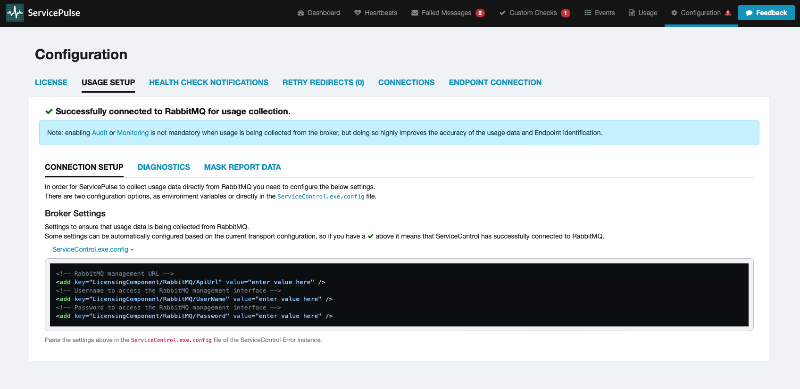
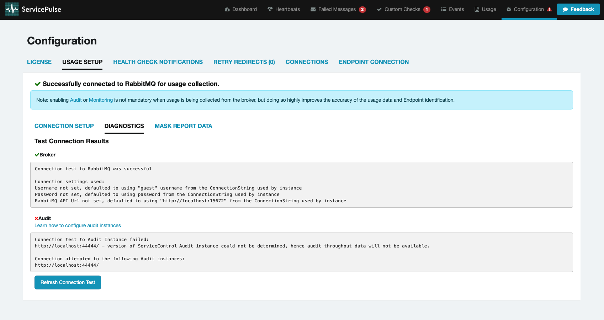
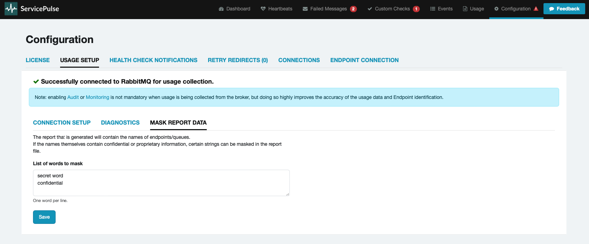

This document describes the settings required for collecting usage data to generate a [usage report](usage-reporting-with-servicepulse.md) in ServicePulse.

> [!NOTE]
> The usage data collection functionality requires ServicePulse version 1.40 or later, and ServiceControl version 5.4 or later.

## Connection setup

In most scenarios, existing ServiceControl error instance connection settings will be used to establish a connection to the broker.



If there is a connection problem, specific usage settings can be provided as environment variables or directly in the [ServiceControl.exe.config](/servicecontrol/servicecontrol-instances/configuration.md) file.

The Usage Setup tab provides easy copy/paste functionality to obtain the required settings in the correct format, based on configuration type.

Refer to the [Diagnostics](#diagnostics) tab to diagnose connection issues.

### Azure Service Bus

ServiceControl reads the message counts for each queue from the namespace's [metrics in Azure Monitor](https://learn.microsoft.com/en-us/azure/service-bus-messaging/monitor-service-bus-reference). This requires a Microsoft Entra identity, either a [managed identity](https://learn.microsoft.com/en-us/entra/identity/managed-identities-azure-resources/overview) or a [service principal](https://learn.microsoft.com/en-us/entra/identity-platform/app-objects-and-service-principals), that has the [**Monitoring Reader**](https://learn.microsoft.com/en-us/azure/azure-monitor/fundamentals/roles-permissions-security#monitoring-reader) role on the namespace. For a minimal permission set, see [Minimum permissions](#connection-setup-azure-service-bus-minimum-permissions).

Azure Service Bus supports two ways to authenticate: [Microsoft Entra ID and shared access signatures (SAS)](https://learn.microsoft.com/en-us/azure/service-bus-messaging/service-bus-authentication-and-authorization). The one the transport connection string uses determines which identity ServiceControl uses to read the metrics:

| Transport connection string | Identity used to read the metrics | Settings required |
| --- | --- | --- |
| [Microsoft Entra ID authentication](/servicecontrol/transports.md#azure-service-bus-enabling-managed-identity): a fully qualified namespace, or `Authentication=Managed Identity` | The same identity the transport uses | None |
| [Shared access signature (SAS)](https://learn.microsoft.com/en-us/azure/service-bus-messaging/service-bus-sas): `Endpoint=sb://…;SharedAccessKeyName=…;SharedAccessKey=…` | A separate service principal with a client secret | `TenantId`, `ClientId`, and `ClientSecret` |

In both cases, setting `SubscriptionId` to the [Azure subscription](https://learn.microsoft.com/en-us/azure/azure-portal/get-subscription-tenant-id#find-your-azure-subscription) that contains the namespace is recommended. If it is not set, ServiceControl uses the first subscription the identity can access, and reports that it cannot find the namespace if the namespace is in a different one.

**When the transport uses Microsoft Entra ID authentication**, [assign the **Monitoring Reader** role](https://learn.microsoft.com/en-us/azure/role-based-access-control/role-assignments-portal) on the namespace to the managed identity or service principal that the transport uses. `TenantId`, `ClientId`, and `ClientSecret` are not needed, and ServiceControl ignores them if they are set. With a fully qualified namespace, ServiceControl uses [`DefaultAzureCredential`](https://learn.microsoft.com/en-us/dotnet/api/azure.identity.defaultazurecredential?view=azure-dotnet), so the identity can also be a service principal that authenticates with a [certificate credential](https://learn.microsoft.com/en-us/entra/identity-platform/certificate-credentials) or a [federated identity credential](https://learn.microsoft.com/en-us/entra/workload-id/workload-identity-federation), configured through [environment variables](https://learn.microsoft.com/en-us/dotnet/api/overview/azure/identity-readme?view=azure-dotnet#environment-variables).

**When the transport uses a shared access signature (SAS)**, create a separate service principal for ServiceControl:

1. Create an app registration for ServiceControl, and note its **Application (client) ID** and **Directory (tenant) ID**.
2. Add a [client secret](https://learn.microsoft.com/en-us/entra/identity-platform/how-to-add-credentials?tabs=client-secret) to the app registration.
3. Assign the app registration's service principal the **Monitoring Reader** role on the namespace.
4. Configure `TenantId`, `ClientId`, and `ClientSecret` on the ServiceControl instance. See [Settings](#connection-setup-azure-service-bus-settings).

The setup can be done via the [portal](#connection-setup-azure-service-bus-using-azure-portal) or [CLI](#connection-setup-azure-service-bus-using-azure-cli).

#### Using Azure Portal

To use the Azure Portal:

1. Create the app registration (SAS only):
    - Navigate to: **Home > App registrations**
    - Select **➕ New registration**
    - On the **Overview** page, note the **Application (client) ID** and **Directory (tenant) ID**
2. Add a client secret (SAS only):
    - Navigate to: **{application name} > Certificates & secrets > Client secrets**
    - Select **➕ New client secret**, and note the secret's **Value**
3. Assign the **Monitoring Reader** role:
    - Navigate to: **Home > Service Bus > {service bus namespace} > Access control (IAM)**
    - Select: **➕ Add > Add role assignment**
    - Enter:
      - Role: `Monitoring Reader`
      - Assign access to: **User, group, or service principal** for the app registration, or **Managed identity** for a managed identity
      - Members: Select **➕ Select members > {application or managed identity name}**
    - Select: **Review + assign**

#### Using Azure CLI

To use the Azure CLI or scripting:

```ps1
# Set context first
az account set --subscription "YourAzureSubscriptionName"

# Create the app registration and its service principal (SAS only)
$applicationId = az ad app create --display-name ServiceControlUsageReporting --query appId --output tsv
az ad sp create --id $applicationId

# Add a client secret (SAS only). The output shows the ClientSecret (password) and TenantId (tenant)
az ad app credential reset --id $applicationId --append

# Store who gets the role: the app registration (SAS), or the transport's managed identity principal ID
$assigneeId = $applicationId

# List subscription ID
az servicebus namespace list

# Store your Subscription ID
$subscriptionId = "<Your Subscription ID>"

# List resource group
az group list

# Store resource group and namespace names
$resourceGroupName = "<Your Resource Group Name>"
$namespaceName = "<Your Namespace Name>"

# Assign role to resource group
$scope = "/subscriptions/$subscriptionId/resourceGroups/$resourceGroupName"

# or to specific resource in resource group
$scope = "/subscriptions/$subscriptionId/resourceGroups/$resourceGroupName/providers/Microsoft.ServiceBus/namespaces/$namespaceName"
# end alternative

# Assign the Monitoring Reader role
az role assignment create --assignee $assigneeId --role "Monitoring Reader" --scope $scope
```

#### Settings

Refer to the [Usage Reporting when using the Azure Service Bus transport](/servicecontrol/servicecontrol-instances/configuration.md#usage-reporting-when-using-the-azure-service-bus-transport) section of the ServiceControl config file for an explanation of the Azure Service Bus-specific settings.

#### Minimum Permissions

The built-in role [`Monitoring Reader`](https://learn.microsoft.com/en-us/azure/azure-monitor/fundamentals/roles-permissions-security#monitoring-reader) is sufficient to access the required Azure Service Bus metrics.

To restrict permissions to the minimal required set, create a custom role with the following permissions:

```json
{
    "properties": {
        "roleName": "myrolename",
        "description": "",
        "assignableScopes": [
            "/subscriptions/xxxxxxxxxxxxxxxxxxxxx"
        ],
        "permissions": [
            {
                "actions": [
                    "Microsoft.ServiceBus/namespaces/read",
                    "Microsoft.ServiceBus/namespaces/providers/Microsoft.Insights/metricDefinitions/read",
                    "Microsoft.ServiceBus/namespaces/queues/read",
                    "Microsoft.Resources/subscriptions/read",
                    "Microsoft.Resources/subscriptions/resources/read",
                    "Microsoft.Insights/Metrics/Read"
                ],
                "notActions": [],
                "dataActions": [],
                "notDataActions": []
            }
        ]
    }
}
```

The `Microsoft.ServiceBus` permissions are required to read queue names and metric data from Azure Monitor. The `Microsoft.Resources/subscriptions` permissions are required in order to locate the Service Bus namespace within the Azure subscription. The `Microsoft.Insights/Metrics/Read` permissions are required to find the available metrics.

### Amazon SQS

#### Settings

Refer to the [Usage Reporting when using the Amazon SQS transport](/servicecontrol/servicecontrol-instances/configuration.md#usage-reporting-when-using-the-amazon-sqs-transport) section of the ServiceControl config file for an explanation of the Amazon SQS-specific settings.

#### Minimum Permissions

```json
{
    "Version": "2012-10-17",
    "Statement": [
        {
            "Sid": "VisualEditor0",
            "Effect": "Allow",
            "Action": "cloudwatch:GetMetricStatistics",
            "Resource": "*"
        },
        {
            "Sid": "VisualEditor1",
            "Effect": "Allow",
            "Action": "sqs:ListQueues",
            "Resource": "*"
        }
    ]
}
```

### SQL Server

#### Settings

Refer to the [Usage Reporting when using the SqlServer transport](/servicecontrol/servicecontrol-instances/configuration.md#usage-reporting-when-using-the-sqlserver-transport) section of the ServiceControl config file for an explanation of the SQL Server-specific settings.

#### Minimum Permissions

User with rights to query [INFORMATION_SCHEMA].[COLUMNS] table.

### PostgreSQL

#### Settings

Refer to the [Usage Reporting when using the PostgreSQL transport](/servicecontrol/servicecontrol-instances/configuration.md#usage-reporting-when-using-the-postgresql-transport) section of the ServiceControl config file for an explanation of the PostgreSQL Server-specific settings.

#### Minimum Permissions

User with rights to query [INFORMATION_SCHEMA].[COLUMNS] table.

### RabbitMQ

#### Settings

Refer to the [Usage Reporting when using the RabbitMQ transport](/servicecontrol/servicecontrol-instances/configuration.md#usage-reporting-when-using-the-rabbitmq-transport) section of the ServiceControl config file for an explanation of the RabbitMQ-specific settings.

Querying of metrics from RabbitMQ requires access to the management API. If it is not possible to access the management API, e.g. due to security considerations, then use [audit and monitoring data](#audit-and-monitoring-data) instead.

#### Minimum permissions

User with monitoring tag and read permission.

### MSMQ

MSMQ does not support native querying of metrics. Use [audit and monitoring data](#audit-and-monitoring-data) instead.

### IBM MQ

IBM MQ does not support native querying of metrics. Use [audit and monitoring data](#audit-and-monitoring-data) instead.

### Azure Storage Queues

Azure Storage Queues does not support native querying of metrics. Use [audit and monitoring data](#audit-and-monitoring-data) instead.

## Audit and monitoring data

For transports that do not support querying broker-side metrics, ServiceControl generates the usage report from data collected by the Audit and/or Monitoring instances. To enable this:

- Auditing
  - install the [Audit](./../servicecontrol/audit-instances) instance
  - configure [auditing](./../nservicebus/operations/auditing.md) on all NServiceBus endpoints
- Monitoring
  - install the [Monitoring](./../monitoring) instance
  - configure [metrics](./../monitoring/metrics) on all NServiceBus endpoints

## Diagnostics

The Diagnostics tab helps to diagnose any connection issues to the broker, as well as the audit and monitoring instances.



After making any setting changes, press the `Refresh Connection Test` button to verify whether the problem is resolved.
If unable to resolve the issue, open a [non-critical support case](https://particular.net/support) and include the diagnostic output.

## Report masks

Sensitive information can be anonymized in the usage report. Endpoint, queue, and machine names sometimes contain customer, project, or product names; any such word can be masked so that it is redacted (obfuscated) before the report is generated and never leaves the environment.

Specify the words to anonymize in the `Mask Report Data` tab, one word per line. Every occurrence of a listed word is replaced in the generated report.


