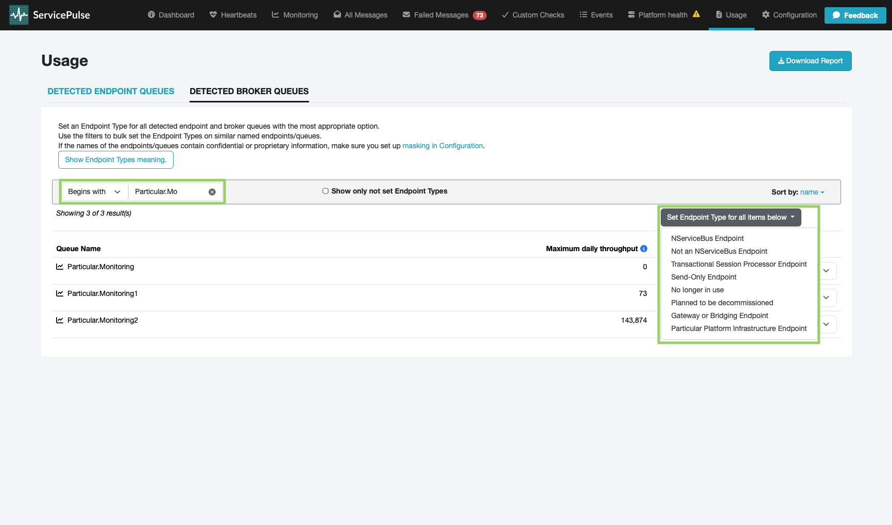
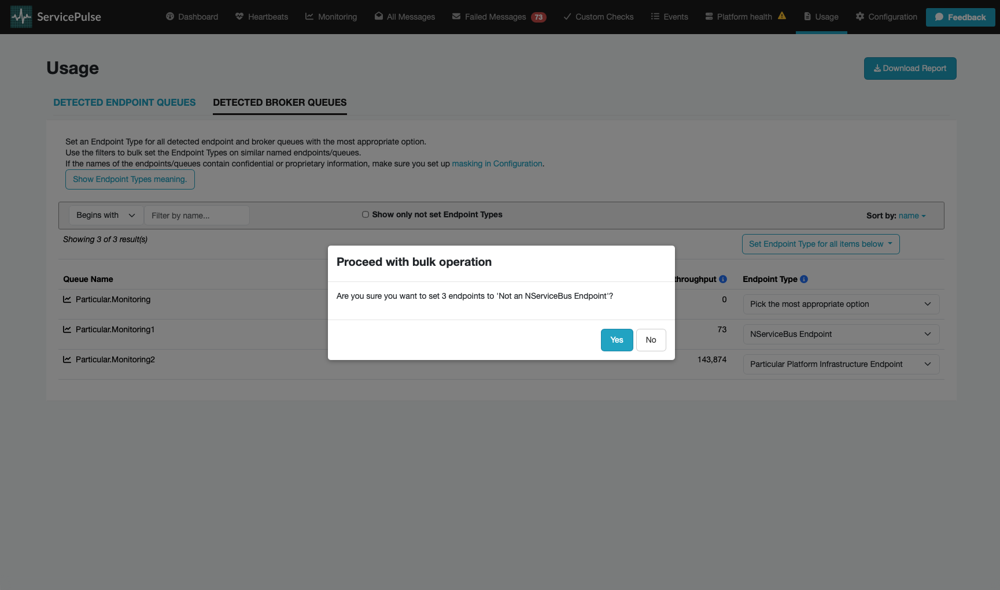
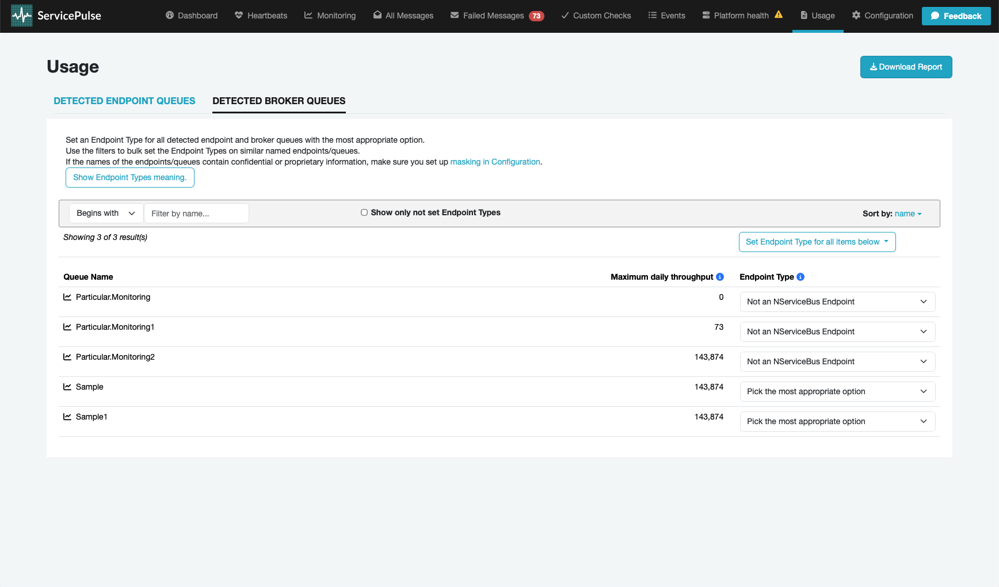

> [!NOTE]
> The usage data collection functionality requires ServicePulse version 1.40 or later, and ServiceControl version 5.4 or later.

A usage report is a file generated by ServicePulse that shows messaging throughput of a system based on identified NServiceBus endpoints and the throughput of their corresponding queues. To enable this functionality in ServicePulse, [usage reporting setup](/servicepulse/usage-reporting-setup.md) must be completed first. Once configured, no ongoing maintenance is needed, and the Usage page will display throughput for each queue detected.

This report is needed when licensing the Particular Platform and must be downloaded and sent manually. Before submitting the report, [sensitive data can be masked](usage-reporting-setup.md#report-masks) and queues that do not map to NServiceBus endpoints (and therefore, do not count toward licensing) can be marked as such.

Customers who are not able to use ServicePulse can contact their Account Manager directly or [reach out to the Particular Software Sales team](https://particular.net/contact) if they do not have an Account Manager.

## Viewing usage data in ServicePulse

The Usage page in ServicePulse has two tabs:

- [Detected endpoint queues](#viewing-usage-data-in-servicepulse-detected-endpoint-queues)
- [Detected broker queues](#viewing-usage-data-in-servicepulse-detected-broker-queues) (only displayed when using a broker transport)

For each detected endpoint queue and broker queue, the maximum daily throughput is displayed. This can be helpful to get an understanding of which [tier](https://particular.net/pricing) the corresponding endpoint belongs to for licensing purposes.

### Detected endpoint queues

This list is comprised of endpoint queues that have a clear connection to an NServiceBus endpoint. However, these can be marked to indicate if they correspond to a [type of endpoint that should not count toward licensing](#endpoint-type-indicators).

Changes made to the endpoint type are automatically saved for future reporting, so it is important to remember to make an update if the endpoint type changes.

### Detected broker queues

For [NServiceBus transport](./../transports) that allow querying the broker, there may be additional information on the `Detected Broker Queues` tab. These are queues detected on the broker that cannot be automatically linked to an NServiceBus endpoint. These queues will be included in the usage report for NServiceBus licensing purposes, but their corresponding endpoints can also be [marked to indicate if they should not count toward licensing](#endpoint-type-indicators).

This feature will not be displayed for non-broker transports like MSMQ and Azure Storage Queues.

## Downloading a usage report

Click `Download Report` to generate a usage report as a JSON file. This report contains the queues from both the [detected endpoint queues](#viewing-usage-data-in-servicepulse-detected-endpoint-queues) and [detected broker queues](#viewing-usage-data-in-servicepulse-detected-broker-queues) tabs. The report also includes the [endpoint type](#endpoint-type-indicators) selections made on screen, and any specified [words to mask](usage-reporting-setup.md#report-masks) will be obfuscated.

The `Download Report` button is disabled if there is less than 24 hours worth of usage data.

The report file must be provided to Particular Software on request; it is **not** automatically uploaded or sent. Once Particular Software receives the report, the reported queues and throughput are analyzed to determine which ones count for licensing purposes.

## Endpoint type indicators

The following endpoint type indicators are available to help categorize endpoints appropriately:

### NServiceBus Endpoint

Known NServiceBus [endpoint](/nservicebus/endpoints/). These endpoints are included in licensing calculations as they represent active NServiceBus endpoints processing business messages.

### No longer in use

NServiceBus endpoint that is no longer in use, usually with zero throughput in the corresponding queue. These endpoints are not included in licensing calculations since they are inactive.

### Transactional Session Processor Endpoint

An [endpoint that is only processing transactional session dispatch messages](/nservicebus/transactional-session/#design-considerations). These are [specialized endpoints](/nservicebus/transactional-session/#remote-processor) dedicated to handling the coordination of transactional sessions, and are excluded from licensing calculations.

### Send-Only Endpoint

An endpoint that [only sends](/nservicebus/endpoints/#send-only) messages and does not process any messages. These endpoints have different licensing considerations since they don't process incoming messages.

### Planned to be decommissioned

An endpoint that is expected to no longer be used within the next 30 days. These endpoints may be excluded from licensing calculations as they represent temporary infrastructure.

### Not an NServiceBus Endpoint

Not an NServiceBus endpoint. These are broker queues or other messaging infrastructure that should not be included in NServiceBus licensing calculations.

### Gateway or Bridging Endpoint

These are endpoints that are either part of the [Gateway](/nservicebus/gateway/) or [Messaging Bridge](/nservicebus/bridge/) infrastructure.

### Particular Platform Endpoint

This is a Particular Platform infrastructure endpoint.

## Bulk endpoint type updates

The filter option can be used for bulk updating endpoint types matching a certain naming pattern.

1. Find the endpoints/queues that need to be bulk updated
2. Press the `Set Endpoint Type for all items below` button to select which endpoint type the filtered results should be set to.
   
3. A confirmation box appears - press `Yes` to proceed with the bulk update.
   
4. All endpoints/queues on screen will be updated to the selected endpoint type and automatically saved.
   

## Need help?

To get help downloading a usage report, [open a support case](https://customers.particular.net/request-support/licensing).
