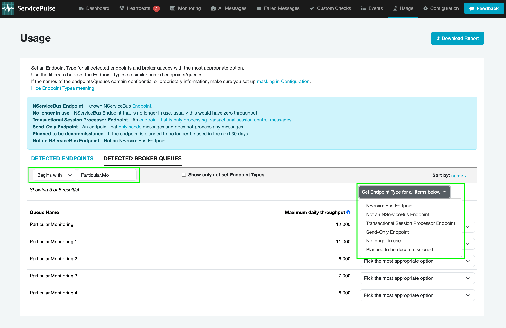
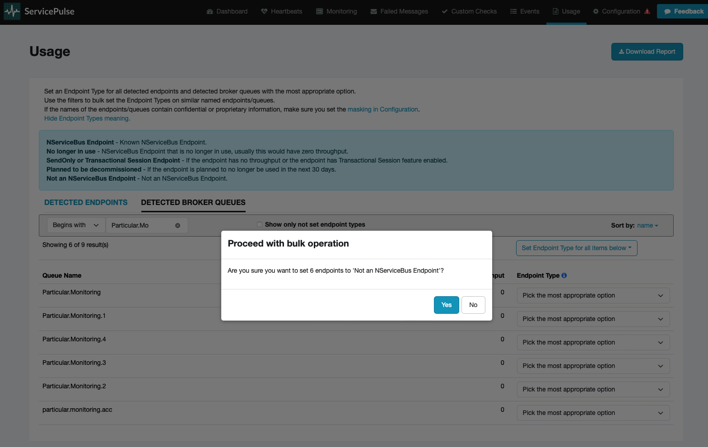

## Using ServicePulse to measure usage

ServicePulse will generate a usage report containing NServiceBus endpoint count and throughput summary. The report is saved as a file onto the local machine, which needs to be sent to Particular upon request, usually at license renewal time.

ServicePulse provides the user with:

- The ability to [view system usage](#viewing-usage-summary) at any time
- The ability to [specify if a detected queue should not be included in license pricing](#setting-an-endpoint-type)
- Improved endpoint detection for endpoints that have Monitoring or Audit enabled
- Once setup, there's no more work required, just a button press once a year to generate the usage report

The Usage page allows for viewing the endpoint usage summary of a system using NServiceBus.
A usage report can be downloaded here at license renewal time.

> [!NOTE]
> The usage data collection functionality requires ServicePulse version 1.40 or later, and ServiceControl version 5.4 or later. Additionally, if using RabbitMQ broker, version 3.10.0 or higher is required.

Customers who are not able to use ServicePulse can either contact their Account Manager directly or use the [contact form](https://particular.net/contact).

## Download a usage report

Click `Download Report` to generate a usage report file with the detected [endpoints](#viewing-usage-summary-detected-endpoints) and [queues](#viewing-usage-summary-detected-broker-queues). The report includes the [endpoint type](#setting-an-endpoint-type) selections made on screen, and any specified [words to mask](usage-config.md#report-masks) will be obfuscated.

The `Download Report` button is disabled if there is less than 24 hours worth of usage data.

The report file must be provided to Particular upon request, it is **not** automatically uploaded or sent.

## Viewing usage summary

At any time, the system usage can be viewed on the Usage page.
This page has two tabs:

- [Detected endpoints](#viewing-usage-summary-detected-endpoints)
- [Detected broker queues](#viewing-usage-summary-detected-broker-queues) (only displayed when using a broker transport)

For each endpoint and queue, the maximum daily throughput is displayed. This can be helpful to get an understanding of which [tier](https://particular.net/pricing) the endpoint belongs to for licensing purposes.

### Detected endpoints

Detected endpoints are those identified by the system as NServiceBus endpoints and are included in the usage report for NServiceBus licensing purposes. There is an option to set the endpoint type if there is a valid reason as to why it should not be included in the licensing calculations. Any changes made to the endpoint type are automatically saved.

### Detected broker queues

If the system is using an [NServiceBus transport](./../transports) that allows querying of metrics, then any queues detected on the broker that cannot be automatically identified as NServiceBus endpoints will be listed in the `Detected Broker Queues` tab. These queues will be included in the usage report for NServiceBus licensing purposes.

This option will not be displayed for non-broker transports (e.g. MSMQ and Azure Storage Queues).

## Setting an endpoint type

The usage summary may contain detected queues that should not be counted as part of a license with Particular Software.

Once a report is submitted to Particular, it is reviewed, and any system queues that should not be counted for licensing purposes are removed.

In addition, the detected endpoints and broker queues screens provide an option to set the endpoint type, which specifies a reason as to why a queue should not be included in the licensing calculations. Any changes made to the endpoint type are automatically saved.

### Endpoint type indicators

The following endpoint type indicators are available to help categorize endpoints appropriately:

#### NServiceBus Endpoint

Known NServiceBus [endpoint](/nservicebus/endpoints/). These endpoints are included in licensing calculations as they represent active NServiceBus endpoints processing business messages.

#### No longer in use

NServiceBus endpoint that is no longer in use, usually with zero throughput. These endpoints are not included in licensing calculations since they are inactive.

#### Transactional Session Processor Endpoint

An [endpoint that is only processing transactional session dispatch messages](/nservicebus/transactional-session/#design-considerations). These are [specialized endpoints](/nservicebus/transactional-session/#remote-processor) dedicated to handling the coordination of transactional sessions, and it is excluded during licensing calculations.

#### Send-Only Endpoint

An endpoint that [only sends](/nservicebus/hosting/#self-hosting-send-only-hosting) messages and does not process any messages. These endpoints have different licensing considerations since they don't process incoming messages.

#### Planned to be decommissioned

An endpoint that is expected to no longer be used within the next 30 days. These endpoints may be excluded from licensing calculations as they represent temporary infrastructure.

#### Not an NServiceBus Endpoint

Not an NServiceBus endpoint. These are broker queues or other messaging infrastructure that should not be included in NServiceBus licensing calculations.

#### Gateway or Bridging Endpoint

This is either part of the [Gateway](/nservicebus/gateway/) infrastructure or part of the [Messaging Bridge](/nservicebus/bridge/) infrastructure.

#### Particular Platform Endpoint

This is a Particular Platform infrastructure endpoint.

### Bulk endpoint updates

The filter option can be used for bulk updating of endpoints or queues matching a certain naming pattern.

1. Find the endpoints/queues that need to be bulk updated
2. Press the `Set Endpoint Type for all items below` button to select which endpoint type the filtered results should be set to.
   
3. A confirmation box appears - press `Yes` to proceed with the bulk update.
   
4. All endpoints/queues on screen will be updated to the selected endpoint type and automatically saved.
   

### Need any help?

To get help with problems encountered attempting to create a throughput report, [create a support case](https://customers.particular.net/request-support/licensing).
