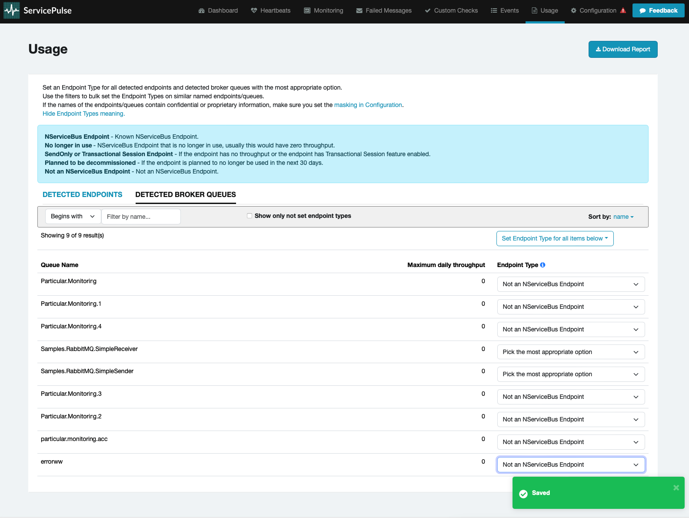

The Usage page allows for viewing the endpoint usage summary of a system using NServiceBus.
A usage report can be generated here at license renewal time.

> [!NOTE]
> The usage data collection functionality requires ServicePulse version 1.40 or later, and ServiceControl version 5.4 or later.

## Download a usage report

Click `Download Report` to generate a usage report file with the detected [endpoints](#viewing-usage-summary-detected-endpoints) and [queues](#viewing-usage-summary-detected-broker-queues). The report includes the [endpoint type](#setting-an-endpoint-type) selections made on screen, and any specified [words to mask](usage-config.md#report-masks) will be obfuscated.

The report file must be provided to Particular upon request - it will not be automatically uploaded or sent.

## Viewing usage summary

At any time the system usage can be viewed on the Usage page. It is divided into two sections:

- [Detected endpoints](#viewing-usage-summary-detected-endpoints)
- [Detected broker queues](#viewing-usage-summary-detected-broker-queues)

For each endpoint and queue, the maximum daily throughput is displayed. This can be helpful to get an understanding of which [tier](https://particular.net/pricing) the endpoint belongs to for licensing purposes.

### Detected endpoints

Detected endpoints are those identified by the system as NServiceBus endpoints and are included in the usage report for NServiceBus licensing purposes. There is an option to set the endpoint type if there is a valid reason as to why it should not be included in the licensing calculations. Any changes made to the endpoint type are automatically saved.

### Detected broker queues

If the system is using an [NServiceBus transport](./../transports) that allows querying of metrics, then any queues detected on the broker that cannot be automatically identified as NServiceBus endpoints will be listed in the `Detected Broker Queues` tab. These queues will be included in the usage report for NServiceBus licensing purposes.

This option will not be displayed for non-broker transports (e.g. MSMQ and Azure Storage Queues).

## Setting an endpoint type

The usage summary may contain detected queues that should not be counted as part of a license with Particular Software.

Once a report is submitted to Particular, it is reviewed and any system queues that should not be counted for licensing purposes are removed.

In addition, the detected endpoints and broker queues screens provide an option to set the endpoint type, which specifies a reason as to why a queue should not be included in the licensing calculations. Any changes made to the endpoint type are automatically saved.

### Bulk endpoint updates

The filter option can be used for bulk updating of endpoints or queues matching a certain naming pattern.

1. Find the endpoints/queues that need to be bulk updated
2. Press the `Set Endpoint Type for all items below` button to select which endpoint type the filtered results should be set to.

3. A confirmation box appears - press `Yes` to proceed with the bulk update.

4. All endpoints/queues on screen will be updated to the selected endpoint type and automatically saved.

