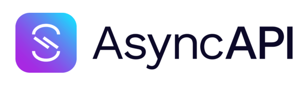

[AsyncAPI](https://www.asyncapi.com) is an open-source specification that provides a standard way to define:

- Event-driven services
- Message brokers
- Topics, channels, and event payloads

It makes it easier to document, visualize, and generate code for systems built on event-driven architecture.

Have a look at the [AsyncAPI sample](/samples/asyncapi/) to see how it can be used with NServiceBus.
