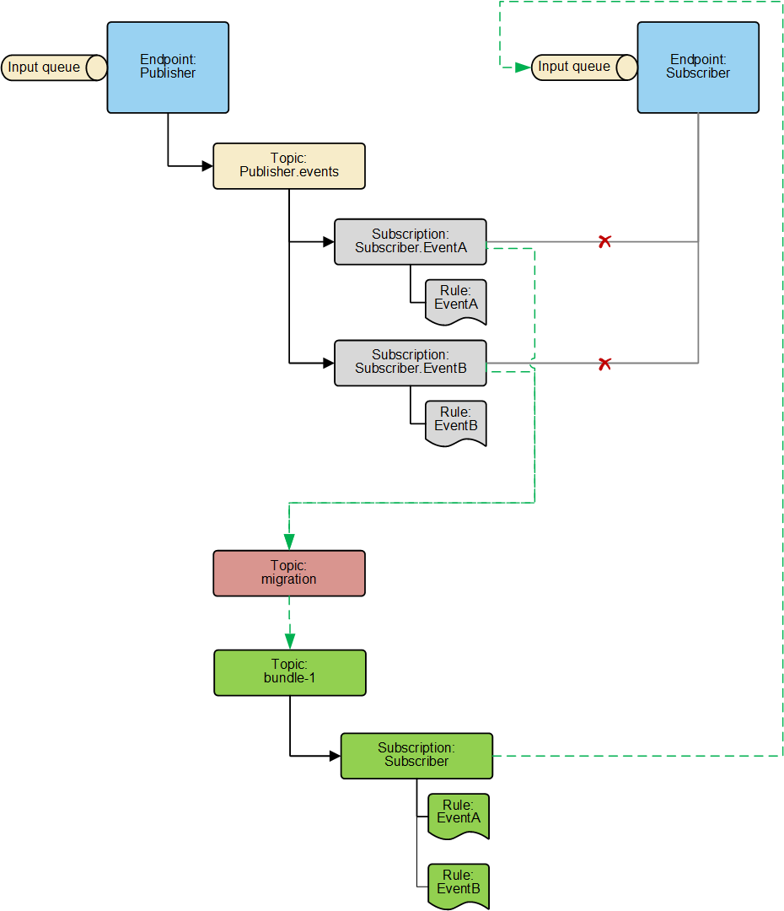

include: legacy-asb-warning

The endpoint-oriented topology was the first topology included in the Azure Service Bus transport. Its design was based on [message-driven publish-subscribe](/nservicebus/messaging/publish-subscribe/#mechanics-message-driven-persistence-based) and has several [restrictions](/transports/azure-service-bus/legacy/topologies.md#versions-7-and-above-forwarding-topology-topologies-comparison).

The forwarding topology was introduced to take advantage of the broker-style native capabilities of Azure Service Bus. It is the recommended topology for new projects. The new Azure Service Bus transport is only [compatible](/transports/azure-service-bus/compatibility.md) with the forwarding topology.

Before migrating to the new Azure Service Bus transport, a system using the endpoint-oriented topology must be migrated to the forwarding topology. The migration approach described here allows migration of individual endpoints to the forwarding topology in any order, and avoids a big-bang style migration.

## Namespace validation

To proceed with migration, it's recommended to verify Azure Service Bus namespaces support the migration feature. See [verification steps for migration](https://github.com/Particular/NServiceBus.AzureServiceBus/issues/810). 

All namespaces used for development, testing, and production should be validated prior to migration taking place.

## Side-by-side migration

INFO: Endpoints with migration mode enabled require "manage" rights to create entities on the broker.

Before migrating endpoints to the forwarding topology, all endpoints must have migration mode enabled. To enable migration mode:

1. Pick an endpoint that is using the endpoint-oriented topology. That is, any endpoint configured with `transport.UseEndpointOrientedTopology()`.
1. Update the `NServiceBus.Azure.Transports.WindowsAzureServiceBus` NuGet package reference to Version 9.1 or higher.
1. Enable migration mode by calling `topology.EnableMigrationToForwardingTopology()` where `topology` is the object returned by `transport.UseEndpointOrientedTopology()`. Leave all the other configuration as-is.

After applying the above steps to one or more endpoints, they should be deployed to production. This cycle should be repeated until all endpoints using the endpoint-oriented topology have migration mode enabled.

### Other Platform components

ServiceControl should now be upgraded to Version 3.5.0 or later, and both ServiceControl and Monitoring instances should be updated to the latest. The migration mode is enabled automatically.

### Next steps

After all the endpoints have been running in production for some time with migration mode enabled, they can be migrated to the forwarding topology by switching to the new Azure Service Bus transport as described in the next section.

NOTE: Endpoints with migration mode enabled should be allowed to run for some time in production to ensure all existing messages have been forwarded to the input queue for the receiving endpoints.

## Migrating from the legacy transport

When all endpoints using the legacy transport are running in migration mode, they can be migrated to the new transport. Before that is done, their compatibility with the new transport should be verified, as described in the [compatibility guide](/transports/azure-service-bus/compatibility.md). To migrate from the legacy transport:

1. Uninstall the `NServiceBus.Azure.Transports.WindowsAzureServiceBus` package.
1. Install the `NServiceBus.Transport.AzureServiceBus` package.
1. Delete any non-compiling code such as `transport.UseEndpointOrientedTopology()` and remove any routing configuration code described in ["Publishers name configuration"](/transports/azure-service-bus/legacy/publisher-names-configuration.md).
1. If more [advanced configuration options](/transports/azure-service-bus/legacy/configuration/full.md) have been used with the legacy transport, switch those over to the [new configuration options](/transports/azure-service-bus/configuration.md) where possible. For configuration options that are not available in the new transport, defaults selected specifically for the new transport will be applied.

After applying the above steps to one or more endpoints, they should be deployed to production. This cycle should be repeated until all endpoints have been migrated to the new transport.

NOTE: Endpoints using the endpoint-oriented topology with migration mode enabled can co-exist and seamlessly communicate with endpoints using both the legacy transport with forwarding topology and the new Azure Service Bus transport.

### Other Platform components

ServiceControl and Monitoring instances should now be switched to `Azure Service Bus` transport using ServiceControl Management Utility.

## Finalizing migration (cleanup stage)

After all, the endpoints have been running in production for some time using the forwarding topology, the [endpoint-oriented topology](/transports/azure-service-bus/legacy/topologies.md#versions-7-and-above-endpoint-oriented-topology) topics with their subscriptions can be removed.

WARNING: Exercise caution when removing subscriptions. If it is unclear which subscriptions can be removed, contact [Support](https://particular.net/support).

## How it works

To understand this section better, refer to the [topologies documentation](/transports/azure-service-bus/legacy/topologies.md) for details on how the endpoint-oriented and forwarding topologies operate.

Migration mode has no impact on commands, it only affects events. It does not change how events are published. It only changes how events are **subscribed to**.
Endpoints running in migration mode will continue to publish events using endpoint specific topics. Subscribers running in migration mode change the way they subscribe to events.
Subscribers running in migration mode will no longer fetch messages from subscriptions. Instead, they will perform the following:

1. Create forwarding topology subscription entities if not yet present; a `bundle-1` topic for all events, a subscription per subscriber endpoint, and a SQL filter per event type (in green). A subscription will auto-forward an event to the endpoint's queue.
1. Create a `migration` topic, if not yet present, that performs de-duplication and auto-forwards events to the `bundle-1` topic (in red).
1. Auto-forward all events arriving at `<subscriber_endpoint_name>.<event_type_name>` subscriptions from the endpoint specific topic `<publishing_endpoint_name>.events` to the `migration` topic (in grey).

Below is an example of a publisher with two events, `EventA` and `EventB`, and a subscriber consuming those events. When an endpoint is running in migration mode, the topology is as follows:

## Frequently asked questions

Q: Why is the `migration` topic required?
A: When an instance of a publisher has been migrated to the forwarding topology, and another instance is still in migration, all events published by the endpoint still in migration need to be de-duplicated. The `migration` topic ensures events are de-duplicated regardless of which instance published them.

Q: What should be migrated first, subscribers or publishers?
A: The order of migration doesn't matter. A publisher could also be a subscriber and the other way around.

Q: Can I add a new endpoint while in migration mode?
A: Yes.

Q: Are commands affected by migration mode?
A: No. Commands work the same way in both topologies and are not affected by migration.

## Additional considerations

When migrating from the legacy Azure Service Bus transport, not all configuration settings will be found with the new Azure Service Bus transport. Certain configuration options will not be found in the new transport as it has sensible and optimal settings configured by the transports and should not be altered.

Particular Services Platform support for new transport was added in Service Control version 3 and later. 