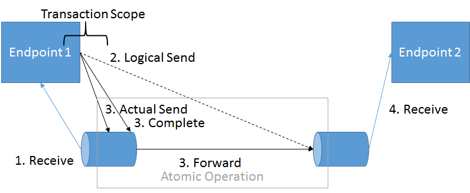
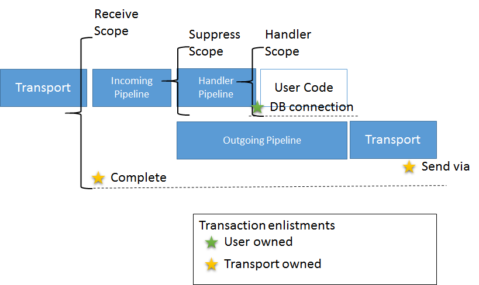
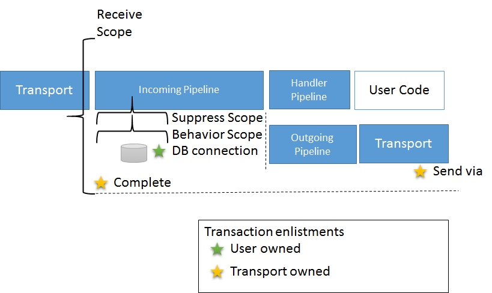

When running in `SendsAtomicWithReceive` mode, the Azure Service Bus (ASB) transport opens a transaction scope that cannot be enlisted by any other resource manager. As a result any custom behaviors or satellites need to explicitly wrap their transaction scope with a suppress scope.

This transaction scope is a requirement to allow the ASB transport to take advantage of [the via entity path / transfer queue](https://github.com/Azure/azure-service-bus/tree/master/samples/DotNet/Microsoft.ServiceBus.Messaging/AtomicTransactions) feature. This capability allows the transport to provide better delivery guarantees by reducing the number of duplicates sent out in case of exceptions occurring after the send operation.

Using a transfer queue, send operations to different ASB entities can be executed via a single entity, the receive queue, and be completed in a single operation together with the acknowledgment that the receive operation has completed. Therefor messages are only sent when the receive operation completes. 

Schematically it works like this:

## Undesired side effects

Transaction scopes automatically flow along the downstream execution path, and implicitly enlist any transactional resource in the ambient transaction.

On the other hand, the ASB SDK actively evaluates how many transactional resources are enlisted in the ambient transaction and throws an exception if it detects more than one.

Both of these behaviors make it impossible to enlist any database operation, or additional direct send operation using ASB SDK in this transaction.

## Use suppress scopes

To deal with this problem ensure that every transactional operation is wrapped in a suppress scope that internally opens a new transaction scope.

The ASB transport already does this automatically for any invocation of `IHandleMessages` by injecting a suppress scope into the handler invocation pipeline. 

The new pipeline architecture for `SendAtomicWithReceive` is schematically represented in the following diagram:

From a transport and transaction management perspective, the NServiceBus pipeline can be divided into three parts:
* The incoming pipeline, which is invoked by the transport whenever a message is received.
* The handler invocation pipeline responsible for invoking the implementations of `IHandleMessages`.
* And finally the outgoing pipeline, responsible for sending out messages through the transport.

Note that the pipeline is not straight, there is a [fork in the pipeline](/nservicebus/pipeline/steps-stages-connectors.md) that is separating the handler invocation path from the outgoing path. Dispatching only happens after the handler invocation pipeline has returned, and all implementations of `IHandleMessages` have been executed successfully.

This is important, as it allows the transport to flow its transaction scope from the incoming pipeline to the outgoing pipeline. While at the same time it can prevent the receive scope from promoting the handler scope by putting a suppress scope around the handler invocation pipeline.

But for custom behaviors or satellites that are plugging into the incoming or outgoing pipeline this suppress scope needs to be added explicitly.

A schematic representation of such a behavior is depicted in the following diagram:

include: send-atomic-with-receive-note
