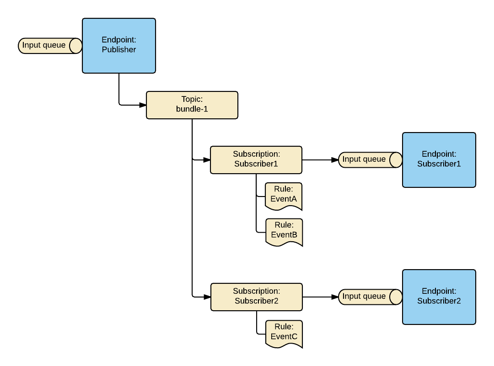

Messaging topology is a specific arrangement of the messaging entities, such as queues, topics, subscriptions, and rules.

Azure Service Bus transport operates on a topology created on the broker. The topology handles exchanging messages between endpoints, by creating and configuring Azure Service Bus entities.

The built-in topology, also know as `ForwardingTopology`, was introduced to take advantage of the broker nature of the Azure Service Bus and to leverage its native capabilities.

The topology creates a single input queue per endpoint and implements a [publish-subscribe](/nservicebus/messaging/publish-subscribe/) mechanism with all publishers using a single topic.

Subscriptions are created under the topic with one subscription entity per subscribing endpoint. Each subscription contains multiple rules; there's one rule per event type that the subscribing endpoint is interested in. This enables a complete decoupling between publishers and subscribers. All messages received by subscription are forwarded to the input queue of the subscriber.

#### Quotas and limitations

The `ForwardingTopology` supports up to 2,000 endpoints with up to 2,000 events in total. Since multiple rules per subscriptions are used, topics cannot be partitioned.

#### Topology highlights

|                                             |                     |
|---------------------------------------------|---------------------|
| Decoupled Publishers / Subscribers          |  yes                |
| Polymorphic events support                  |  yes                |
| Event overflow protection                   |  yes                |
| Subscriber auto-scaling based on queue size |  yes                |
| Reduced number of connections to the broker |  yes                |