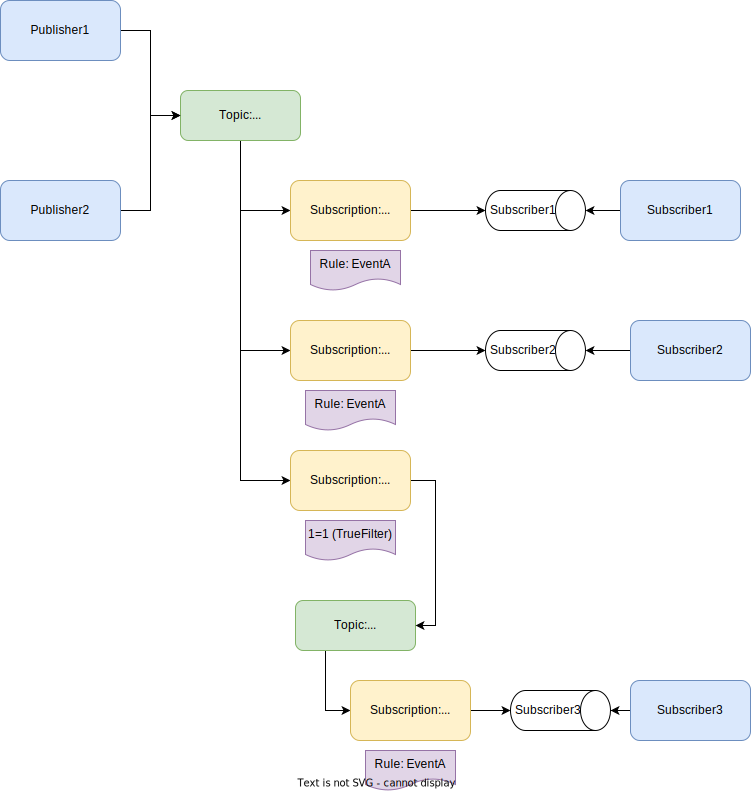

The built-in topology, also known as `ForwardingTopology`, was introduced to leverage Azure Service Bus' broker model and its native capabilities.

The topology creates a single input queue per endpoint and implements a [publish-subscribe](/nservicebus/messaging/publish-subscribe/) mechanism, with all publishers using a single topic.

Subscriptions are created under the topic, with one subscription entity per subscribing endpoint. Each subscription contains multiple rules; there's one rule per event type that the subscribing endpoint is interested in. This enables a complete decoupling between publishers and subscribers. All messages received by subscription are forwarded to the subscriber's input queue.


#### Quotas and limitations

The `ForwardingTopology` is subject to [quotas](https://learn.microsoft.com/en-us/azure/service-bus-messaging/service-bus-quotas) of Azure Service Bus. A single topic supports up to 2000 subscriptions and 2000 filters/rules. For every logical endpoint, one subscription is created that contains one rule per event type subscribed, as shown on the topology overview.

For example, in larger systems, there may be dozens of event types for various business components to interact. Considering a system with 100 different event types, with every endpoint subscribing to 25% of the events, an endpoint would have to manage at least 25 rules. This means the `ForwardingTopology` can handle up to 80 different logical endpoints until it reaches its scaling limits. The more events there are and the more an endpoint is interested in subscribing to them, the fewer endpoints can be added to the system.

It is possible to create a hierarchy of topics by separating the publish topic from the subscribe topic. Due to the added complexity of the hierarchy and the increased number of operations, it is encouraged to start with a single-topic topology and reevaluate options when approximately 50% of the capacity is reached.

For example, an existing system using `bundle-1` as the default single topic topology can add new endpoints as subscribers under `bundle-2` but continue publishing all their events to `bundle-1`. This ensures non-interrupted communication between the endpoints while making it possible to scale beyond the limits of a single topic. A newly added endpoint would need to configure its topology as follows:

snippet: custom-topology-hierarchy-bundle

This creates a new `bundle-2` topic, a subscription called `forward-bundle-2` on the `bundle-1`topic, which automatically forwards all events published to `bundle-1` to `bundle-2`. The new endpoint creates its subscription under `bundle-2` as shown in the picture below:



> [!NOTE]
> While it is technically possible to create even deeper hierarchies (e.g. attaching a `bundle-3` to `bundle-2`), it is strongly discouraged to do so due to the complexity and limitations of the number of hops a message can be routed through. The maximum allowed number of hops in Azure Service Bus is four and needs to be considered when creating a topology hierarchy. In addition, introducing more forwarding hops also increases the number of operations used, affecting pricing or memory/CPU used depending on the selected Azure Service Bus tier.

#### Topic creation

In the ForwardingTopology, all events are published to a single shared topic (default: bundle-1). This topic is considered shared infrastructure and is automatically created by any endpoint that requires it — whether it’s a publisher or a subscriber.

With installers enabled, each endpoint ensures the topic exists as part of its startup process. This allows publishing to succeed even if no subscribers are yet active.

In systems using a topic hierarchy (e.g., bundle-2 subscribing to bundle-1), the endpoint will automatically create:
- The new secondary topic (e.g., bundle-2)
- A forwarding subscription on the upstream topic (e.g., bundle-1 → bundle-2), if it doesn’t already exist
- Its own subscription under that topic

#### Subscription rule matching

```sql
[NServiceBus.EnclosedMessageTypes] LIKE '%(full class name)%'
```

The [SQL rules added on the subscriber](https://docs.microsoft.com/en-us/azure/service-bus-messaging/topic-filters) side will match the [EnclosedMessageTypes header](/nservicebus/messaging/headers.md#serialization-headers-nservicebus-enclosedmessagetypes) to the fully qualified class name, including `%` at the beginning and `%` at the end. In this case, `%` follows standard SQL syntax and stands for [any string of zero or more characters](https://docs.microsoft.com/en-us/azure/service-bus-messaging/service-bus-messaging-sql-filter#pattern).

For example, a subscriber interested in the event `Shipping.OrderAccepted` will add the following rule to the subscription:

```sql
[NServiceBus.EnclosedMessageTypes] LIKE '%Shipping.OrderAccepted%'
```

The subscription rules uses `%` both at the beginning and at the end of the ` LIKE` clause to support the following scenarios:

- Interface-based inheritance
- Evolution of the message contract

##### Interface-based inheritance

A published message type can have multiple valid interfaces in its hierarchy representing a message type. For example:

```csharp
namespace Shipping;

interface IOrderAccepted : IEvent { }
interface IOrderStatusChanged : IEvent { }

class OrderAccepted : IOrderAccepted, IOrderStatusChanged { }
class OrderDeclined : IOrderAccepted, IOrderStatusChanged { }
```

In this scenario, the [EnclosedMessageTypes headers](/nservicebus/messaging/headers.md#serialization-headers-nservicebus-enclosedmessagetypes) looks like the following when publishing the `OrderAccepted` event:

```
Shipping.OrderAccepted, Shared, Version=1.0.0.0, Culture=neutral, PublicKeyToken=XYZ;Shipping.IOrderAccepted, Shared, Version=1.0.0.0, Culture=neutral, PublicKeyToken=XYZ;Shipping.IOrderStatusChanged, Shared, Version=1.0.0.0, Culture=neutral, PublicKeyToken=XYZ
```

For a handler `class OrderAcceptedHandler : IHandleMessages<OrderAccepted>` the subscription will look like:

```sql
[NServiceBus.EnclosedMessageTypes] LIKE '%Shipping.OrderAccepted%'
```

This ensures that the condition matches the [EnclosedMessageTypes header](/nservicebus/messaging/headers.md#serialization-headers-nservicebus-enclosedmessagetypes) shown previously.

If the subscriber is interested only in the interface `IOrderStatusChanged`, it will declare a handler `class OrderStatusChanged : IHandleMessages<IOrderStatusChanged>` and the corresponding subscription will look like:


```sql
[NServiceBus.EnclosedMessageTypes] LIKE '%Shipping.IOrderStatusChanged%'
```

This matches any [EnclosedMessageTypes header](/nservicebus/messaging/headers.md#serialization-headers-nservicebus-enclosedmessagetypes) that contains `Shipping.IOrderStatusChanged` regardless of the position in the header. When a publisher starts publishing `Shipping.OrderDeclined` the event is automatically routed to the subscriber's input queue without any topology changes.

##### Evolution of the message contract

As mentioned in [versioning of shared contracts](/nservicebus/messaging/sharing-contracts.md#versioning) and also shown in the examples above, NServiceBus uses the fully-qualified assembly name in the message header. [Evolving the message contract](/nservicebus/messaging/evolving-contracts.md) encourages creating entirely new contract types and then adding a version number to the original name. For example, when evolving `Shipping.OrderAccepted`, the publisher would create a new contract called `Shipping.OrderAcceptedV2`. When the publisher publishes `Shipping.OrderAcceptedV2` events, the enclosed message type would look as follows:

```
Shipping.OrderAcceptedV2, Shared, Version=1.0.0.0, Culture=neutral, PublicKeyToken=XYZ;Shipping.IOrderAccepted, Shared, Version=1.0.0.0, Culture=neutral, PublicKeyToken=XYZ;Shipping.IOrderStatusChanged, Shared, Version=1.0.0.0, Culture=neutral, PublicKeyToken=XYZ
```

Any existing subscriber that subscribes to:

```sql
[NServiceBus.EnclosedMessageTypes] LIKE '%Shipping.OrderAccepted%'
```

will still receive those events automatically since the base name of `Shipping.OrderAcceptedV2` is `Shipping.OrderAccepted`. New subscribers subscribing to the updated contract can subscribe with:

```sql
[NServiceBus.EnclosedMessageTypes] LIKE '%Shipping.OrderAcceptedV2%'
```

which matches the newly created contract more closely.

#### Topology highlights

|                                             |                     |
|---------------------------------------------|---------------------|
| Decoupled Publishers / Subscribers          |  yes                |
| Polymorphic events support                  |  yes                |
| Event overflow protection                   |  yes                |
| Subscriber auto-scaling based on queue size |  yes                |
| Reduced number of connections to the broker |  yes                |
