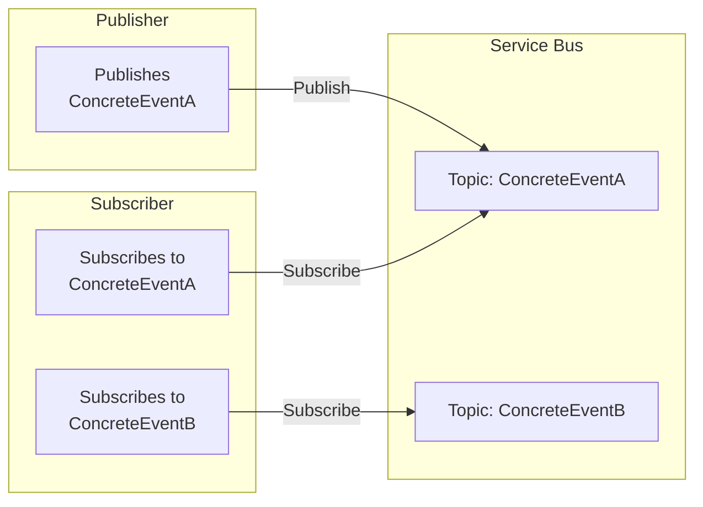
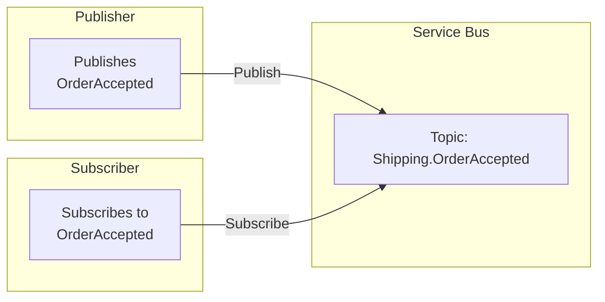
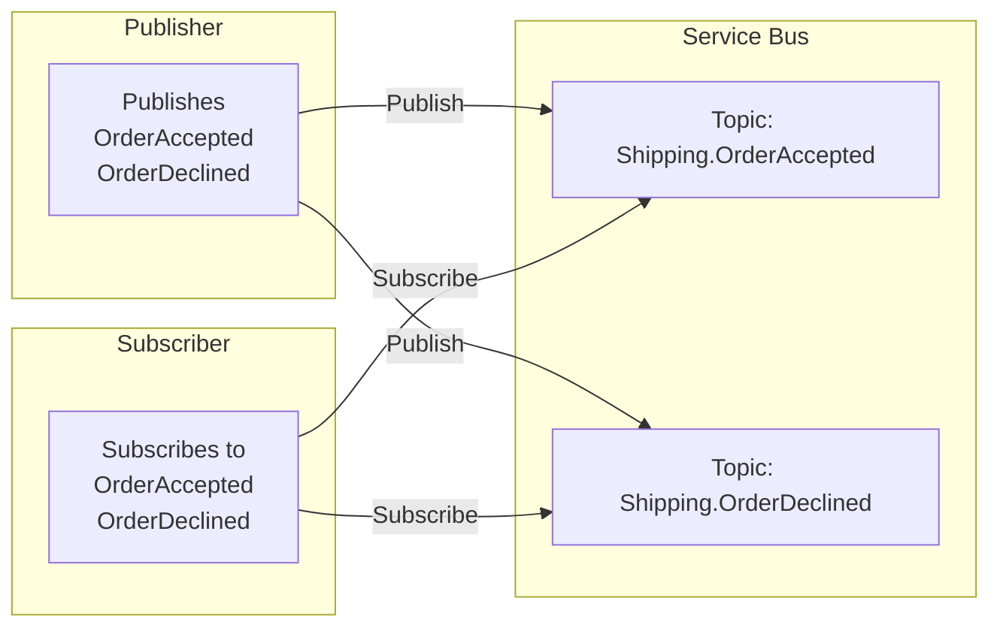

The **topic-per-event** topology dedicates one Azure Service Bus topic to each *concrete* event type. This design moves away from the single “bundle” topic and its SQL or Correlation filters, thereby reducing filter overhead and distributing messages more evenly across multiple topics.

In the topic-per-event topology:

1. **Publishers** send an event to a specific topic named after the most concrete event type.
2. **Subscribers** each create a *subscription* under each topic that matches the event(s) they are interested in.
3. Because there is no single, central “bundle” topic to hold all messages, each published event flows to its own dedicated topic.



This design can dramatically reduce filtering overhead, boosting performance and scalability. Distributing the messages across multiple topics avoids the single-topic bottleneck and mitigates the risk of hitting per-topic subscription and filter limits.

#### Quotas and limitations

A single Azure Service Bus topic [can hold up to 2,000 subscriptions, and each Premium namespace (with one messaging unit) can have up to 1,000 topics](https://learn.microsoft.com/en-us/azure/service-bus-messaging/service-bus-quotas).

- Subscriptions per topic: 2,000 (Standard/Premium).
- Topics per Premium namespace: 1,000 per messaging unit.
- Topic size: 5 GB quota per topic.

By allocating a separate topic for each concrete event type, the overall system can scale more effectively:

- Each topic is dedicated to one event type, so message consumption is isolated.
- Failure domain size is reduced from the entire system to a single topic so if any single topic hits its 5 GB quota, only that event type is affected.
- The maximum limit of 1,000 topics per messaging unit can comfortably support hundreds of event types, especially when factoring that not all event types are high-volume

> [!NOTE]
> If the system has numerous event types beyond these limits, an architectural review is recommended. Additional messaging units or other partitioning strategies may be required.

#### Topic creation

In this topology, topics are created exclusively by subscribers.

When an endpoint subscribes to an event, it creates the corresponding topic if installers are enabled and a subscription to that topic exists. If no endpoint subscribes to a given event, the topic for that event will *not* be created, even if another endpoint publishes it.

Even with installers enabled, an endpoint will only provision infrastructure for the events it explicitly subscribes to. As a result, a publisher may receive a `404 Not Found` from Azure Service Bus when attempting to publish an event that has no subscribers yet. This behavior is intentional. NServiceBus establishes subscriptions at runtime, so at transport startup, publishers have no knowledge of which events they will publish. Although topic names can be inferred through mapping conventions, the existence of a mapping does not imply that the topic should be created.

#### Subscription rule matching

In this topology, no SQL or Correlation filtering is required on the topic itself, because messages in a topic are all of the same event type. Subscriptions can use a default “match-all” rule (`1=1`) or the default catch-all rule on each topic subscription.

Since there is only one event type per topic:

- Subscribers don’t need to manage large numbers of SQL or Correlation filters.
- Interface-based inheritance does require extra care if multiple interfaces or base classes are in play (see below).

> [!NOTE]
> With the mapping API it is possible to multiplex multiple (related) events over the same topic. This is only advisable when all the subscribers on the same topic are interested in all the (related) events on the topic. Otherwise it would be necessary to re-introduce SQL or Correlation filter rules, which can impact the throughput on the topic. By disabling auto-subscribe and removing the manage rights, the transport assumes all required events arrive in the input queue due to "forwarding" on the subscriptions and would never try to update the existing rules. This allows tweaking the runtime behavior to an even more complex multiplexing needs.

##### Interface-based inheritance

A published message type can have multiple valid interfaces in its hierarchy representing a message type. For example:

```csharp
namespace Shipping;

interface IOrderAccepted : IEvent { }
interface IOrderStatusChanged : IEvent { }

class OrderAccepted : IOrderAccepted, IOrderStatusChanged { }
class OrderDeclined : IOrderAccepted, IOrderStatusChanged { }
```

For a handler `class OrderAcceptedHandler : IHandleMessages<OrderAccepted>` the subscription will look like:



If the subscriber is interested only in the interface `IOrderStatusChanged`, it will declare a handler `class OrderStatusChanged : IHandleMessages<IOrderStatusChanged>` and a mapping to the corresponding topics where the types implementing that contract are published to.

snippet: asb-interface-based-inheritance

When a publisher starts publishing `Shipping.OrderDeclined` the event needs to be mapped

snippet: asb-interface-based-inheritance-declined

to opt into receiving the event into the subscriber's input queue and therefore requires a topology change.



Depending on the desired use-cases it is possible to map in two ways:

- Subscriber-side
- Publisher-side

On the subscriber-side the endpoint can be configure so that, although the type accepted by the handler is `IOrderStatusChanged`, the actual topics interested in are named after the derived types:

snippet: asb-interface-based-inheritance-declined

This will make auto-subscribe create these two topics instead and wire the subscription to them.

Alternatively, the publisher can be configure to publish all its derived events onto the single `IOrderStatusChanged`  topic that multi-plexes all status changed related events:

snippet: asb-interface-based-inheritance-publisher

This second option requires less entities on the broker side but forces the subscribers to all have handlers for all the multiplexed derived events that are and will be published to that topic since the subscription in this topology doesn't apply filtering by design.

##### Evolution of the message contract

As mentioned in [versioning of shared contracts](/nservicebus/messaging/sharing-contracts.md#versioning), and shown in the examples above, NServiceBus uses the fully-qualified assembly name in the message header. [Evolving the message contract](/nservicebus/messaging/evolving-contracts.md) encourages creating entirely new contract types and then adding a version number to the original name. For example, when evolving `Shipping.OrderAccepted`, the publisher creates a new contract called `Shipping.OrderAcceptedV2`. When the publisher publishes `Shipping.OrderAcceptedV2` events, by default, these are published to the `Shipping.OrderAcceptedV2` topic and therefore existing subscribers interested in the previous version would not receive those events.

Use one of the following options when evolving message contracts:

- Publish both versions of the event on the publisher side to individual topics and setting up the subscribers where necessary to receive both _or_
- Multiplex all versions of the event to the same topic and filter the versions on the subscriber within specialized filter rules

When publishing both versions of the event, the subscribers need to opt-in to receiving those events by adding an explicit mapping:

snippet: asb-versioning-subscriber-mapping

When multiplexing all versions of the event to the same topic the following configuration needs to be added on the publisher side:

snippet: asb-versioning-publisher-mapping

and then a customization that promotes the full name to a property of the native message

snippet: asb-versioning-publisher-customization

which would allow adding either a Correlation filter (preferred) or a SQL filter based on the promoted full name.

##### Advanced Multiplexing Strategies

While the **topic-per-event** topology offers strong benefits for performance, observability, and isolation, certain scenarios may benefit from strategically multiplexing multiple events onto a shared topic. These scenarios include:

- Multi-tenancy architectures
- Entity quota constraints
- Deployment simplification (e.g., when using infrastructure-as-code)
- Semantic grouping of related events

> [!WARNING]
> Multiplexing is only advisable when all subscribers bound to a shared topic are intended to process all event types sent to that topic. Introducing filtering within a multiplexed topic may reintroduce the complexity and performance limitations the topic-per-event topology seeks to avoid.

---

###### Publisher-Side Multiplexing

The publishing side can be configured to route multiple event types to a shared topic using the `PublishTo` API:

```csharp
topology.PublishTo<CustomerCreated>("Tenant.CustomerLifecycle");
topology.PublishTo<CustomerUpdated>("Tenant.CustomerLifecycle");
topology.PublishTo<CustomerDeleted>("Tenant.CustomerLifecycle");
```

In this configuration, all listed events are published to the same `Tenant.CustomerLifecycle` topic. All subscribers to this topic must be prepared to handle all published event types:

```csharp
class CustomerCreatedHandler : IHandleMessages<CustomerCreated> { ... }
class CustomerUpdatedHandler : IHandleMessages<CustomerUpdated> { ... }
class CustomerDeletedHandler : IHandleMessages<CustomerDeleted> { ... }
```

###### Subscriber-Side Multiplexing

Alternatively, interface-based event grouping can be employed by subscribing explicitly to multiple topics:

```csharp
topology.SubscribeTo<ICustomerLifecycleEvent>("Tenant.CustomerCreated");
topology.SubscribeTo<ICustomerLifecycleEvent>("Tenant.CustomerUpdated");
topology.SubscribeTo<ICustomerLifecycleEvent>("Tenant.CustomerDeleted");
```

This approach preserves per-event topic isolation while grouping handler logic by shared interfaces.

###### Multiplexing Derived Events

For inheritance scenarios, it is possible to map multiple derived events to a common topic:

```csharp
topology.PublishTo<OrderAccepted>("Shipping.IOrderStatusChanged");
topology.PublishTo<OrderDeclined>("Shipping.IOrderStatusChanged");
```

In this case, the topic `Shipping.IOrderStatusChanged` serves as a common destination for multiple concrete event types. Subscribers will receive all messages sent to that topic and must handle the full range of possible types.

###### Filtering Within a Multiplexed Topic

If selective consumption is required within a multiplexed topic, a promoted message property such as the full event type name can be added using the following customization (Subject used for demonstration purposes only):

```csharp
transport.OutgoingNativeMessageCustomization = (operation, message) =>
{
    if (operation is MulticastTransportOperation multicast)
    {
        // Subject is used for demonstration purposes only, choose a property that fits your scenario
        message.Subject = multicast.MessageType.FullName;
    }
};
```

This property can then be used to define a `CorrelationFilter` (sample here uses bicep):

```bicep
resource subscription 'Microsoft.ServiceBus/namespaces/topics/subscriptions@2021-06-01-preview' = {
  name: '${topic.name}/subscriber'
  properties: {
    rule: {
      name: 'CustomerUpdatedOnly'
      filterType: 'CorrelationFilter'
      correlationFilter: {
        subject: 'MyNamespace.CustomerUpdated'
      }
    }
  }
}
```

This configuration enables selective routing while using a shared topic, though it reintroduces filtering overhead and should be applied judiciously.

##### Strategy Comparison

| Strategy                      | Topic Count | Filter Required | Subscriber Code Complexity | Recommended Scenarios                     |
|------------------------------|-------------|------------------|-----------------------------|--------------------------------------------|
| Per-event topic (default)    | High        | No               | Low                         | General purpose and high isolation         |
| Publisher-side multiplexing  | Low         | No               | Medium                      | All consumers handle all related events    |
| Subscriber-side multiplexing | High        | No               | Medium                      | Inheritance- or Interface-driven subscriptions             |
| Multiplexing with filtering  | Low         | Yes              | High                        | Selective consumption with entity limits   |

#### Handling overflow and scaling

In the single-topic model, a high volume of messages in one event type can degrade overall system performance for all events when the topic is saturated. With the topic-per-event model, each event type has its own 5 GB quota and its own topic partitioning. This provides a more localized failure domain:

- Failure isolation: If one event type experiences a surge, only that topic will be throttled or fill its quota.
- Load distribution: The broker spreads load across multiple internal partitions, often improving throughput when compared to a single large topic.

#### Observability

Monitoring is often simpler because each event type’s topic can be tracked with distinct metrics (message count, size, etc.). You can see which event types are experiencing spikes without needing to filter a single large “bundle” topic.

#### Topology highlights

|                                             |                               |
|---------------------------------------------|-------------------------------|
| Decoupled Publishers / Subscribers          |  yes                          |
| Polymorphic events support                  |  yes (mapping API)            |
| Event overflow protection                   |  yes (per-topic)              |
| Subscriber auto-scaling based on queue size |  yes (queues)                 |
| Reduced complexity for non-inherited events |  yes                          |
| Fine-grained resource usage / observability |  yes (each topic is distinct) |
