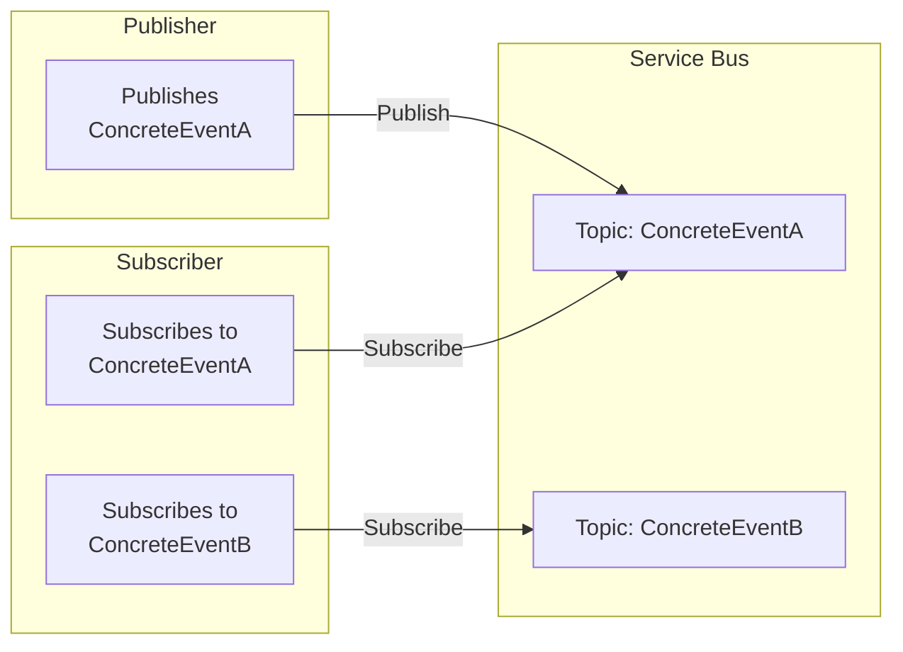
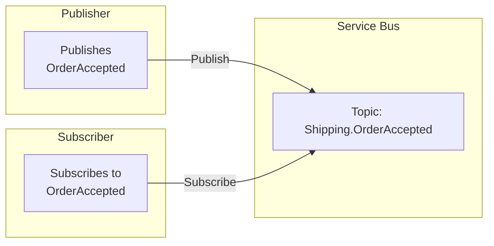
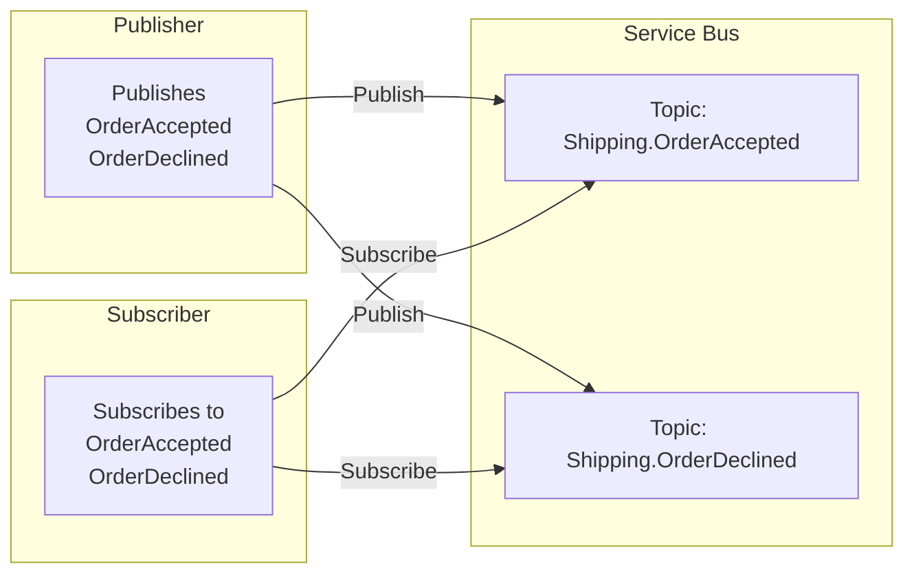

The **topic-per-event** topology dedicates one Azure Service Bus topic to each *concrete* event type. This design moves away from the single “bundle” topic and its SQL or Correlation filters, thereby reducing filter overhead and distributing messages more evenly across multiple topics.

In the topic-per-event topology:

1. **Publishers** send an event to a specific topic named after the most concrete event type.
2. **Subscribers** each create a *subscription* under each topic that matches the event(s) they are interested in.
3. Because there is no single, central “bundle” topic to hold all messages, each published event flows to its own dedicated topic.



This design can dramatically reduce filtering overhead, boosting performance and scalability. Distributing the messages across multiple topics avoids the single-topic bottleneck and mitigates the risk of hitting per-topic subscription and filter limits.

#### Quotas and limitations

A single Azure Service Bus topic [can hold up to 2,000 subscriptions, and each Premium namespace (with one messaging unit) can have up to 1,000 topics](https://learn.microsoft.com/en-us/azure/service-bus-messaging/service-bus-quotas).

- Subscriptions per topic: 2,000 (Standard/Premium).
- Topics per Premium namespace: 1,000 per messaging unit.
- Topic size: 5 GB quota per topic.

By allocating a separate topic for each concrete event type, the overall system can scale more effectively:

- Each topic is dedicated to one event type, so message consumption is isolated.
- Failure domain size is reduced from entire system to single topic so if any single topic hits its 5 GB quota, only that event type is affected.
- The maximum limit of 1,000 topics per messaging unit can comfortably support hundreds of event types, especially when factoring that not all event types are high-volume

> [!NOTE]
> If the system has numerous event types beyond these limits, an architectural review is recommended. Additional messaging units or other partitioning strategies may be required.

#### Subscription rule matching

In this topology, no SQL or Correlation filtering is required on the topic itself because messages in a topic are all of the same event type. Subscriptions can use a default “match-all” rule (`1=1`) or the default catch-all rule on each topic subscription.

Since there is only one event type per topic:

- Subscribers don’t need to manage large numbers of SQL or Correlation filters.
- Interface-based inheritance does require extra care if multiple interfaces or base classes are in play (see below).

> [!NOTE]
> With the mapping API it is possible to multiplex multiple (related) events over the same topic. This is only advisable when all the subscribers on the same topic are interested in all the (related) events on the topic. Otherwise it would be necessary to re-introduce SQL or corelation filter rules which can impact the throughput on the topic. By disabling auto-subscribe and removing the manage rights the transport assumes all required events arrive in the input queue due to "forwarding" on the subscriptions and would never try to update the existing rules which allows tweaking the runtime behavior to even more complex multiplexing needs.

##### Interface-based inheritance

A published message type can have multiple valid interfaces in its hierarchy representing a message type. For example:

```csharp
namespace Shipping;

interface IOrderAccepted : IEvent { }
interface IOrderStatusChanged : IEvent { }

class OrderAccepted : IOrderAccepted, IOrderStatusChanged { }
class OrderDeclined : IOrderAccepted, IOrderStatusChanged { }
```

For a handler `class OrderAcceptedHandler : IHandleMessages<OrderAccepted>` the subscription will look like:



If the subscriber is interested only in the interface `IOrderStatusChanged`, it will declare a handler `class OrderStatusChanged : IHandleMessages<IOrderStatusChanged>` and a mapping to the corresponding topics where the types implementing that contract are published to.

snippet: asb-interface-based-inheritance

When a publisher starts publishing `Shipping.OrderDeclined` the event is needs to be mapped

snippet: asb-interface-based-inheritance-declined

in order to opt into receiving the event into the subscriber's input queue and therefore requires a topology change.



##### Evolution of the message contract

As mentioned in [versioning of shared contracts](/nservicebus/messaging/sharing-contracts.md#versioning) and also shown in the examples above, NServiceBus uses the fully-qualified assembly name in the message header. [Evolving the message contract](/nservicebus/messaging/evolving-contracts.md) encourages creating entirely new contract types and then adding a version number to the original name. For example, when evolving `Shipping.OrderAccepted`, the publisher would create a new contract called `Shipping.OrderAcceptedV2`. When the publisher publishes `Shipping.OrderAcceptedV2` events, those would be published by default to `Shipping.OrderAcceptedV2` topic and therefore existing subscribers interested in the previous version would not receive those events. The following options are available:

- Publish both versions of the event on the publisher side to individual topics and setting up the subscribers where necessary to receive both _or_
- Multiplex all versions of the event to the same topic and filter the versions on the subscriber side within specialized filter rules

When publishing both versions of the event the subscribers need to opt-in to receiving those events by adding an explicit mapping:

snippet: asb-versioning-subscriber-mapping

When multiplexing all versions of the event to the same topic the following configuration needs to be added on the publisher side:

snippet: asb-versioning-publisher-mapping

and then a customization that promotes the full name to a property of the native message

snippet: asb-versioning-publisher-customization

which would allow adding either a correlation filter (preferred) or a SQL filter to filter out based on the promoted full name.

#### Handling overflow and scaling

In the single-topic model, a high volume of messages in one event type can degrade overall system performance for all events when the topic saturates. With topic-per-event, each event type has its own 5 GB quota and its own topic partitioning, providing a more localized failure domain

- Failure isolation: If one event type experiences a surge, only that topic can get throttled or fill its quota.
- Load distribution: The broker spreads load across multiple internal partitions, often improving throughput compared to a single large topic.

#### Observability

Monitoring is often simpler because each event type’s topic can be tracked with distinct metrics (message count, size, etc.). You can see which event types are experiencing spikes without filtering through a single large “bundle” topic

#### Topology highlights

|                                             |                               |
|---------------------------------------------|-------------------------------|
| Decoupled Publishers / Subscribers          |  yes                          |
| Polymorphic events support                  |  yes (mapping API)            |
| Event overflow protection                   |  yes (per-topic)              |
| Subscriber auto-scaling based on queue size |  yes (queues)                 |
| Reduced complexity for non-inherited events |  yes                          |
| Fine-grained resource usage / observability |  yes (each topic is distinct) |
