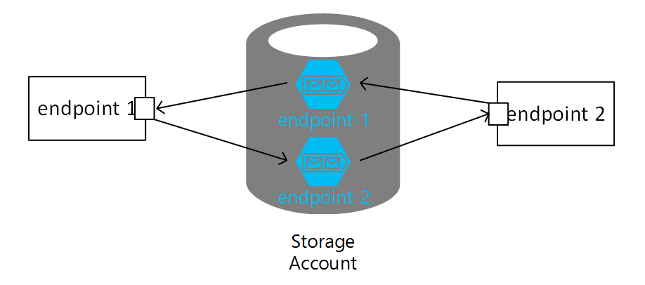
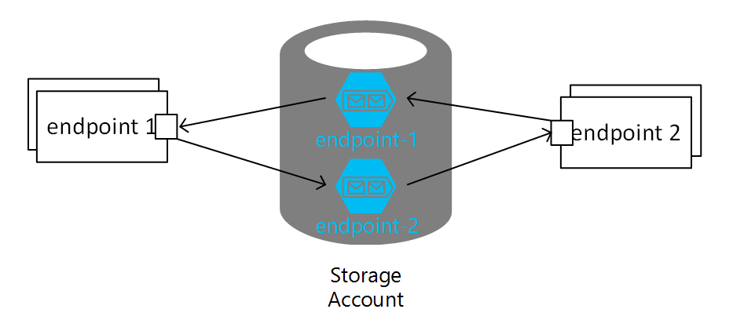
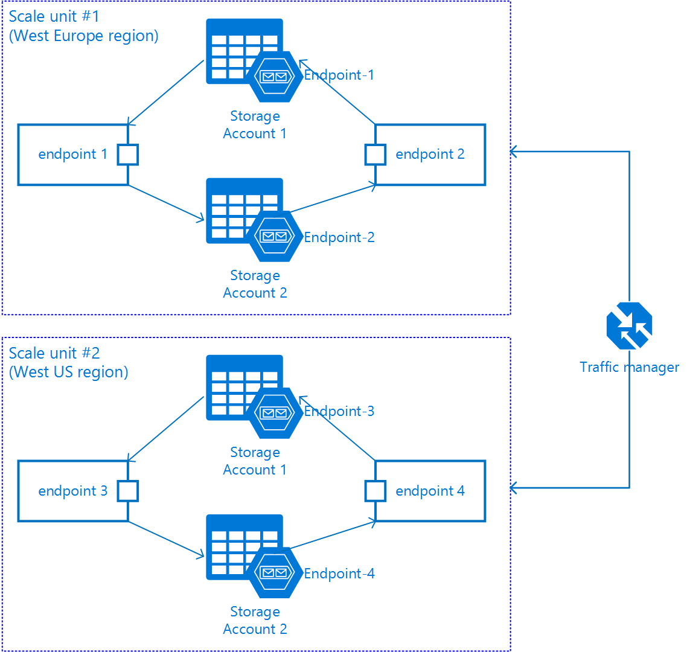

Endpoints running on the Azure Storage Queues transport using a single storage account are subject to potential throttling once the maximum number of concurrent requests to the storage account is hit. To overcome this limitation, multiple storage accounts can be used. To better understand scale out options with storage accounts, it is advised to understand [Azure storage account scalability and performance](https://docs.microsoft.com/en-us/azure/storage/common/storage-scalability-targets).

## Azure Storage Scalability and Performance

All messages in a queue are accessed via a single queue partition. A single queue is targeted to process up to 2,000 messages per second. Scalability targets for storage accounts can vary based on region with up to 20,000 messages per second (throughput achieved using an object size of 1KB). This is subject to change and should be periodically verified.

When the number of messages per second exceeds this quota, the storage service responds with an [HTTP 503 Server Busy message](https://docs.microsoft.com/en-us/azure/media-services/media-services-encoding-error-codes). This message indicates that the platform is throttling the queue. If a single storage account is unable to handle an application's request rate, an application could also leverage several different storage accounts using a storage account per endpoint. This ensures application scalability without saturating a single storage account. This also allows discrete control over queue processing, based on the sensitivity and priority of the messages that are handled by different endpoints. High priority endpoints could have more workers dedicated to them than low priority endpoints.

NOTE: Using multiple storage accounts is currently NOT compatible with ServiceControl. A [ServiceControl transport adapter](/servicecontrol/transport-adapter/), or multiple installations of ServiceControl, is required in order to leverage both.

## Scaling Out

A typical implementation uses a single storage account to send and receive messages. All endpoints are configured to receive and send messages using the same storage account.

When the number of instances of endpoints is increased, all endpoints continue reading and writing to the same storage account. Once the limit of 2,000 message/sec per queue or 20,000 message/sec per storage account is reached, Azure storage service throttles the message throughput.

While an endpoint can only read from a single Azure storage account, it can send messages to multiple storage accounts. This way one can set up a solution using multiple storage accounts where each endpoint uses its own Azure storage account, thereby increasing message throughput.

## Scale Units

Scaleout and splitting endpoints over multiple storage accounts works to a certain extent, but it cannot be applied infinitely while expecting throughput to increase linearly. Only so much throughput from a single resource or group of resources is possible.

A suitable techniques to overcome this problem includes resource partitioning and use of scale units. A scale unit is a set of resources with well determined throughput, where adding more resources to this unit does not result in increased throughput. When the scale unit is determined, to improve throughput, create more scale units. Scale units do not share resources.

An example of a partitioned application with a different number of deployed scale units is an application deployed in various regions.

NOTE: Use real Azure storage accounts. Do not use Azure storage emulator as it only supports a single fixed account named devstoreaccount1.".

## Cross namespace routing

NServiceBus allows to specify destination addresses using an `"endpoint@physicallocation"` when messages are dispatched, in various places such as the [Send](/nservicebus/messaging/send-a-message.md) and [Routing](/nservicebus/messaging/routing.md) API or the `MessageEndpointMappings`. In this notation the `physicallocation` section represents the location where the endpoint's infrastructure is hosted, such as a storage account.

Using this notation it is possible to route messages to any endpoint hosted in any storage account.

partial: message-endpoint-mapping

partial: routing-send-options-full-connectionstring

partial: aliases

partial: registered-endpoint
