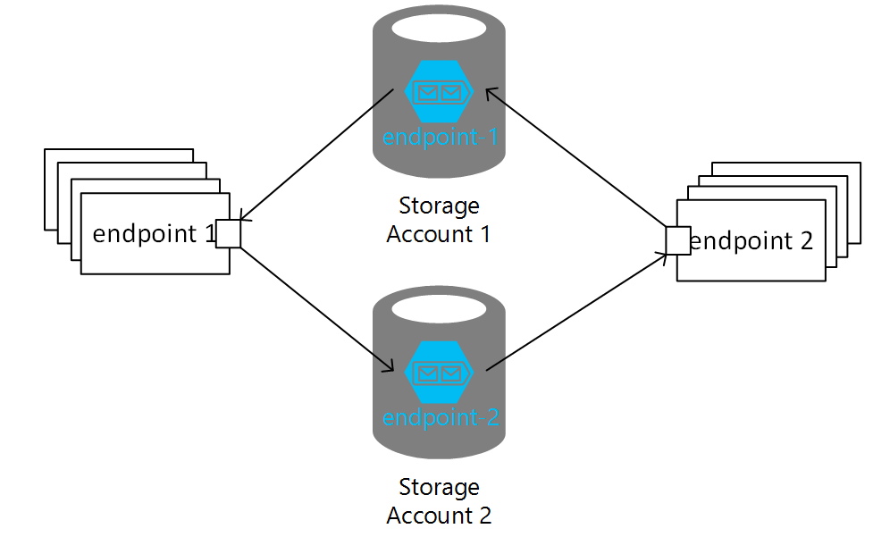

> [!IMPORTANT]
> Using multiple storage accounts is currently NOT compatible with ServiceControl. Either multiple installations of ServiceControl for monitoring or the [ServiceControl transport adapter](/servicecontrol/transport-adapter.md) are required for these situations.

It is common for systems running on Azure Storage Queues to depend on a single storage account. However, there is a potential for throttling issues once the maximum number of concurrent requests to the storage account is reached, causing the storage service to respond with an [HTTP 503 Server Busy message](https://docs.microsoft.com/en-us/azure/media-services/media-services-encoding-error-codes). Multiple storage accounts can be used to overcome this.

To determine whether your system may benefit from scaling out to multiple storage accounts, refer to the the Scale targets table in the Azure [Scalability and performance targets for Queue Storage](https://learn.microsoft.com/en-us/azure/storage/queues/scalability-targets) article, which define when throttling starts to occur.

For additional guidance on considerations when developing a system using Azure Storage Queues, see the article on [Performance and scalability checklist for Queue Storage](https://learn.microsoft.com/en-us/azure/storage/queues/storage-performance-checklist).

> [!NOTE]
> Use real Azure storage accounts. Do not use Azure storage emulator as it only supports a single fixed account named "devstoreaccount1".

> [!NOTE]
> There are limits to how much increasing the number of storage accounts increases throughput. Consider using [scale units as part of a comprehensive scaling strategy](https://learn.microsoft.com/en-us/azure/well-architected/performance-efficiency/scale-partition#choose-a-scaling-strategy) to address higher throughput and reliability needs.

## Configuring multiple storage accounts

Each additional storage account must be registered with the endpoint using a distinct name that acts as an alias for the accounts connection string(s).

Additionally, while it is not required, an the account used when initializing the `AzureStorageQueueTransport` should also be given an alias.

To enable sending from an endpoint using `account_A` to an endpoint using `account_B`, the endpoint on `account_B` needs to be registered on the account using the `AddEndpoint` method. Subscribing to publishing endpoints on other storage accounts uses an overload of the `AddEndpoint` method.

Putting it all together multiple account configuration looks like this:

snippet: AzureStorageQueuesAddingAdditionalAccounts

> [!NOTE]
> The examples above use different values for the default account aliases. Using the same name, such as `default`, to represent different storage accounts in different endpoints is highly discouraged as it introduces ambiguity in resolving addresses like `queue@default` and may cause issues when e.g. replying. In that case an address is interpreted as a reply address, the name `default` will point to a different connection string.

## Using send options

The `SendOptions` class provides ways to influence routing of a message. When using multiple storage accounts the `<endpoint>@<alias>` notation can be used with `SendOptions` methods that take an endpoint name to further specifiy the storage account.

When replying to a message, `SendOptions` can [specify an alternative endpoint](/nservicebus/messaging/send-a-message.md#influencing-the-reply-behavior) to send the reply to and endpoint on another storage account using the alias:

snippet: AzureStorageSendOptionsReply

Although registering endpoints to route messages is preferred, NServiceBus allows [overriding the default routing](/nservicebus/messaging/send-a-message.md#overriding-the-default-routing) using `SendOptions`, which also works with storage account aliases:

snippet: AzureStorageSendOptionsOverride