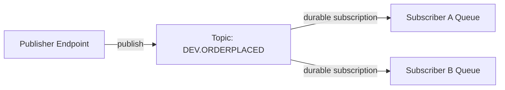
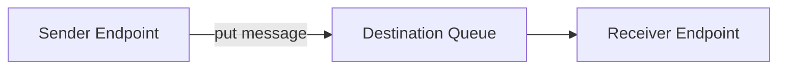
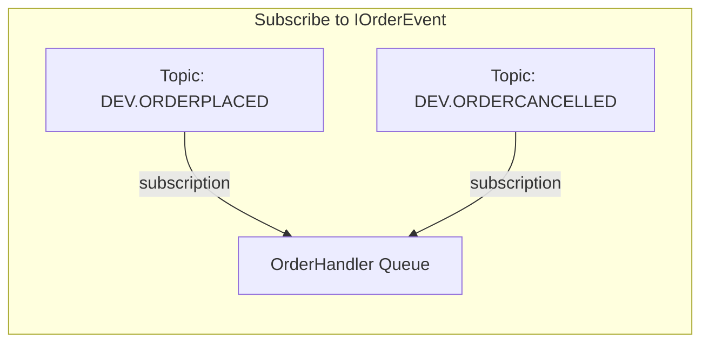

The IBM MQ transport implements publish/subscribe messaging using IBM MQ's native topic and subscription infrastructure. This means event subscriptions do not require NServiceBus persistence.

## Topic-per-event topology

The default topology creates one IBM MQ topic per concrete event type. When an event is published, the message is sent to the corresponding topic. Subscribers create durable subscriptions against the topic, with messages delivered to their input queue.



### Sending (unicast)

Commands are sent directly to the destination queue by name. No topics are involved.



### Publishing (multicast)

When an endpoint publishes an event, the message is published to the topic for that event type. IBM MQ delivers a copy to every endpoint with a durable subscription on that topic.

### Subscribing

When an endpoint subscribes to an event type, the transport creates a durable subscription linking the event's topic to the endpoint's input queue. When the endpoint starts, existing subscriptions are resumed automatically.

### Unsubscribing

When an endpoint unsubscribes from an event type, the durable subscription is deleted from the queue manager.

## Polymorphism

The transport supports polymorphic event subscriptions. When subscribing to a base class or interface, the transport discovers all concrete types that implement it and creates a subscription for each.

For example, given:

```csharp
public interface IOrderEvent { }
public class OrderPlaced : IOrderEvent { }
public class OrderCancelled : IOrderEvent { }
```

Subscribing to `IOrderEvent` creates subscriptions for both `OrderPlaced` and `OrderCancelled`:



> [!NOTE]
> For polymorphic subscriptions to work correctly, all concrete event types must be loadable in the subscribing endpoint's AppDomain. If a concrete type is defined in an assembly that is not referenced, the subscription for that type will not be created.

## Topic naming

Topics are named using a configurable strategy. The default uses a prefix (default: `DEV`) and the fully qualified type name:

|Concept|Example|
|:---|---|
|Topic name|`DEV.MYAPP.EVENTS.ORDERPLACED`|
|Topic string|`dev/myapp.events.orderplaced/`|
|Subscription name|`OrderService:dev/myapp.events.orderplaced/`|

> [!WARNING]
> IBM MQ topic names are limited to 48 characters. If the generated name exceeds this limit, the transport throws an exception at startup. See [topic naming configuration](connection-settings.md#topic-naming) for how to customize the naming strategy.
