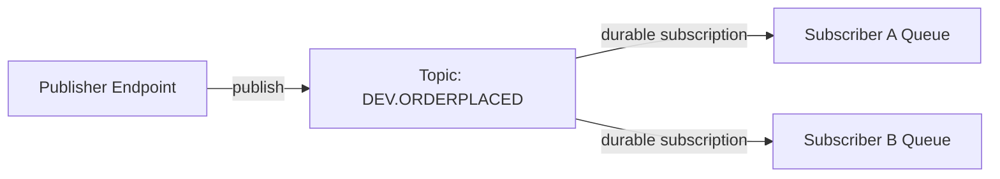
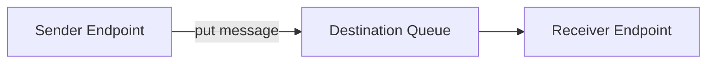
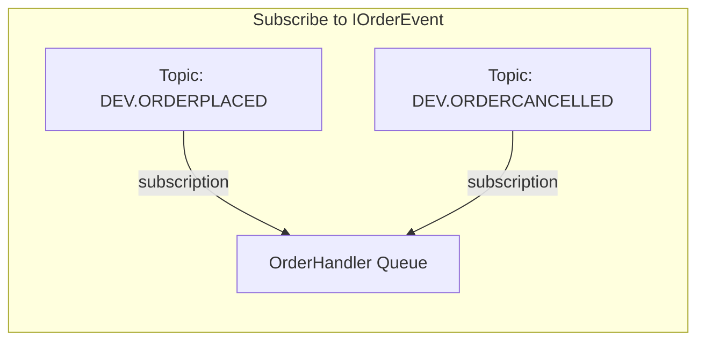

The IBM MQ transport implements publish/subscribe messaging using IBM MQ's native topic and subscription infrastructure. This means event subscriptions do not require NServiceBus persistence.

## Topic-per-event topology

The default topology creates one IBM MQ topic object per concrete event type. When an event is published, the message is sent to the corresponding topic. Subscribers create durable subscriptions against the topic, with messages delivered to their input queue.



### Sending (unicast)

Unicast messages (commands) are sent directly to the destination queue by name. No topics or exchanges are involved.



### Publishing (multicast)

When an endpoint publishes an event:

1. The transport resolves the IBM MQ topic for the event type using the configured `TopicNaming` strategy.
2. If infrastructure setup is enabled, the topic object is created if it does not already exist.
3. The message is published to the topic. IBM MQ delivers a copy to every durable subscription on that topic.

### Subscribing

When an endpoint subscribes to an event type:

1. The transport resolves all concrete types assignable to the subscribed type (supporting polymorphic subscriptions).
2. For each concrete type, a durable subscription is created linking the topic to the endpoint's input queue.
3. When the endpoint starts, existing subscriptions are resumed.

### Unsubscribing

When an endpoint unsubscribes from an event type, the corresponding durable subscriptions are deleted from the queue manager.

## Polymorphism

The transport supports polymorphic event subscriptions via subscriber-side fan-out. When subscribing to a base class or interface, the transport scans loaded assemblies for all concrete types that implement or extend the subscribed type and creates a separate durable subscription for each.

For example, given:

```csharp
public interface IOrderEvent { }
public class OrderPlaced : IOrderEvent { }
public class OrderCancelled : IOrderEvent { }
```

Subscribing to `IOrderEvent` creates durable subscriptions for both `OrderPlaced` and `OrderCancelled`. Each published event is delivered exactly once to the subscriber regardless of how many type hierarchies match.



> [!NOTE]
> For polymorphic subscriptions to work correctly, all concrete event types must be loadable in the subscribing endpoint's AppDomain. If a concrete type is defined in an assembly that is not referenced, the subscription for that type will not be created.

## Topic naming

Topics are named using a configurable `TopicNaming` strategy. The default strategy uses a prefix (default: `DEV`) and the fully qualified type name:

|Concept|Format|Example|
|:---|---|---|
|Topic name (admin object)|`PREFIX.FULL.TYPE.NAME` (uppercase)|`DEV.MYAPP.EVENTS.ORDERPLACED`|
|Topic string|`prefix/full.type.name/` (lowercase)|`dev/myapp.events.orderplaced/`|
|Subscription name|`endpointname:topicstring`|`OrderService:dev/myapp.events.orderplaced/`|

> [!WARNING]
> IBM MQ topic admin names are limited to 48 characters. If the generated topic name exceeds this limit, the transport throws an `InvalidOperationException` at startup. Override `TopicNaming.GenerateTopicName` to implement a shortening strategy.

### Custom topic naming

To customize how event types map to topic names, subclass `TopicNaming`:

```csharp
public class ShortTopicNaming() : TopicNaming("APP")
{
    public override string GenerateTopicName(Type eventType)
    {
        // Use only the type name, not the full namespace
        return $"APP.{eventType.Name}".ToUpperInvariant();
    }
}
```

Then configure the transport:

```csharp
var transport = new IbmMqTransport(options =>
{
    // ... connection settings ...
    options.TopicNaming = new ShortTopicNaming();
});
```

### Custom topic prefix

To change just the prefix without subclassing:

```csharp
var transport = new IbmMqTransport(options =>
{
    // ... connection settings ...
    options.TopicNaming = new TopicNaming("PROD");
});
```

This produces topic names like `PROD.MYAPP.EVENTS.ORDERPLACED` instead of the default `DEV.MYAPP.EVENTS.ORDERPLACED`.

## Topology configuration

The topology strategy is set via the `Topology` property:

```csharp
var transport = new IbmMqTransport(options =>
{
    // ... connection settings ...
    options.Topology = TopicTopology.TopicPerEvent();
});
```

The `TopicPerEvent` topology is currently the only built-in topology.
