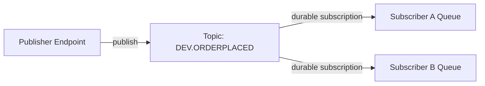
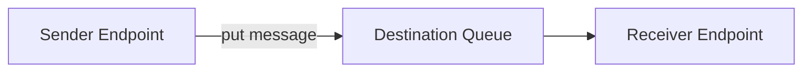
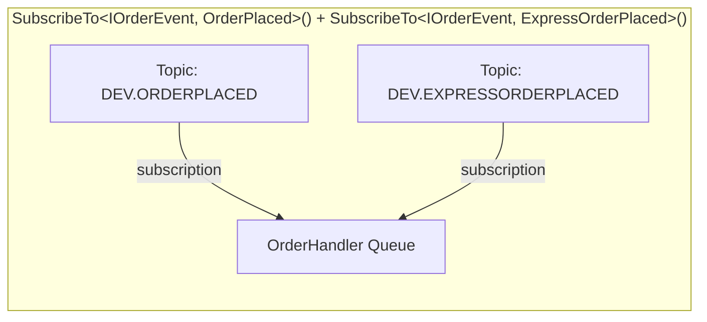

The IBM MQ transport implements publish/subscribe messaging using IBM MQ's native topic and subscription infrastructure. Event subscriptions do not require NServiceBus persistence.

## Topology

The transport uses one IBM MQ topic per concrete event type. When an event is published, the message is sent to the corresponding topic. Subscribers create durable subscriptions against the topic, with messages delivered to their input queue.


```mermaid
graph LR
    P[Publisher Endpoint] -->|publish| T[Topic: DEV.ORDERPLACED]
    T -->|durable subscription| S1[Subscriber A Queue]
    T -->|durable subscription| S2[Subscriber B Queue]
```

### Sending (unicast)

Commands are sent directly to the destination queue by name. No topics are involved.


```mermaid
graph LR
    S[Sender Endpoint] -->|put message| Q[Destination Queue]
    Q --> R[Receiver Endpoint]
```

### Publishing (multicast)

When an endpoint publishes an event, the message is published to the topic for that event type. IBM MQ delivers a copy to every endpoint with a durable subscription on that topic.

### Subscribing

When an endpoint subscribes to an event type, the transport creates a durable subscription linking the event's topic to the endpoint's input queue. When the endpoint starts, existing subscriptions are resumed automatically.

### Unsubscribing

When an endpoint unsubscribes from an event type, the durable subscription is deleted from the queue manager.

## IBM MQ resources

The transport uses three types of IBM MQ resources:

### Queues

Local queues (`QLOCAL`) are used for point-to-point messaging (commands) and as the destination for durable subscriptions (events). Each endpoint has an input queue named after the endpoint.

### Topic objects

An administrative topic object defines the mapping between a topic name (the admin object identifier, max 48 characters) and a topic string (the routing path used by publishers and subscribers). For example:

|Property|Example|
|:---|---|
|Topic name (admin object)|`DEV.MYAPP.EVENTS.ORDERPLACED`|
|Topic string|`dev/myapp.events.orderplaced/`|

Publishers open the topic by its topic string to publish messages. The admin object must exist on the queue manager before publishing.

### Subscriptions

A durable subscription links a topic string to a destination queue. When a message is published to a matching topic string, IBM MQ delivers a copy to the subscription's destination queue. Subscription names follow the format `EndpointName:topicstring/`, for example:

```
OrderService:dev/myapp.events.orderplaced/
```

## Resource creation

### When installers are enabled

When `EnableInstallers()` is called, the transport creates resources during endpoint startup:

|Resource|Created by|When|
|:---|---|---|
|Input queue|Both publisher and subscriber|At startup, for the endpoint's own queue|
|Error queue|Both publisher and subscriber|At startup|
|Send destination queues|Sender|At startup, for all configured send-only destinations|
|Topic objects|Publisher or subscriber|At startup, for all explicitly configured `PublishTo` and `SubscribeTo` topic routes|
|Durable subscriptions|Subscriber|At subscribe time, when the endpoint subscribes to an event type|

### When installers are not enabled

The transport validates that all explicitly configured topics exist on the queue manager. If any are missing, startup fails with an `InvalidOperationException` listing the missing topics. Queues and subscriptions must be pre-created using the [command-line tool](operations-scripting.md) or native IBM MQ administration.

See [security and permissions](security.md) for the IBM MQ authorities required for each operation.

## Polymorphism

IBM MQ uses a topic-per-event model: each concrete event type is published to its own topic. Subscribing to a base class or interface does **not** automatically subscribe to topics for derived types. Without explicit configuration, a handler for `IOrderEvent` would only receive messages published directly to the `IOrderEvent` topic, missing messages published as `OrderPlaced` or `OrderCancelled`.

To prevent accidental under-subscription, the transport throws an `InvalidOperationException` at startup when subscribing to a type that has known descendants in the loaded assemblies. This guard is controlled by `ThrowOnPolymorphicSubscription` (default: `true`).

### Explicit subscription routing

Use `SubscribeTo` to map a subscribed event type to the concrete types' topics that should be received:

snippet: ibmmq-explicit-subscribe-routes

This creates subscriptions on both the `OrderPlaced` and `ExpressOrderPlaced` topics, delivering both to the subscriber's input queue:


```mermaid
graph LR
    subgraph "SubscribeTo&lt;IOrderEvent, OrderPlaced&gt;() + SubscribeTo&lt;IOrderEvent, ExpressOrderPlaced&gt;()"
        T1[Topic: DEV.ORDERPLACED] -->|subscription| Q[OrderHandler Queue]
        T2[Topic: DEV.EXPRESSORDERPLACED] -->|subscription| Q
    end
```

Alternatively, specify topic strings directly when they don't follow the naming convention:

snippet: ibmmq-explicit-subscribe-topic-string

### Explicit publish routing

Use `PublishTo` to override the topic for a published event type. This is useful when integrating with existing topic structures:

snippet: ibmmq-explicit-publish-routes

### Disabling the polymorphic subscription guard

If a subscriber intentionally subscribes to only one type's topic (without receiving descendants), disable the guard:

snippet: ibmmq-disable-polymorphic-guard

> [!WARNING]
> Disabling this guard means subscribing to a base type will silently create a subscription only for that exact type's topic. Messages published as derived types will not be received unless explicit routes are configured.

### Deployment recommendations for polymorphic event hierarchies

When using polymorphic events, distribute event types in dedicated, independently versioned packages. This allows subscribers to reference new concrete types and update their subscriptions before the publisher begins publishing those events.

Ensure that the deployment pipeline runs all subscriber subscription steps **before** starting the new version of the publisher. If a publisher starts publishing a new concrete event type before subscribers have created their subscriptions, those messages will be lost because no durable subscription exists to route them to a queue.

A typical deployment order:

1. Deploy the updated message contracts package containing the new event type.
2. Update subscriber endpoint configurations to add `SubscribeTo` routes for the new type.
3. Run the [command-line tool](operations-scripting.md) to create subscriptions for all subscribers, or deploy and start all subscribing endpoints so they create their durable subscriptions.
4. Deploy and start the publishing endpoint.

## Topic naming

Topics are named using a configurable strategy. The prefix defaults to `DEV` and the fully qualified type name determines the rest:

|Concept|Example|
|:---|---|
|Topic name|`DEV.MYAPP.EVENTS.ORDERPLACED`|
|Topic string|`dev/myapp.events.orderplaced/`|
|Subscription name|`OrderService:dev/myapp.events.orderplaced/`|

> [!WARNING]
> IBM MQ topic names are limited to 48 characters. If the generated name exceeds this limit, the transport throws an exception at startup. See [topic naming configuration](connection-settings.md#topic-naming) for how to customize the naming strategy.
