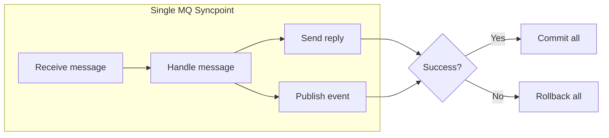

The IBM MQ transport supports the following [transport transaction modes](/transports/transactions.md):

- Transport transaction - Sends atomic with receive
- Transport transaction - Receive only (default)
- Unreliable (transactions disabled)

`TransactionScope` mode is not supported because the IBM MQ .NET client does not participate in System.Transactions distributed transactions.

> [!NOTE]
> `Exactly once` message processing without distributed transactions can be achieved with any transport using the [Outbox](/nservicebus/outbox/) feature.

## Sends atomic with receive

In `SendsAtomicWithReceive` mode, the message receive and all send/publish operations are performed under a single IBM MQ syncpoint. Either all operations succeed together or they all roll back.

This is achieved by sharing the same `MQQueueManager` connection between the receiver and the dispatcher. Messages are put with `MQPMO_SYNCPOINT`, and the syncpoint is committed only when processing completes successfully.



```csharp
var endpointConfiguration = new EndpointConfiguration("MyEndpoint");
var transport = new IbmMqTransport(options =>
{
    // ... connection settings ...
});
transport.TransportTransactionMode = TransportTransactionMode.SendsAtomicWithReceive;
endpointConfiguration.UseTransport(transport);
```

> [!NOTE]
> Messages sent outside of a handler (e.g., via `IMessageSession`) are dispatched using an independent connection and are not included in the syncpoint.

## Receive only

In `ReceiveOnly` mode, each message is received under its own syncpoint. Successfully processed messages are committed; failed messages are backed out and returned to the queue. Send and publish operations use a separate connection and are not part of the receive transaction.

This is the default transaction mode.

```csharp
var endpointConfiguration = new EndpointConfiguration("MyEndpoint");
var transport = new IbmMqTransport(options =>
{
    // ... connection settings ...
});
transport.TransportTransactionMode = TransportTransactionMode.ReceiveOnly;
endpointConfiguration.UseTransport(transport);
```

> [!WARNING]
> If the connection to the queue manager is lost after a message has been successfully processed but before the commit, the queue manager will back out the message and it will be redelivered. This can result in the endpoint processing the same message multiple times. Use the [Outbox](/nservicebus/outbox/) feature to guarantee exactly-once processing.

## Unreliable (transactions disabled)

In `None` mode, messages are consumed without any transactional guarantees. If processing fails, the message is lost. Send and publish operations are also non-transactional.

```csharp
var endpointConfiguration = new EndpointConfiguration("MyEndpoint");
var transport = new IbmMqTransport(options =>
{
    // ... connection settings ...
});
transport.TransportTransactionMode = TransportTransactionMode.None;
endpointConfiguration.UseTransport(transport);
```

> [!CAUTION]
> This mode should only be used when message loss is acceptable, such as for non-critical telemetry or logging messages.
