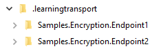
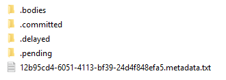

The Learning Transport stores all messages on disk as individual files. By default, the storage location is a `.learningtransport` folder that exists at the solution root. All files are textual and can be opened with any text editor to inspect their contents.

Each endpoint in a project will have a subfolder in the `.learningtransport` folder.

Within the endpoint folder, each message will be represented by a `<GUID>.metadata.txt` file that will exist at the root of the folder. This file contains metadata, such as the message headers, for the message. 

The contents of the message can be found in the `.bodies` folder in a `<GUID>.body.txt` file.
