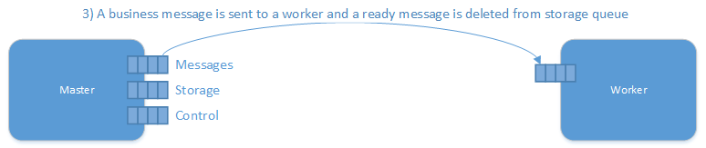
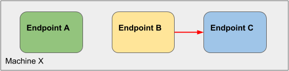
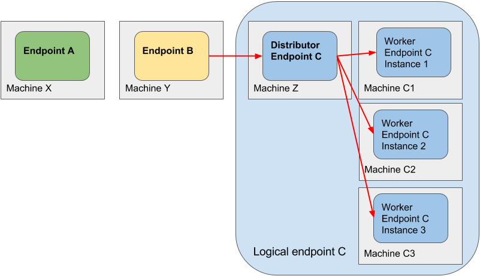
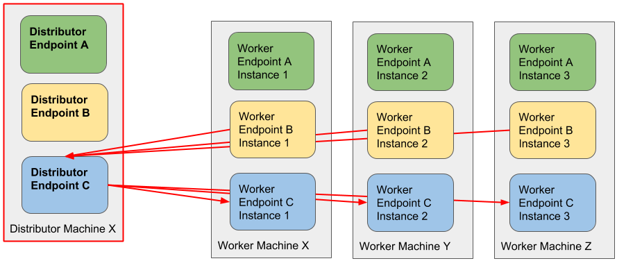
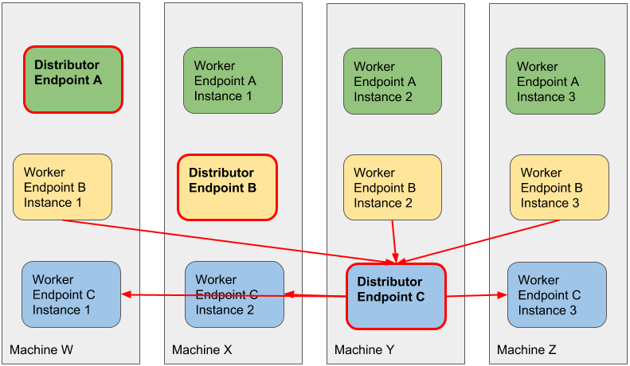
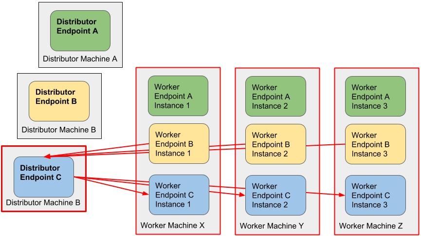
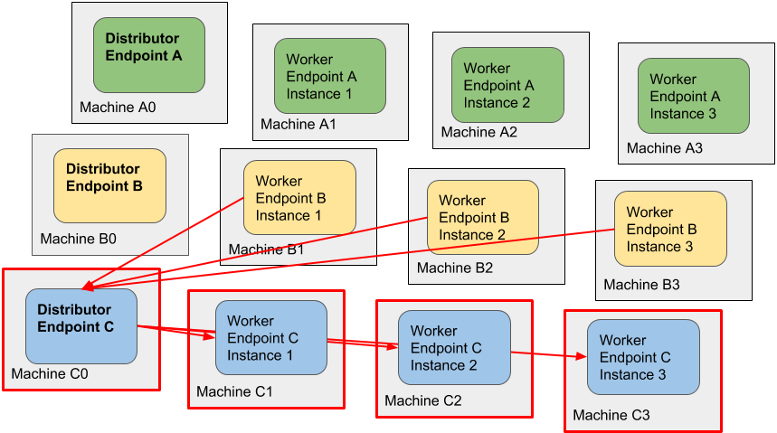

WARNING: The distributor for MSMQ is no longer supported starting from NServiceBus Versions 7 and above. It is recommended to transition to the [Sender Side Distribution](/transports/msmq/sender-side-distribution.md) model instead. NServiceBus Version 6 endpoints support worker mode as a legacy feature to help with this transition. For more details, see the [migration strategy](/nservicebus/upgrades/5to6/distributor.md).

The NServiceBus Distributor is similar in behavior to standard [load balancers](https://en.wikipedia.org/wiki/Load_balancing_%28computing%29). It is the key to transparently scaling out message processing over many machines.

As a standard NServiceBus process, the Distributor maintains all the fault-tolerant and performance characteristics of NServiceBus but is designed to never overwhelm any of the worker nodes.

WARNING: Keep in mind that the Distributor is designed for *load balancing within a single site* and not between different sites. For information on using NServiceBus across multiple physical sites, see [the gateway](/nservicebus/gateway/multi-site-deployments.md).

## How the Distributor works

Worker nodes send messages to the distributor process, indicating when they are ready to accept more work. These messages arrive at the distributor via a separate 'control' queue:

Then the distributor creates a ready message per available thread:

The distributor stores this information. When a message arrives at the distributor, it uses previously stored information to find a free worker node and sends the message to it. If no worker nodes are free, the distributor process waits before repeating the previous step.

All pending work stays in the distributor process' queue (rather than building up in each of the workers' queues), giving visibility of how long messages are waiting. This is important for complying with time-based service level agreements (SLAs).

For more information on monitoring, see [Performance Counters](/monitoring/metrics/performance-counters.md).

For more information about Pub/Sub in a Distributor scenario see the [Distributor and Publish-Subscribe](/transports/msmq/distributor/publish-subscribe.md) article.

## Performance

For each message being processed, the distributor process performs a few additional operations: it receives a ready message from a Worker, sends the work message to the Worker and receives a ready message post processing. That means that using Distributor introduces a certain processing overhead, that is independent of how much work is done. Therefore the Distributor is more suitable for relatively long running units of work (high I/O like http calls, writing to disk) as opposed to very short-lived units of work (a quick read from the database and dispatching a message using `Bus.Send` or  `Bus.Publish`).

To get a sense of the expected performance take the maximum MSMQ throughput on a given machine (e.g. by running NServiceBus with `NOOP` handlers) and divide it by 4.

If scaling out small units of work is required, consider splitting the handlers into smaller vertical slices of functionality and deploying them to dedicated endpoints.

WARNING: The default concurrency of the distributor process is set to 1. That means the messages are processed sequentially. Make sure that the [**MaximumConcurrencyLevel** has been increased in the configuration](/nservicebus/operations/tuning.md#tuning-concurrency) on the endpoint that runs distributor process. A good rule of thumb to set this value to 2-4 times the amount of cores of a given machine. While fine-tuning, inspect disk, CPU and network resources until one of these reaches its maximum capacity.

Increasing the concurrency on the workers might not lead to increased performance if the executed code is multi-threaded, e.g. if the worker does CPU-intensive work using all the available cores such as video encoding.

## High availability

If the distributor process goes down, the worker nodes do not receive any messages, even though they remain running. That is why it is important to [ensure that the distributor is running in a high availability configuration](deploying-to-a-cluster.md).

## Risk on resource I/O congestion

The distributor process is constrained by hardware parameters such as disk and network I/O bandwidth. If a single endpoint does not fully utilize either of these resources, then it is possible to host multiple distributor processes on a single server.

Monitor servers using standard infrastructure monitoring tools to verify if hardware isn't becoming a bottleneck.

## Deployment configurations

Typically, in the beginning the system is deployed to a single server only. When its capacity isn't enough then this server is mirrored/cloned to create a farm of servers and the distributor is put in front to act as a load balancer. However, in case of distributor this usually isn't the best way to scale-out.

This section describes available options and covers their pros and cons.

In most environments, multiple endpoints are hosted on a single server: 

If one machine doesn't have enough capacity the solution can be scaled out by moving endpoints to separate servers. Even if there is any risk of congestion, it is then evenly distributed:

Eventually, the solution will reach the limits of what a single machine can do, even after scaling up. The next step is selectively scale out certain endpoints. The distributor acts like a load balancer, all messages sent to *Endpoint C* will first be send to *Machine Z* and forwarded to workers according to their availability. 

Often the load is not even across all endpoints, so performance problems are related to just a few of the endpoints. There is no need to scale out all endpoints, only those endpoints that need it:

#### One distributor machine

This is the most common setup for systems using the distributor. There is a single distributor machine that hosts all the distributor endpoints:

Pros and cons:

- Deployment configuration is simple, all machines are configured in the same way.
- The routing configuration is simple, as routes are the same for all servers and message mappings.
- Every single message will always flow via the *Distributor machine*, this server is now a **single point of failure**. For this reason it is really important to have this configuration deployed on a highly available environment with redundant storage.
- When all endpoints are mirrored, the endpoints that have lower load can be idle and unnecessarily waste RAM resources.
- If all machines have similar parameters, then resources won't be optimally utilized, i.e. either the workers will be idle while the distributor is very busy or vice versa.
- The deployment is fairly static and there is no room for tuning.

Note: This setup is often used in environments that are not heavily using virtualization and common when using clustering to achieve high availability.

#### Balanced distributor setup

To mitigate most issues related to network congestion, the potential solution is to deploy distributors across the available servers together with workers:

This results in the network traffic to be balanced across available servers. There is not a single point of failure and this model becomes more appealing with more servers, especially if there are more servers than workers.

Pros and cons:

- There's no single point of failure.
- The distributor nodes still are not fully isolated which can result in congestion issues.
- The routing configuration is a bit more complex than in the setup with a single distributor machine, but can still be managed manually.
- There's no need to have the same amount of workers and distributors on each machine, the number of endpoints/processes can be adjusted to optimally utilize the capacity of the hardware.

#### Single distributor per machine

In this setup every distributor endpoint is deployed to a separate machine:

Pros and cons:

- Every distributor endpoint is isolated.
- There is not a single point of failure.
- All endpoints can be scaled out.
- The routing configuration is a bit more complex than in previous setups, but can still be managed manually.
- Can suffer from throughput limitations. In that case [sender side distribution](../sender-side-distribution.md) might be an alternative.

Note: This setup is more common in environments that use virtualization.

#### Machine per distributor and per worker

In this setup every distributor and worker endpoint is deployed to a separate machine:

Pros and cons:

- Every machine works in complete isolation.
- Every machine can have different parameters, appropriate for the given endpoint.
- Some endpoints do not require the distributor.
- The routing configuration is really complex, it is not suitable to store routes in application configuration files.
- Can still suffer from throughput limitations. In that case [sender side distribution](../sender-side-distribution.md) might be an alternative.

Note: This setup is especially appropriate for virtualized environments and in the cloud when using the IaaS model.
