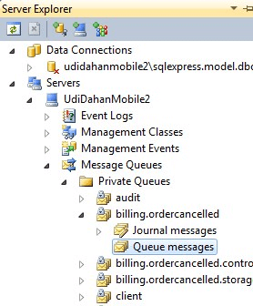
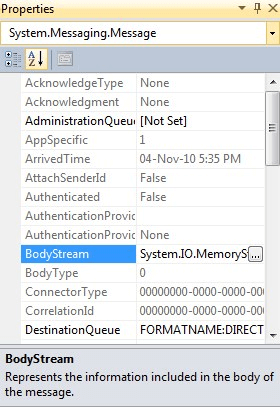
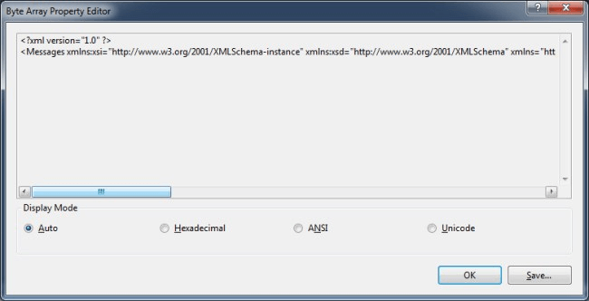
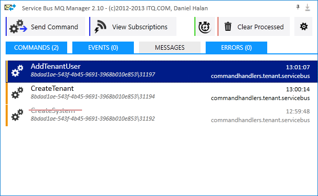

There are several ways to view content in MSMQ, both free and paid.

### Visual Studio

The queues on the local machine can be listed using Server Explorer in Visual Studio:



If there is a message in one of the queues, select it and view the properties of the message in the property panel (press <kbd>F4</kbd> to open) in Visual Studio:



The BodyStream property shows the contents of the message:




### Windows native tools

The MSMQ MMC snap-in can be used to manage queues.

Use one of the following based on Windows operating system version:

```
Start > Run > compmgmt.msc > Features > Message Queuing
```

or

```
Start > Run > compmgmt.msc > Services and Applications > Message Queuing
```


### QueueExplorer

QueueExplorer is a commercial third-party product for managing MSMQ.

http://www.cogin.com/mq/

> QueueExplorer can do much more than the built-in management console, such as copy, move or delete messages, save and load, stress test, and view and edit full message bodies (with special support for .NET serialized objects).


### Mqueue Viewer

Mqueue Viewer is a fast and free tool to manage MSMQ messages and queues. More advanced features are available in the paid version.

https://www.mqueue.net/

> Mqueue Viewer is a fast and simple tool to manage MSMQ queues, view, edit, add, delete messages. It works with multiple machines/servers.


### Service Bus MQ Manager

A free application to view and manage MSMQ messages.

https://github.com/danielHalan/ServiceBusMQManager


