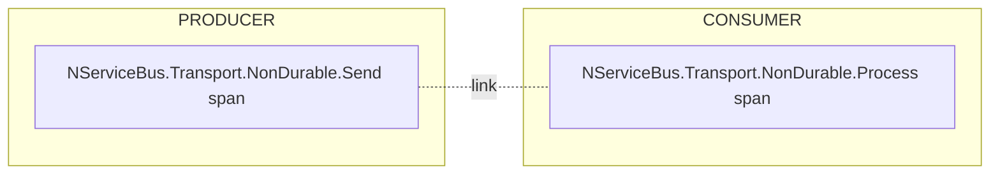
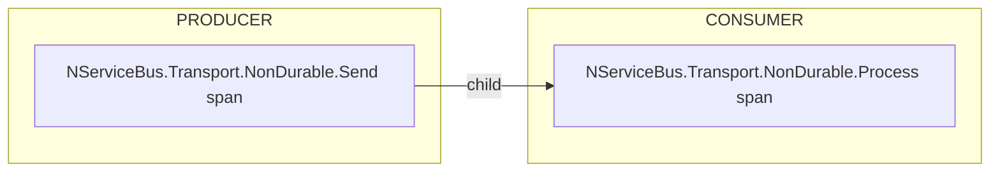

The transport emits OpenTelemetry activities under the source `NServiceBus.Transport.NonDurable`.

| Activity name | Kind | Description |
|:---|:---|:---|
| `NServiceBus.Transport.NonDurable.Send` | Producer | A message is dispatched to a destination queue. |
| `NServiceBus.Transport.NonDurable.Schedule` | Producer | A delayed delivery message is scheduled. |
| `NServiceBus.Transport.NonDurable.Process` | Consumer | A message is received and processed. |

## Span correlation

The `Process` span is a root span. It correlates to the producer span that created the message through an [activity link](https://opentelemetry.io/docs/concepts/signals/traces/), following the [OpenTelemetry messaging semantic conventions](https://opentelemetry.io/docs/specs/semconv/messaging/). The producer span is parented to the handler activity that performed the send.

Keeping the consumer side of each hop a root span prevents trace depth from growing with every hop in self-feeding and saga message chains. Each message's processing is a bounded sub-trace, with causal linkage preserved via the link.

With [inline execution](/transports/non-durable/#inline-execution) enabled, a message processed synchronously within the send uses the producer span as its parent. The `Process` span is a child of the `Send` span and carries no links, mirroring the synchronous call stack.

Delayed delivery is processed asynchronously by the message pump even when inline execution is enabled. Delayed messages therefore keep the root span and link correlation described above.

Tags include `messaging.system = nondurable`, `messaging.destination.name`, `messaging.operation.name`, `messaging.message.id`, and `messaging.message.conversation_id`.
