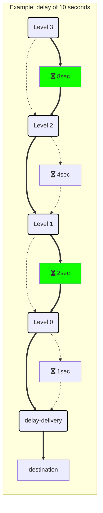

In versions 4.3 and above, the RabbitMQ transport no longer relies on the [timeout manager](/nservicebus/messaging/timeout-manager.md) to implement [delayed delivery](/nservicebus/messaging/delayed-delivery.md). Instead, the transport creates infrastructure inside the broker which can delay messages using native RabbitMQ features.


## How it works

When an endpoint is started, the transport declares a set of topic exchanges, queues, and bindings that work together to provide the necessary infrastructure to support delayed messages. Exchanges and queues are grouped to provide 28 delay levels. There is one final delivery exchange in addition to the delay-level exchanges. When a message needs to be delayed, the value of the desired delay is first converted to seconds. The binary representation of this value is used as part of the routing key when the message is sent to the delay-level exchanges. The full routing key has the following format:

```
N.N.N.N.N.N.N.N.N.N.N.N.N.N.N.N.N.N.N.N.N.N.N.N.N.N.N.N.destination
```

Where `N` is either `0` or `1`, representing the delay value in binary, and `destination` is the name of endpoint the delayed message will be sent to.

As an example, a delay of 10 seconds (`1010` in binary) on a message bound for the `destination` queue is encoded with a routing key of:

```
0.0.0.0.0.0.0.0.0.0.0.0.0.0.0.0.0.0.0.0.0.0.0.0.1.0.1.0.destination
```


### Delay levels

Each exchange/queue pair that makes up a level represents one bit of the total delay value. By having 28 of these levels, corresponding to `2^27` through `2^0`, the delay infrastructure can delay a message for any value that can be represented by a 28-bit number.

NOTE: With 28 total levels, the maximum delay value is 268,435,455 seconds, or about 8.5 years.

A delay level is created by declaring a topic exchange that is bound to a queue with a routing key of `1`, and to the exchange corresponding to `level - 1` with a routing key of `0`. The queue for the delay level is declared with an [`x-message-ttl`](https://www.rabbitmq.com/ttl.html) value corresponding to `2^level` seconds. The queue is also declared with an [`x-dead-letter-exchange`](https://www.rabbitmq.com/dlx.html) value corresponding to the `level - 1` exchange, so that when a message in the queue expires, it will be routed to the `level - 1` exchange.

The delay levels are connected in this manner, from highest (27) to lowest (0). Each delay level's routing key adds wildcards as needed so that each routing key is looking at the portion of the message's routing key that corresponds to its delay level.

The following diagram illustrates the relationships between the exchanges and queues in the delay infrastructure, which are connected by bindings and `x-dead-letter-exchange` values. It's important to note the wildcard rules for RabbitMQ binding expressions, where *word* describes a dot-delimited segment:

* `*` substitutes for exactly one word
* `#` substitutes for 0 or more words

<style>
.edgeLabel {
    font-family: Consolas, Courier New, monospace;
}
</style>

```mermaid

graph TD

subgraph Delay-Level Exchanges, Queues, Bindings, and TTLs

exchange27(Exchange: nsb.delay-level-27)
queue27[Queue: nsb.delay-level-27]
exchange26(Exchange: nsb.delay-level-26)
queue26[Queue: nsb.delay-level-26]
exchange25(Exchange: nsb.delay-level-25)

hiddenExchanges(Not Shown: nsb.delay-level-24 through nsb.delay-level-2)

exchange1(Exchange: nsb.delay-level-01)
queue1(Queue: nsb.delay-level-01)
exchange0(Exchange: nsb.delay-level-00)
queue0(Queue: nsb.delay-level-00)
delivery(Exchange: nsb.delay-delivery)

exchange27 -->|"Binding: 1.#<br/>(No * wildcards)"| queue27
exchange27 -->|"Binding: 0.#<br/>(No * wildcards)"| exchange26
queue27 -->|"TTL: 2^27s ≈ 4.25 years"| exchange26

exchange26 -->|"Binding: *.1.#<br/>(1 * wildcard)"| queue26
exchange26 -->|"Binding: *.0.#<br/>(1 * wildcard)"| exchange25
queue26 -->|"TTL: 2^26s ≈ 2.13 years"| exchange25

exchange25 -.-> hiddenExchanges
hiddenExchanges -.-> exchange1

exchange1 -->|"Binding:<br/>*.*.*.*.*.*.*.*.*.*.*.*.*.*.*.*.*.*.*.*.*.*.*.*.*.*.1.#<br/>(26 * wildcards)"| queue1
exchange1 -->|"Binding:<br/>*.*.*.*.*.*.*.*.*.*.*.*.*.*.*.*.*.*.*.*.*.*.*.*.*.*.0.#<br/>(26 * wildcards)"| exchange0
queue1 -->|TTL: 2^1s = 2 seconds| exchange0

exchange0 -->|"Binding:<br/>*.*.*.*.*.*.*.*.*.*.*.*.*.*.*.*.*.*.*.*.*.*.*.*.*.*.*.1.#<br/>(27 * wildcards)"| queue0
exchange0 -->|"Binding:<br/>*.*.*.*.*.*.*.*.*.*.*.*.*.*.*.*.*.*.*.*.*.*.*.*.*.*.*.0.#<br/>(27 * wildcards)"| delivery
queue0 -->|TTL: 2^0s = 1 second| delivery

classDef exchangeClass stroke:#000000,stroke-width:2px,font-weight:bold;
class exchange27,exchange26,exchange25,exchange1,exchange0,delivery exchangeClass

classDef hiddenExchanges font-style:italic,fill:transparent,stroke:transparent;
class hiddenExchanges hiddenExchanges

end
```

To avoid unnecessary traversal through the delay infrastructure, the message is published to the first applicable exchange by identifying the first level that will route to a queue, or in other words, the first `1` in the routing key. In the 10-second example (binary `1010`), the message would first be published to the `nsb.delay-level-03` exchange, and all of that exchange's bindings are evaluated. Only two bindings exist for the exchange, so:

* If the value is a `1`, the exchange will route the message to the `nsb.delay-level-03` queue, where it will wait until the TTL expires (2^3 seconds) before being forwarded to the `nsb-delay-level-02` exchange.
* If the value is a `0`, the exchange will route the message to the `nsb.delay-level-02` exchange.


### Delivery

At the end of this process, the message is routed to the `nsb.delay-delivery` exchange. It is at this final step where the message destination is evaluated to determine where the message should be routed to.

Every endpoint that can receive delayed messages will create bindings like `#.EndpointName` to this exchange to control final routing. The exact process depends upon the [routing topology](routing-topology.md) in use. These bindings match any combination of delay values, but only the binding for the correct destination endpoint will match, resulting in the message being delivered only to the correct endpoint.


### Example

This example illustrates the delay mentioned above, showing a message sent with a delay of 10 seconds to an endpoint called `destination`. For brevity, the number of delay levels has been reduced to 4, so the routing key for this message is `1.0.1.0.destination`, and it is published to the Level 3 exchange:

|Exchange         |Routing Key Segment    |Routing Value|Routed To        |Delay in Queue|Dead-letter To|
|-----------------|-----------------------|:-----------:|-----------------|:-------:|:---------------:|
|Level 03         |**1**.0.1.0.destination|     `1`     |Level 03 Queue   |8 seconds|Level 02 Exchange|
|Level 02         |1.**0**.1.0.destination|     `0`     |Level 01 Exchange|    -    |        -        |
|Level 01         |1.0.**1**.0.destination|     `1`     |Level 01 Queue   |2 seconds|Level 00 Exchange|
|Level 00         |1.0.1.**0**.destination|     `0`     |Delivery Exchange|    -    |        -        |
|Delivery Exchange|1.0.1.0.**destination**|`destination`|`destination`    |    -    |        -        |

This example can be visualized using the following



## Backwards compatibility

It is safe to operate a combination of native-delay and non-native-delay endpoints at the same time. Native endpoints can send delayed messages to endpoints that are not yet aware of the native delay infrastructure. Native endpoints can continue to receive delayed messages from non-native endpoints as well.

partial: timeout-manager

## Migrating timeouts to Native Delayed Delivery

In order to migrate timeouts to the native-delay delivery implementation, the [migration tool](/nservicebus/tools/migrate-to-native-delivery.md) can be used.
