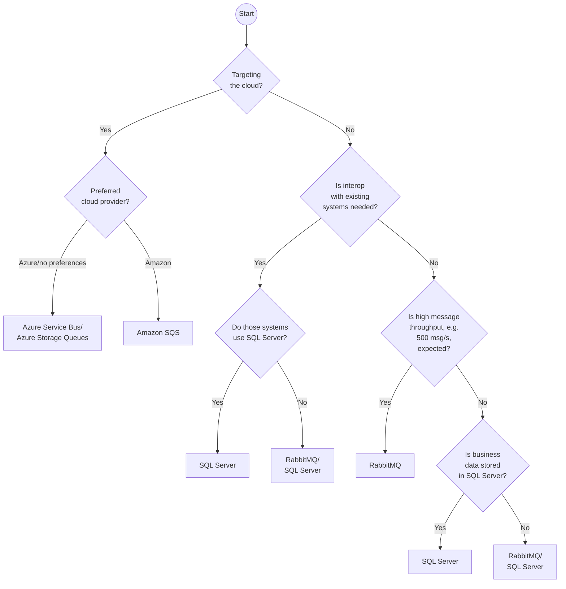

This document provides guidance for deciding which [transport](/transports) may best suit a specific scenario.

This guide does not provide definitive answers for all scenarios. Every decision has trade-offs, some of which are described in the documentation for each transport. If it is unclear what the best choice is, or there are very specific constraints, contact [Particular Software](https://particular.net/contactus).

## Broker versus federated

The queueing technologies behind most transports take the form of a central message broker that handles physical message routing. The transports which use these queueing technologies rely on the broker to send and receive messages. It is important that the broker is highly available. If it cannot be reached, the system will be unable to send or receive messages. Note that, although a broker is involved, this is still a "bus" architecture and not a "broker" architecture. See [bus versus broker architecture](/nservicebus/architecture) for a discussion on the distinction.

Other queueing technologies are "federated" and deployed on every machine that sends or receives messages. The only supported transport which uses a federated queueing technology is [MSMQ](msmq). The MSMQ transport uses a "store and forward" delivery strategy. When a message is sent, it is stored locally and delivered to the remote machine only when that machine is reachable. That means messages can be sent even if the remote machine is unreachable, although they won’t be delivered until the remote machine is reachable.

## Supported transports

Each of the following sections describes the advantages and disadvantages of each supported transport and some reasons for choosing that transport.

* [Learning Transport](#learning)
* [Azure Service Bus](#azure-service-bus)
* [Azure Storage Queues](#azure-storage-queues)
* [SQL Server](#sql-server)
* [RabbitMQ](#rabbitmq)
* [Amazon SQS](#amazon-sqs)
* [MSMQ](#msmq)

For transports which use a cloud hosted queueing technology, the quality of the network connection between the applications and cloud provider is important. If the connection is problematic, it may not be possible to send messages. For example, this may result in problems capturing data from a user interface. If applications are running the same data centre as the queueing technology, this risk is mitigated.

This is a basic flowchart for selecting a supported transport. Where more than one transport is listed, refer to the sections below. They describe the advantages and disadvantages of each transport in more detail.

## Learning

The learning transport should not be used in production.

This transport is intended for learning how to work with NServiceBus. It does not require the installation of a queueing technology and works "out of the box". This is done by storing sent and received messages as files on disk.

## Azure Service Bus

Azure provides multiple messaging technologies. One of the most advanced and reliable is Azure Service Bus.

### Advantages

- Fully managed, turn-key infrastructure
- Ease of scaling
- Ease of feature selection
- Supports message transactions. Other Azure queueing technologies do not
- Up to 1MB message size
- More native capabilities, such as delayed message delivery, which requires an [outbox](/nservicebus/outbox) when using some other transports

### Disadvantages

- Requires careful monitoring of costs, although the transport does provide features for throttling throughput
- On-premises development and testing is not possible
- Message processing time is limited to 5 minutes
- Relies on TCP, which may require opening additional ports in a firewall

### When to select this transport

- When the application is running on Windows Azure
- For enterprise messaging features such as additional reliability
- When messages are too large for Azure Storage Queues
- When elastic scaling is required

## Azure Storage Queues

Azure Storage Queues has fewer features than Azure Service Bus but can be more cost effective.

### Advantages

- Fully managed, turn-key infrastructure
- Can store a very large number of messages (up to the 200 TB limit of the related Azure Storage account) although this should not be required in most scenarios
- Low price per message
- High level of availability

### Disadvantages

- The size of a single message is limited to 64 KB including headers and body. NServiceBus uses headers for metadata, which could consume a lot of the message overall size.
- Atomic message receive and data manipulation requires an [outbox](/nservicebus/outbox).
- Does not offer a native publish-subscribe mechanism. A database is required for storing event subscriptions (via [NServiceBus persistence](/persistence)). [Explicit routing for publish/subscribe](/nservicebus/messaging/routing.md#event-routing-message-driven) must also be specified.
- Significant latency when receiving messages, due to polling over HTTP for new messages.

### When to select this transport

- When the application is running on Windows Azure and the additional features of Azure Service Bus are not worth the cost
- When high throughput is not required
- When scale-out is not required. Scaling out requires Azure Service Bus

## SQL Server

The SQL Server transport implements queues using relational database tables. Each row of a queue table holds one message with an ID, headers, and body, plus additional columns for backward compatibility.

### Advantages

- SQL Server is already present in many organizations. This could result in lower licensing and training costs, as well as a reduction in operational risk, since the skills and knowledge required to run SQL Server are already present.
- Mature tooling, such as [SQL Server Management Studio (SSMS)](https://docs.microsoft.com/en-us/sql/ssms/download-sql-server-management-studio-ssms)
- Free to start with the [SQL Server Express or Developer editions](https://www.microsoft.com/en-us/sql-server/sql-server-downloads)
- Easy scale-out through competing consumers. Multiple instances of the same endpoint consume messages from a single queue.
- Supports distributed transactions, allowing atomic message processing and data manipulation in database systems which also support distributed transactions (e.g. SQL Server), using the [Microsoft Distributed Transaction Coordinator (MSDTC)](https://docs.microsoft.com/en-us/previous-versions/windows/desktop/ms684146(v=vs.85))
- Can store both queues and business data in a single backup, making it easier to restore a system to a consistent state

### Disadvantages

- Does not offer a native publish-subscribe mechanism. A database is required for storing event subscriptions (via [NServiceBus persistence](/persistence)). [Explicit routing for publish/subscribe](/nservicebus/messaging/routing.md#event-routing-message-driven) must also be specified.
- Adds pressure to the server due to polling for new messages
- Depending on throughput, can add significant load to an existing SQL Server installation

### When to select this transport

- When it's not possible to introduce a native queueing technology
- When the benefits of introducing a native queueing technology are outweighed by the cost of licensing, training, and ongoing maintenance compared with using an existing SQL Server infrastructure
- For integration with a legacy application which uses SQL Server, using [database triggers](/samples/sqltransport/native-integration/)

## RabbitMQ

[RabbitMQ](https://www.rabbitmq.com/) is a popular message broker used with many platforms. It can be used both on-premises and in the cloud.

### Advantages

- Highly adopted, with a large community of users and contributors
- Provides native reliability and high-availability features
- Offers a native publish-subscribe mechanism. Does not require a database for storing event subscriptions (via NServiceBus persistence). Explicit routing for publish/subscribe is not required.
- Ease of integration with applications running on other platforms through a wide range of [supported clients](https://www.rabbitmq.com/devtools.html).
- Native support for the [competing consumer pattern](https://www.enterpriseintegrationpatterns.com/patterns/messaging/CompetingConsumers.html). Messages are received by instances in a round-robin fashion without additional configuration.

### Disadvantages

- Running RabbitMQ in a cluster, which is strongly recommended, requires deeper operational knowledge of RabbitMQ. Not all companies have the same level of expertise as with other technologies, like SQL Server. This may require additional training.
- Doesn’t handle [network partitions](https://www.rabbitmq.com/partitions.html) well; partitioning across a WAN requires the use of specific features.
- Requires careful consideration for duplicate messages, e.g. using the [outbox](/nservicebus/outbox) feature or making all endpoints idempotent.
- Might require covering additional costs of [commercial RabbitMQ license and support](https://www.rabbitmq.com/services.html).

### When to select this transport

- For native integration with other platforms.
- When RabbitMQ is already used in the organization and the benefit of introducing another queueing technology is outweighed by the cost of licenses, training, and ongoing maintenance.

## Amazon SQS

This is a popular transport for systems hosted in AWS, the Amazon cloud offering.

### Advantages

- Fully managed, turn-key infrastructure
- Automatic, elastic scaling
- Can be used as a gateway between endpoints that cannot communicate directly with each other

### Disadvantages

- Can be expensive in a high throughput scenario
- Less adoption on the .NET platform; can be more difficult to find relevant resources

### When to select this transport

- When the application targets AWS
- For integration with other systems that are already running on Amazon SQS

## MSMQ

WARNING: Microsoft is not making MSMQ available for .NET Core; building new systems using MSMQ is not recommended. 

The MSMQ transport uses the native Windows queueing technology, MSMQ, to send and deliver messages. MSMQ is a distributed or "federated" system that consists of multiple processes, one on each machine. The client only interacts with the local MSMQ process, which stores the messages on disk. The messages are forwarded to the remote machine in the background.

### Advantages

- Built-in component of the Windows operating system (though not installed by default)
- Supports distributed transactions, allowing atomic message processing and data manipulation in database systems which also support distributed transactions (e.g. SQL Server), using the [Microsoft Distributed Transaction Coordinator (MSDTC)](https://docs.microsoft.com/en-us/previous-versions/windows/desktop/ms684146(v=vs.85))
- Uses a store and forward mechanism which allows sending messages even when the destination machine is unavailable due to network issues or other problems

### Disadvantages

- Does not offer a native publish-subscribe mechanism. A database is required for storing event subscriptions (via [NServiceBus persistence](/persistence)). [Explicit routing for publish/subscribe](/nservicebus/messaging/routing.md#event-routing-message-driven) must also be specified.
- Scaling out requires setting up the [distributor](msmq/distributor) or [sender-side distribution](msmq/sender-side-distribution.md) to distribute messages across the destination queues of the scaled-out instances. With a broker-based transport, all scaled-out instances communicate with the centralized broker.

### When to select this transport

- For a better guarantee that the queueing technology is available for applications to send messages
- When running a Windows environment on-premises and unable to invest in licenses or training for other technologies
- When distributed transactions are required to guarantee consistency of data with respect to message handling

