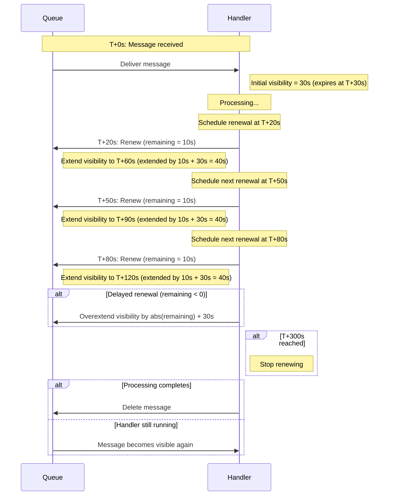

## Message visibility

To prevent messages from being reprocessed while a handler is still executing, the transport automatically renews the message visibility timeout during processing. This is especially important for long-running handlers where the processing time may exceed the original visibility timeout.

The transport calculates when to renew the message visibility using the following logic:

```text
buffer = Min(remainingTime / 2, 10 seconds)
renewAfter = remainingTime - buffer
```

A message visibility timeout renewal is triggered after `renewAfter` has elapsed since the last renewal attempt. The renewal is attempted immediately if the remaining time is less than 400ms. This ensures the message visibility is extended consistently and early enough to avoid expiration, even under system load or scheduling delays.

When renewing, the transport extends the visibility timeout by:

```text
Max(Abs(remainingTimeInSeconds) + visibilityTimeoutInSeconds, visibilityTimeoutInSeconds)
```

This allows the visibility to be “pushed forward” by a consistent chunk while also compensating for delays. If a renewal is delayed and occurs after the visibility timeout expires, the transport tries to compensate, for example assuming the remaining time is `-2s` the new visibility timeout would be `abs(-2s) + 30s = 32s`. This is done because an expired visibility timeout doesn’t always mean the message can’t be completed—if no competing consumer picks it up, processing may still succeed.

**Example**:

- Configured visibility timeout: 30 seconds
- Max total extension duration: 5 minutes



The message visibility timeout extension is a best effort operation and can fail due to several reasons including:

- Significant clock skew between the client and the SQS service time
- Network interruptions for extensive periods of time between the client and the SQS service
- Backpressure from the SQS service due to throttling

### MaxAutoMessageVisibilityRenewalDuration

**Optional**

**Default**: `TimeSpan.FromMinutes(5)`

This configures the allowed maximum message visibility timeout, after which the transport stops renewing the visibility. Amazon SQS supports a maximum value of 12 hours.

By setting it to `TimeSpan.Zero`, the message visibility renewal is disabled; thus, the default message visibility time applies when the message is received.

snippet: MaxAutoMessageVisibilityRenewalDuration

### MessageVisibilityTimeout

**Optional**

**Default**: `null`

By default, the transport acquires the message visibility timeout of the queue by reading the `MessageVisibilityTimeout` attribute. By setting an explicit value, the message visibility timeout on the queue is overruled by the timeout specified in this setting which will be used on every receive request.

snippet: MessageVisibilityTimeout
