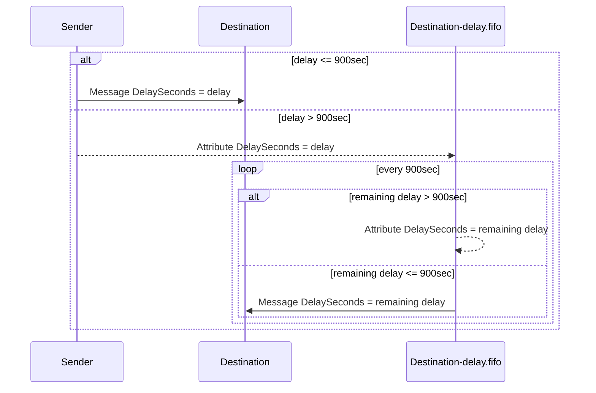
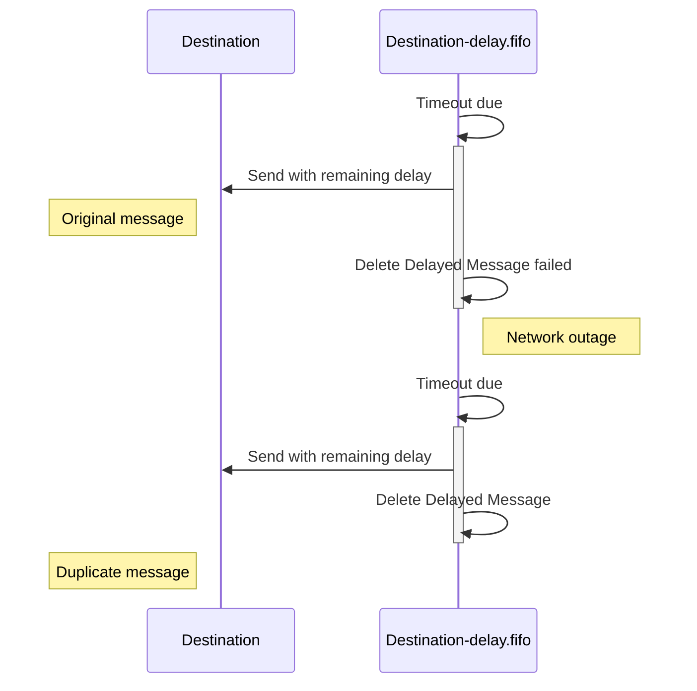
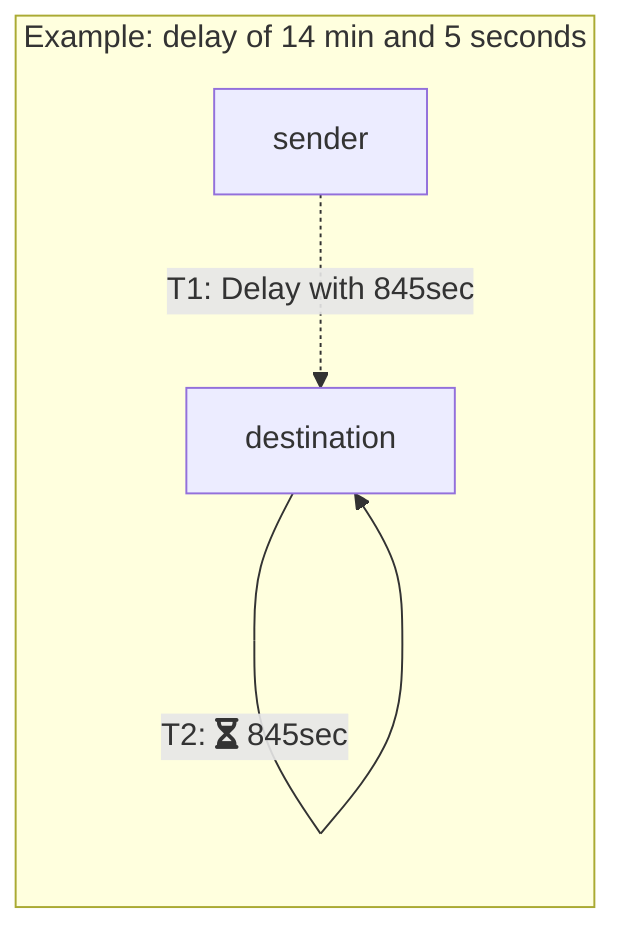
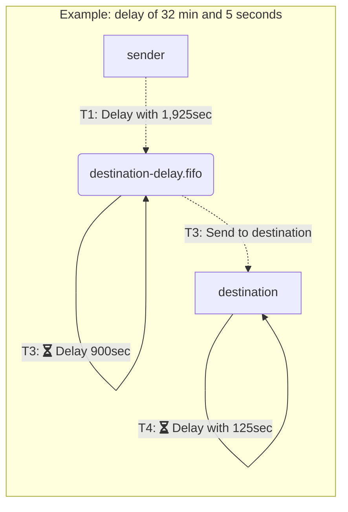

In Versions 4 and above, the SQS transport supports [delayed delivery](/nservicebus/messaging/delayed-delivery.md) of messages longer than 15 minutes (900 seconds).

## Enable unrestricted delayed delivery

The unrestricted delayed delivery has to be enabled on the transport configuration:

snippet: DelayedDelivery

Unrestricted delayed delivery needs to be enabled on the sender and receiver to be able to delay messages longer than 900 seconds.

| Scenario                    | Sender   | Receiver | Supported     |
|-----------------------------|----------|----------|---------------|
| delay duration <= 900 sec   | disabled | disabled | Yes           |
|                             | disabled | enabled  | Yes           |
|                             | enabled  | disabled | Yes           |
|                             | enabled  | enabled  | Yes           |
| delay duration > 900 sec    | disabled | disabled | No            |
|                             | disabled | enabled  | No            |
|                             | enabled  | disabled | No            |
|                             | enabled  | enabled  | Yes           |

Unrestricted delayed delivery requires a FIFO queue for each endpoint that receives delayed messages. The transport handles creation of the FIFO queue automatically when [installers](/nservicebus/operations/installers.md) are enabled.

### Manual FIFO queue creation

If installers are not used, then the FIFO queue will need to be manually created.

The FIFO queue has the following requirements:

- The name must match the endpoint's input queue suffixed with `-delay.fifo`.
- The Delivery Delay setting (DelaySeconds) should be set to 900 seconds.
- The Message Retention Period should be set to at least 4 days.
- A Redrive Policy must not be configured.

For an example of how to manually create queues, see [scripting](/transports/sqs/operations-scripting.md).

## How it works

Each endpoint with unrestricted delayed delivery owns a FIFO queue that is used to offload delayed messages from the main input queue until they are due. The FIFO queue uses a fixed delay interval of 900 seconds on the queue level. The FIFO queue shields the timeout dispatching mechanism in a time window of five minutes from infinitely growing timeouts due to network outages between the timeout requeueing and removing the previous timeout from the queue.

When a sender sends a delayed message to a destination, it determines whether the delay is less or equal to 900 seconds. If that is the case, the message is directly delayed to the destination queue by setting the `DelaySeconds` attribute on the message. When the timeout is greater than 900 seconds, the message is sent to the FIFO queue of the destination endpoint with a message attribute named `NServiceBus.AmazonSQS.DelaySeconds`. The delayed message consumer on the destination's FIFO queue receives all timeouts that are due after 900 seconds. When a timeout is due, and the remaining delay is less than or equal to 900 seconds the message is directly delayed to the destination queue. If the remaining delay is greater than 900 seconds, the message is sent back to the FIFO queue containing a `DelaySeconds` attribute with the remaining timeout interval. The following sequence diagram illustrates the process:

### Clock drift

To avoid clock drift, the broker timestamps are used wherever possible to calculate the remaining timeout. The due time calculation uses `SentTimestamp` as well as `ApproximateFirstReceiveTimestamp` set by the broker. Only in cases of re-delivery when `ApproximateReceiveCount` is higher than one the client's clock is used and thus subjected to clock drift.

### Delivery

For unrestricted delayed deliveries, the last step is always a handover from the FIFO queue to the endpoint's input queue. SQS does not provide cross queue operation transactions, so the handover is subjected to retries. In cases of retries, it might be possible that timeouts are delivered more than once. Message handlers need to be idempotent when used with transports with [transaction](/transports/transactions.md) level `Receive Only` or below. The following diagram illustrates that:

### Example

Below is an example of a delayed delivery less or equal to 900 seconds:

14 min and 4 seconds are in total 845 seconds. This is less than 900 seconds, so the message will be directly sent to the destination with a `DelaySeconds` value of 845 seconds. No message attribute header will be used.

Below is an example of a delayed delivery greater than 900 seconds:

32 min and 5 seconds are in total 1,925 seconds. This will lead to two 900 seconds cycles on the FIFO queue and one delayed delivery on the destination queue with the remaining timeout of 125 seconds (handover between FIFO queue and input queue).

## Cost considerations

Enabling unrestricted delayed delivery will have an impact on cost because FIFO queues are required.

To estimate the cost of a delayed message, the following formula can be used:

N = delay in seconds
P = price per request
C(ycles) = N / 900
O(perations) = C * 2 // dequeue and requeue
T(otal cost) = O * P

NOTE The cost might be lower due to the transport optimizing dequeue operations by batching requests.

### Example

To calculate the cost of a single message delayed for a year, the following applies:

[Price per 1 Million Requests after Free Tier (Monthly)](https://aws.amazon.com/sqs/pricing/)

| FIFO Queue     | $0.50 ($0.00000050 per request) |

N = 31,536,000 seconds
P = $0.00000050
C = 31,536,000 / 900 = 35,040
O = 35,040 * 2 = 70,080
T = 70,080 * $0.00000050 = $0.03504