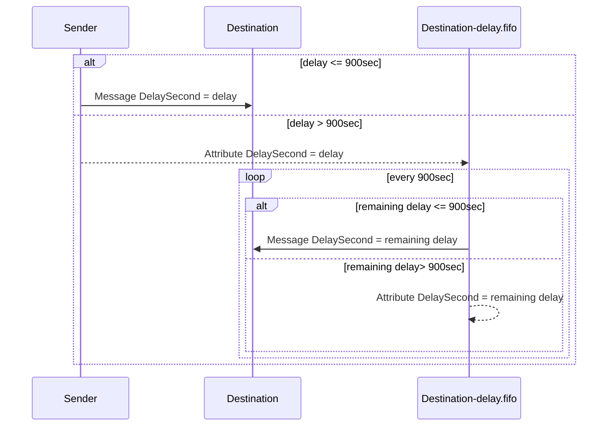
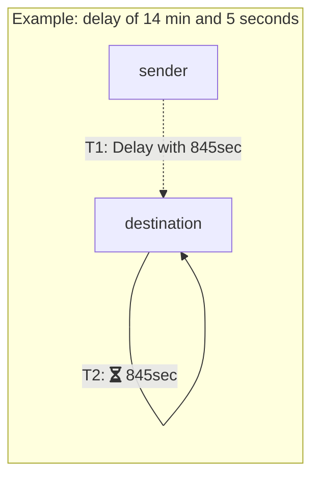
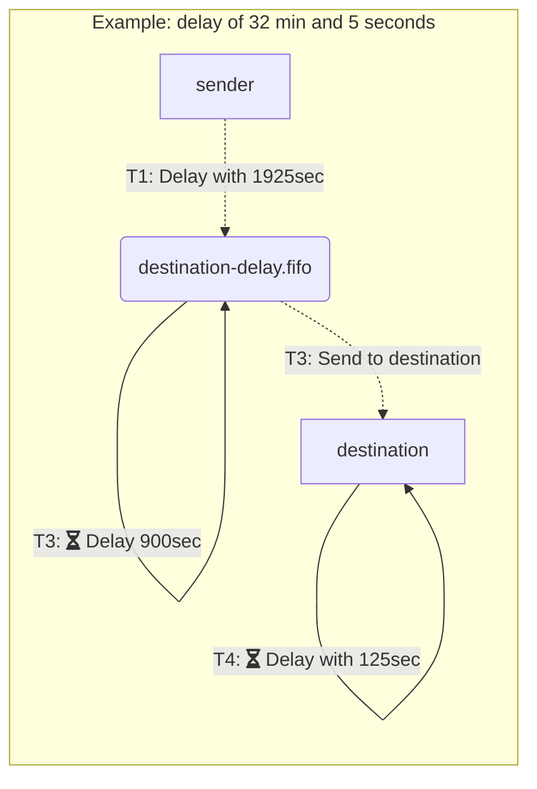

In Versions 4.0 and above, the SQS transport allows [delayed delivery](/nservicebus/messaging/delayed-delivery.md) of messages longer than 15 minutes. The transport creates a FIFO queue per endpoint that allows delaying messages for longer periods of time.

## Enable unrestricted delayed delivery

The unrestricted delayed delivery has to be enabled on the transport configuration:

snippet: DelayedDelivery

Unrestricted delayed delivery needs to be enabled both on the sender and receiver in order to be able to process delayed deliveries longer than 15 minutes (900 seconds). Delayed delivery below 15 minutes is always supported. The following table illustrates that.

| Scenario                    | Sender   | Receiver | Remarks       |
|-----------------------------|----------|----------|---------------|
| Delayed Delivery <= 900 sec | disabled | disabled | Supported     |
|                             | disabled | enabled  | Supported     |
|                             | enabled  | disabled | Supported     |
|                             | enabled  | enabled  | Supported     |
| Delayed Delivery > 900 sec  | disabled | disabled | Not supported |
|                             | disabled | enabled  | Not supported |
|                             | enabled  | disabled | Not supported |
|                             | enabled  | enabled  | Supported     |

Enabling the unrestricted delayed delivery will require a FIFO queue to be created for each endpoint that receives delayed deliveries. The FIFO queue follows a fixed naming convention by appending `-delay.fifo` to the queue name of the endpoint. The creation of the FIFO queue requires the [installers](nservicebus/operations/installers.md) to be enabled or the queue being created upfront via [scripting](/transports/sqs/operations-scripting.md).

## How it works

### Delay levels

### Delivery

### Example

## Cost considerations

Each non-sendonly endpoint with the unrestricted delayed delivery enabled operates one delayed message consumer that applies [long-polling](https://docs.aws.amazon.com/AWSSimpleQueueService/latest/SQSDeveloperGuide/sqs-long-polling.html) with an interval of 20 seconds. [Satellites](nservicebus/satellites.md) will increase the number of delayed message consumers. The following example shows a cost calculation for a message timeout for a year, not taking into account the long-polling costs.

Assuming the following SQS prices:

Price per 1 Million Requests after Free Tier (Monthly)

| Standard Queue | $0.40 ($0.00000040 per request) | 
| FIFO Queue     | $0.50 ($0.00000050 per request) |

More up-to-date information on pricing can be found on the [SQS pricing page](https://aws.amazon.com/sqs/pricing/).

Delaying a message for a year, 365 days or 31536000 (365*24*60*60) seconds, and two operations (dequeue and requeue) per delay interval of 900 seconds. The delayed message will need to go through 35040 delay cycles (3153600 sec / 900 sec) whic leads to 65080 queue operations. The end costs would be

65080 * $0.00000050 = $0.03254

It is important to note that the delayed message consumer tries to fetch up to 10 delayed messages in one batch. Depending on the FIFO queue load (delays expiring) the actual costs might be lower.

## Backwards compatibility

SQS Transport Versions from 2 and above can send delayed messages with a timeout lower or equal to 15 minutes. Versions 4 and above of the transport can send delayed messages with a timeout lower or equal to 15 minutes to older versions of the transport as well. Unrestricted delayed delivieres are only supported for Versions 4 and above.

