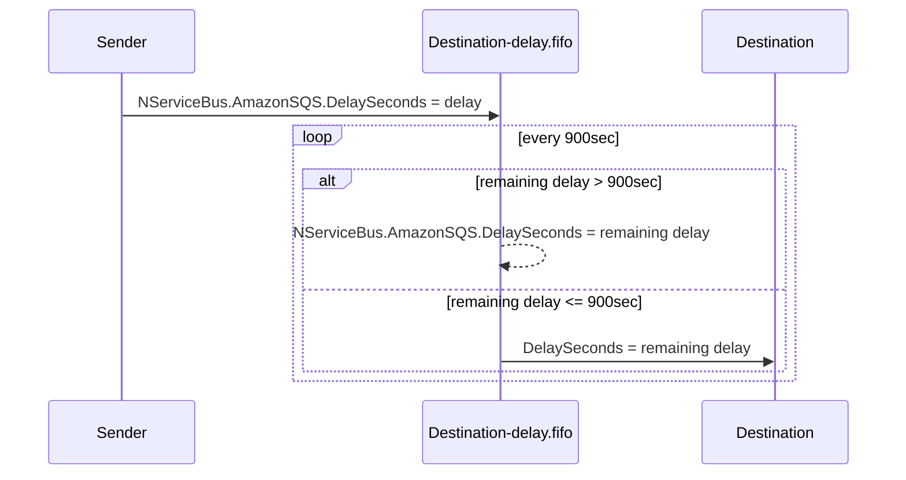
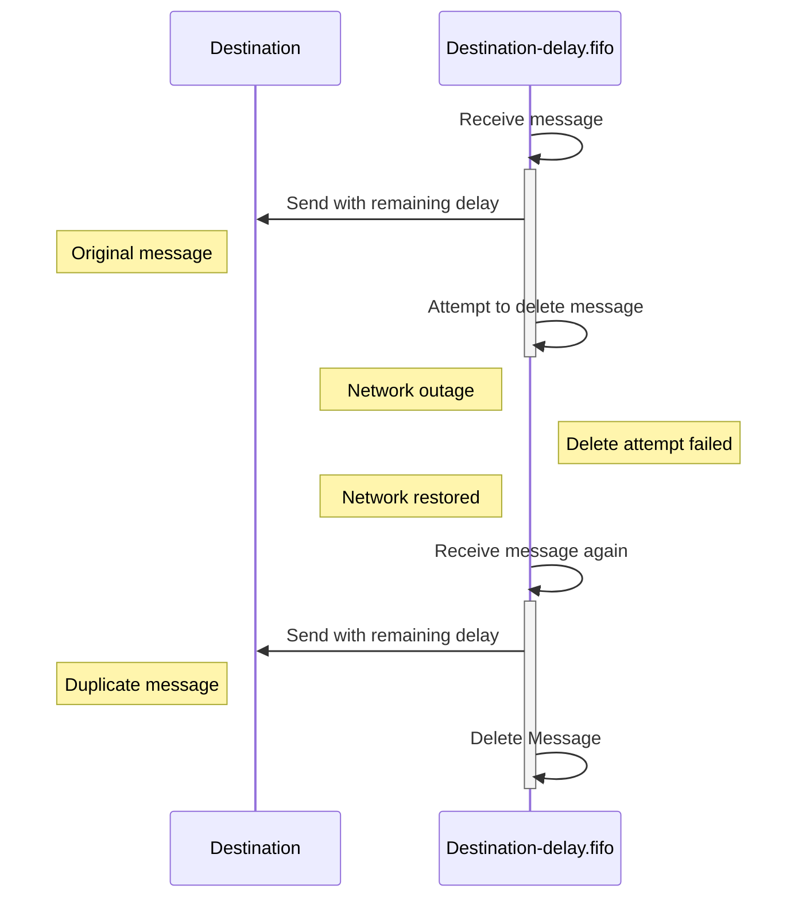
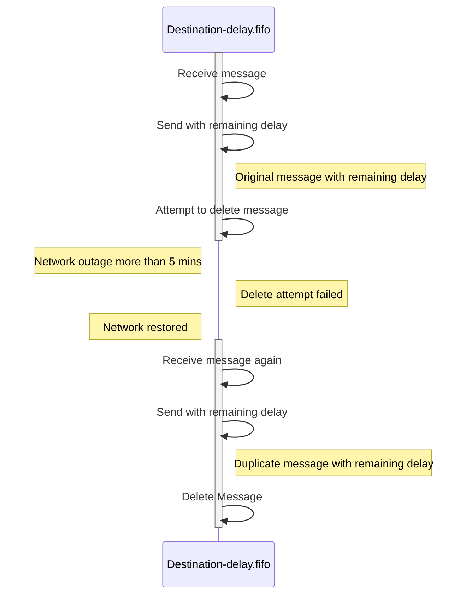

The SQS transport supports [delayed delivery](/nservicebus/messaging/delayed-delivery.md) of messages for longer than 15 minutes (900 seconds) in versions 4 and above.

## Enable unrestricted delayed delivery

partial: enable

Unrestricted delayed delivery must be enabled on the sender and receiver to be able to delay messages longer than 900 seconds.

| Scenario                    | Sender   | Receiver | Supported     |
|-----------------------------|----------|----------|:-------------:|
| delay duration <= 900 sec   | disabled | disabled | Yes           |
|                             | disabled | enabled  | Yes           |
|                             | enabled  | disabled | Yes           |
|                             | enabled  | enabled  | Yes           |
| delay duration > 900 sec    | disabled | disabled | No            |
|                             | disabled | enabled  | No            |
|                             | enabled  | disabled | No            |
|                             | enabled  | enabled  | Yes           |

WARNING: As the chart indicates, sending messages with a delay duration longer than 900 seconds to endpoints using versions 3 and below is not supported.

Unrestricted delayed delivery requires a FIFO queue for each endpoint that receives delayed messages. The transport handles creation of the FIFO queue automatically when [installers](/nservicebus/operations/installers.md) are enabled.

### Manual FIFO queue creation

If installers are not used, then the FIFO queue will need to be manually created.

The FIFO queue has the following requirements:

- The name must match the endpoint's input queue suffixed with `-delay.fifo`.
- The Delivery Delay setting (DelaySeconds) should be set to 900 seconds.
- The Message Retention Period should be set to at least 4 days.
- A Redrive Policy must not be configured.

For an example of how to manually create queues, see [scripting](/transports/sqs/operations-scripting.md).


## How it works

When a delayed message is sent, the delay duration is calculated. If it's less than or equal to 900 seconds, the message is sent directly to the destination input queue with the `DelaySeconds` message attribute set to the delay duration.

If the delay duration is greater than 900 seconds, then the message is sent to the destination's FIFO queue with the `NServiceBus.AmazonSQS.DelaySeconds` custom message attribute set to the delay duration. When the message is received from the FIFO queue after 900 seconds, the remaining delay duration is calculated. If it's less than or equal to 900 seconds, the message is forwarded to the destination input queue with the `DelaySeconds` message attribute set to the remaining delay duration. Otherwise, the message is sent back to the FIFO queue with an updated custom message attribute set to the remaining delay duration.

The following sequence diagram illustrates a message sent with a delay duration greater than 900 seconds:



NOTE: FIFO queues are used to implement this feature because of their native support for de-duplication.

WARNING: The transport uses timestamps from the broker to avoid clock skew, but a discrepancy between broker and endpoint clocks still has potential to cause inaccurate delay calculation.

### Potential duplicate messages

While FIFO queues protect from message duplication, there are still scenarios where messages could be duplicated. To address the possibility of duplicate messages, handlers should be idempotent or the [outbox](/nservicebus/outbox/) feature should be enabled.

#### Scenario 1

As the final step, the message has to be delivered to a regular queue.



#### Scenario 2

While processing a message, if a failure prevents the message from being deleted, and the next processing attempt occurs later than 5 minutes after the first attempt, then the FIFO queue will **not** be able to protect from message duplication.



### Examples

#### Delay of 14 minutes and 5 seconds

```mermaid
graph LR

subgraph 

Sender .-> |DelaySeconds = 845sec| Destination

end
```

#### Delay of 32 minutes and 5 seconds

```mermaid
graph LR

subgraph 

Sender
fifo(Destination-delay.fifo)
Destination

Sender .-> |T1: NServiceBus.AmazonSQS.DelaySeconds = 1,925sec| fifo
fifo --> |"T2: NServiceBus.AmazonSQS.DelaySeconds = 1,025sec"| fifo
fifo .-> |"T3: DelaySeconds = 125sec"| Destination

end
```

## Cost considerations

Enabling unrestricted delayed delivery will have an impact on cost because FIFO queues are required.

To estimate the cost of a delayed message, the following formula can be used:

**N** = delay in seconds<br>
**P** = price per request<br>
**C**(ycles) = **N** / 900<br>
**O**(perations) = **C** * 2 // dequeue and requeue<br>
**T**(otal cost) = **O** * **P**<br>

NOTE: The cost might be lower due to the transport optimizing dequeue operations by batching requests.

### Example

To calculate the cost of a single message delayed for a year, the following applies:

[Price per 1 Million Requests after Free Tier (Monthly)](https://aws.amazon.com/sqs/pricing/)

FIFO Queue: $0.50 ($0.00000050 per request)

N = 31,536,000 seconds<br>
P = $0.00000050<br>
C = 31,536,000 / 900 = 35,040<br>
O = 35,040 * 2 = 70,080<br>
T = 70,080 * $0.00000050 = $0.03504<br>
