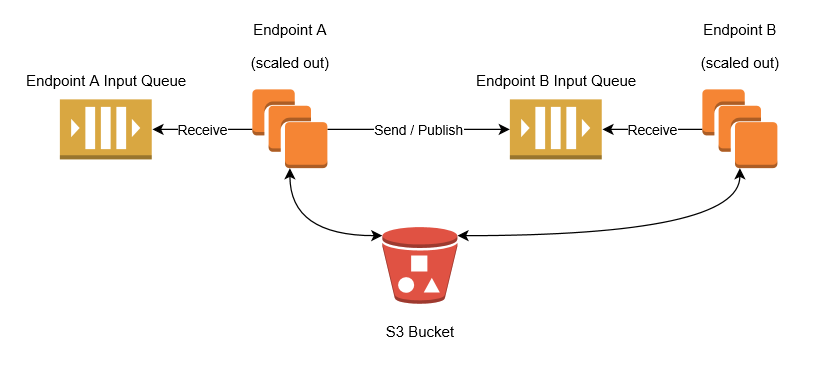

The topology used by the transport is composed of several AWS components.

## SQS

Amazon SQS exposes queue endpoints that are publicly available via [HTTPS](https://en.wikipedia.org/wiki/HTTPS). Endpoints may access SQS queues whether they are deployed in AWS or not: as long as the endpoint can reach both SQS and S3 via HTTPS it can use the transport.

The transport initiates all network connections to SQS and S3, hence the endpoint itself does not need to be publicly accessible and may be behind a firewall or proxy.

The transport uses SQS [Standard Queues](http://docs.aws.amazon.com/AWSSimpleQueueService/latest/SQSDeveloperGuide/standard-queues.html).

SQS queues support [competing consumers](http://www.enterpriseintegrationpatterns.com/patterns/messaging/CompetingConsumers.html). When an endpoint scales out to multiple instances, each instance consumes messages from the same input queue.

### Publish/Subscribe

The transport is [unicast-only](/transports/types.md#unicast-only-transports) and does not provide built-in support for [publish-subscribe messaging](/nservicebus/messaging/publish-subscribe/). Publishing events to multiple endpoints is achieved with multiple transport-level sends to each destination. Subscriptions are created using [persistence based and message driven mechanics](/nservicebus/messaging/publish-subscribe/#mechanics-message-driven-persistence-based).

## S3

SQS supports a maximum message size of 256kb. The transport works around this size limit by using [Amazon S3](http://docs.aws.amazon.com/AmazonS3/latest/dev/Welcome.html) to store message payloads for messages that are larger than 256kb in size. This allows the transport to send and receive messages of practically any size. Note that messages that fit in the 256kb size limit only use SQS and do not use S3.

When a large message is sent, the transport uploads the message body to an S3 bucket and then sends an SQS message that contains a reference to the S3 object. On the receiving end the transport receives the message from SQS, identifies the reference to the S3 object, downloads it and processes the message as normal. When the message is to be deleted, the transport deletes the message from SQS and then deletes it from S3. To ensure that the message is deleted from S3, the transport applies a [lifecycle policy](http://docs.aws.amazon.com/AmazonS3/latest/dev/object-lifecycle-mgmt.html) to the S3 bucket that deletes any messages that are older than the configured [time to live](/transports/sqs/configuration-options.md#maxttldays).