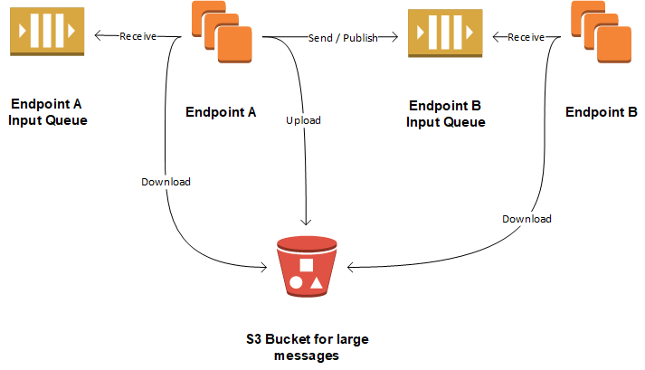

## SQS

Amazon SQS exposes queue endpoints that are publicly available via HTTPS. Endpoints may access SQS queues whether they are deployed in AWS or not: as long as the endpoint can reach SQS (and S3) via HTTPS it can use the Amazon SQS transport.

The Amazon SQS transport uses SQS [Standard Queues](http://docs.aws.amazon.com/AWSSimpleQueueService/latest/SQSDeveloperGuide/standard-queues.html).

Amazon SQS queues support competing consumers. When an endpoint scales out to multiple instances, each instance consumes messages from the same input queue. 

### Publish/Subscribe

the Amazon SQS transport is a unicast-only transport and does not provide built-in support for publish-subscribe messaging. Publishing events to multiple endpoints is achieved with multiple transport-level sends to each destination. Subscriptions are created subscription request messages as described [here](/tutorials/intro-to-nservicebus/4-publishing-events/#subscribing-to-events).

## S3

Amazon SQS supports a maximum message size of 256kb. The Amazon SQS transport works around this size limit by using [Amazon S3](http://docs.aws.amazon.com/AmazonS3/latest/dev/Welcome.html) to store message payloads for messages that are larger than 256kb in size. This allows the transport to send and receive messages of practically any size. Note that messages that fit in the 256 kb size limit only use SQS and do not use S3.

When a large message is sent, the transport first uploads the message body to an S3 bucket and then sends an SQS message that contains a reference to the S3 object. On the receiving end the transport first receives the message from SQS, identifies the reference to the S3 object, downloads it and processes the message as normal. When the message is to be deleted, the transport first deletes the message from SQS and then deletes it from S3. To ensure that the message is deleted from S3, the transport applies a [lifecycle policy](http://docs.aws.amazon.com/AmazonS3/latest/dev/object-lifecycle-mgmt.html) to the S3 bucket that deletes any messages that are older than the configured [time to live](/transports/sqs/configuration-options.md#maxttldays).

