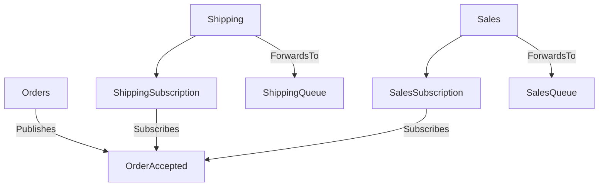

Upgrading from Azure Service Bus transport version 4 to version 5 is a major upgrade and requires careful planning. Read the entire upgrade guide before beginning the upgrade process.

Version 5 of the transport introduces the concept of choosing a topic topology. The following two topologies are supported:

- Migration topology
- Topic per event type topology

The topology selection must be explicitly passed into the constructor of the transport when the transport is being created.

## Topologies

### Topic per Event Type Topology

This topology is the default and preferred choice for new endpoints that do not require backward compatibility with previous versions of the transport. It optimizes event routing, reduces filter overhead, aligns with industry best practices, and improves observability in the event routing path.

The topology represents each event as its own topic. Subscribers add their subscription with forwarding enabled under the topic of the events they are interested in. These subscriptions do not require any filtering rules.



#### Least-privilege

Subscribing and unsubscribing to events require manage rights because entire subscriptions need to be created or deleted. It is possible to run these scenarios with least-privilege access by deploying the necessary subscriptions as part of the endpoint deployment. This can be done by briefly enabling installers, using the [provided tool](/transports/azure-service-bus/operational-scripting), or utilizing infrastructure-as-code tools like Bicep, Terraform, or Pulumi.

### Migration topology

The migration topology is a hybrid design that allows transitioning from the previously used topology to the topic-per-event-type topology on an event-by-event basis, avoiding the need for a big-bang migration process.

The migration topology should be used by endpoints that require backward compatibility with endpoints using the previous topology.

In this topology, each event type must be explicitly mapped as either "to be migrated" or "migrated". Events yet to be migrated will be published or subscribed in the backward-compatible way, while migrated events will follow the topic-per-event-type topology.

#### Least-privilege

Subscribing and unsubscribing to a "to be migrated" event at runtime is supported even when connected endpoints do not have manage rights. This ensures that the migration topology remains backward-compatible from a privilege mode perspective.

For migrated events, subscribing and unsubscribing require manage rights since entire subscriptions need to be created or deleted. These scenarios can be executed with least-privilege access by deploying the necessary subscriptions during the endpoint deployment using the [provided tool](/transports/azure-service-bus/operational-scripting) or infrastructure-as-code tools like Bicep, Terraform, or Pulumi.

## Migrating existing endpoints

While it is possible to migrate events individually, it is currently not supported to partially migrate parts of the topology for a single event. This means that when an event is migrated, both the publisher and all subscribers must migrate together. If a partial migration approach is necessary, be sure to reach out to support.

The following endpoint configuration snippets demonstrate how a migration could take place, assuming the following scenario:

- `Publisher1` publishes `Event1` which is subscribed by `Subscriber1` and `Subscriber2`
- `Publisher1` also publishes `Event2` which is subscribed by `Subscriber1` and `Subscriber3`
- `Publisher2` publishes `Event3` which is subscribed by `Subscriber3` and `Subscriber4`

To use the migration topology, both publishers and subscribers must be on **NServiceBus 9 or higher**. It is not required to upgrade every endpoint to the new version of the transport as long as events are correctly mapped to be published or subscribed in a backward-compatible way where necessary.

For example, if `Subscriber4` cannot be upgraded to a newer version of NServiceBus and the transport, `Publisher2` can either:
- Stay on the older version of the transport.
- Upgrade but explicitly mark `Event3` to be published in a backward-compatible way:


```csharp
var topology = TopicTopology.MigrateFromSingleDefaultTopic();
// Publishes and/or subscribes using the “old” single-topic (here bundle-1) approach.
topology.EventToMigrate<Event3>();
```

If `Subscriber3` is upgraded to the new version of the transport, it must map `Event2` and `Event3`, while `Event3` may need to remain marked as "to be migrated" until `Subscriber4` can be upgraded:

```csharp
var topology = TopicTopology.MigrateFromSingleDefaultTopic();
topology.EventToMigrate<Event2>();
topology.EventToMigrate<Event3>();
```

and the `Publisher1` configuration

```csharp
var topology = TopicTopology.MigrateFromSingleDefaultTopic();
topology.EventToMigrate<Event1>();
topology.EventToMigrate<Event2>();
```

assuming `Subscriber1` and `Subscriber2` can be migrated the `Publisher1` configuration could be switched to

```csharp
var topology = TopicTopology.MigrateFromSingleDefaultTopic();
// Publishes this event using the new “topic per event” approach (here to a Namespace.Event1 topic).
topology.MigratedPublishedEvent<Event1>();
topology.EventToMigrate<Event2>();
```

the `Subscriber1` configuration

```csharp
var topology = TopicTopology.MigrateFromSingleDefaultTopic();
topology.MigratedSubscribedEvent<Event1>();
topology.EventToMigrate<Event2>();
```

and the `Subscriber2` configuration

```csharp
var topology = TopicTopology.MigrateFromSingleDefaultTopic();
// Subscribes to this event using the new “topic per event” approach (here to a Namespace.Event1 topic)
topology.MigratedSubscribedEvent<Event1>();
```

or directly using the topic per event type topology since it only ever subscribes to `Event1` which is only published in the new way.

```csharp
var topology = TopicTopology.Default;
```

The `Subscriber3` configuration would for a period of time look like

```csharp
var topology = TopicTopology.MigrateFromSingleDefaultTopic();
topology.EventToMigrate<Event2>();
topology.EventToMigrate<Event3>();
```

until `Publisher1` switches `Event2` to be published in the new way

```csharp
var topology = TopicTopology.MigrateFromSingleDefaultTopic();
topology.MigratedPublishedEvent<Event1>();
topology.MigratedPublishedEvent<Event2>();
```

or directly using the topic per event type topology since it only ever publishes to Event1 and Event2 now in the new way.

```csharp
var topology = TopicTopology.Default;
```

### Order of migration

Generally, it does not matter whether the publisher or the subscriber is upgraded first, as long as the migration topology settings align with the subscribers' requirements. If a publisher is upgraded before all subscribers, it must be configured to publish events in a backward-compatible way. If the subscribers are upgraded first, they must subscribe to events in a backward-compatible way.

When switching an event to the new topic-per-event-type approach, the publisher and all subscribers must be upgraded together. Using the [provided tool](/transports/azure-service-bus/operational-scripting) or infrastructure-as-code tools like Bicep, Terraform, or Pulumi, it is possible to set up the topic for a specific event, including all forwarding subscriptions, before rolling out the publisher update.

To reduce CPU and memory overhead, subscriber endpoints should disable the [AutoSubscribe feature for the specific event](/nservicebus/messaging/publish-subscribe/controlling-what-is-subscribed.md#automatic-subscriptions-exclude-event-types-from-auto-subscribe) to prevent unnecessary old subscriptions or the deletion of no-longer-used filter rules.

All endpoints using `TopicTopology.Default` can be considered fully migrated.

### Cleanup of no longer used entities on Azure Service Bus

If the migration takes a long time, it may be desirable to delete old subscriptions or rules that are no longer needed to reduce CPU and memory overhead on the single topic still used by some endpoints.

Once all events have been migrated, the old single topic can be deleted.

### Migrating from non-default topics or hierarchies

Use either `TopicTopology.MigrateFromNamedSingleTopic(string topicName)` or `TopicTopology.MigrateFromTopicHierarchy(string topicToPublishTo, string topicToSubscribeOn)`.

The default topic name is `bundle-1`. In case that one is used create the migration topology with `TopicTopology.MigrateFromSingleDefaultTopic()`.

### Migrating subscription name customizations

Previous versions of the transport allowed mapping from queue names to subscription names using function delegates. While flexible, this approach made it difficult to store logic in application configuration.

Starting with v5 of the transport, subscription names can be assigned directly:

```csharp
topology.OverrideSubscriptionNameFor("QueueName", "SubscriptionName")
```

For more advanced scenarios, mappings can be stored in configuration:

```json
{
  ...
  "QueueNameToSubscriptionNameMap": {
    "QueueName": "SubscriptionName"
  }
}
```

The assumption is that any previous delegate invocation would needed to be idempotent to create reliable runtime behavior. Subscription names must adhere to the limits outlined in the [Microsoft documentation on subscription creation](https://docs.microsoft.com/en-us/azure/service-bus-messaging/service-bus-quotas) and are automatically validated during startup.

### Migrating rule name customizations

Previously, rule names could be assigned using function delegates. Starting with v5, rule names can be mapped directly:

```csharp
topology.EventToMigrate<TEventType>("MyRuleName")
```

Or via configuration:

```json
{
  "$type": "migration-topology-options",
  ...
  "EventsToMigrateMap": [
    "Namespace.Event1"
  ],
  "SubscribedEventToRuleNameMap": {
    "Namespace.Event1": "Event1Rule"
  }
}
```

The assumption is that any previous delegate invocation would needed to be idempotent to create reliable runtime behavior. Rules names must adhere to the limits outlined in the [Microsoft documentation on subscription creation](https://docs.microsoft.com/en-us/azure/service-bus-messaging/service-bus-quotas) and are automatically validated during startup.
