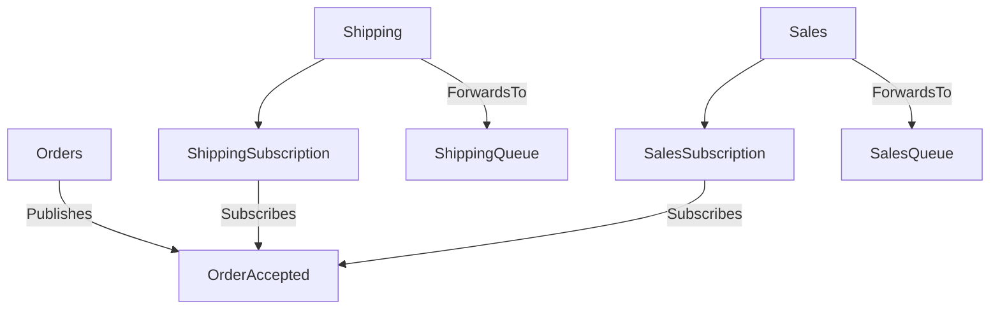

Upgrading from Azure Service Bus transport version 4 to version 5 is a major upgrade and requires careful planning. Read the entire upgrade guide before beginning the upgrade process.

Version 5 of the transport introduces the concept of choosing a topic topology. The two following topologies are supported:

- Migration topology
- Topic per event type topology

The topology selection needs to be explicitly passed into the constructor of the transport when the transport is being created.

## Topologies

### Topic per Event type topology

This topology is the default and preferred topology to be used for new endpoints that do not require backward compatibility with previous versions of the transport. This topology optimizes the event routing, reduces filter overhead, aligns with industry best practices and overall improves the observability on the event routing path.

The topology represents every event as its own topic. Subscribers add their subscription with forwarding enabled underneath the topic of the events they are interested to. Those subscriptions do not require any filtering rules.



#### Least-privilege

Events subscribing and unsubscribing requires manage rights because entire subscriptions need to be created or deleted. It is possible to run those scenarios with least-privilege access by deploying the necessary subscriptions as part of the endpoint deployment by either starting briefly with installers enabled, use the provided tool or any other infrastructure as a service tool like Bicep, Terraform or Pulumi.

### Migration topology

The migration topology is a hybrid topology design that allows to transition from the previously used topology event by event to the topic per event type topology without having to go through a big bang migration process.

The migration topology should be used used by endpoints that require being backwards compatible with endpoints using the previous topology.

In this topology every event type must be explicitly mapped by marking it as "to be migrated" or "migrated". All yet to be migrated events will be published or subscribed in the backward compatible way. All migrated events will be published or subscribed according to the topic per event type topology.

### Least-privilege

Subscribing and unsubscribing to a "to be migrated" at runtime is supported even when connected endpoints has no manage rights support. This is ensured to keep the migration topology backward compatible from a privilege mode perspective.

For migrated events subscribing and unsubscribing requires manage rights because entire subscriptions need to be created or deleted. It is possible to run those scenarios with least-privilege access by deploying the necessary subscriptions as part of the endpoint deployment by either starting briefly with installers enabled, use the provided tool or any other infrastructure as a service tool like Bicep, Terraform or Pulumi.

## Migrating existing endpoints

While it is possible to migrated event by event currently it is not supported to partially migrate parts of the topology for a single event. This means when an event is migrated the publisher and all subscribers need to migrate together. Should a partial migration approach be necessary be sure to reach out to support.

The below endpoint configuration snippets demonstrate how a migration could take place assuming the following scenario:

- Publisher1 publishes Event1 which is subscribed by Subscriber1 and Subscriber2
- Publisher1 also publishes Event2 which is subscribed by Subscriber1 and Subscriber3
- Publisher2 publishes Event3 which is subscribed by Subscriber3 and Subscriber4

In order to use the migration topology the subscribers need to be on NServiceBus 9 or higher. It is not required to upgrade every endpoint to the new version of the transport as long as events are correctly mapped to either be publish or subscribed in a backward compatible way where necessary. For example if for some reasons Subscriber4 cannot be upgraded to a newer version of NServiceBus and the transport then Publisher2 can either stay on the older version of the transport or be upgraded but explicitly mark the published Event3 to be published in a backward compatible way by using the following configuration:

```csharp
var topology = TopicTopology.MigrateFromSingleDefaultTopic();
topology.EventToMigrate<Event3>();
```

If the Subscriber3 endpoint would be upgrade to the new version of the transport it would need to map Event3 and Event2 while Event3 might need to stay marked as to be migrated until Subscriber4 can be upgraded. For example the Subscriber3 configuration might look like

```csharp
var topology = TopicTopology.MigrateFromSingleDefaultTopic();
topology.EventToMigrate<Event2>();
topology.EventToMigrate<Event3>();
```

and the Publisher1 configuration

```csharp
var topology = TopicTopology.MigrateFromSingleDefaultTopic();
topology.EventToMigrate<Event1>();
topology.EventToMigrate<Event2>();
```

assuming Subscriber1 and Subscriber2 can be migrated the Publisher1 configuration could be switched to

```csharp
var topology = TopicTopology.MigrateFromSingleDefaultTopic();
topology.MigratedPublishedEvent<Event1>();
topology.EventToMigrate<Event2>();
```

the Subscriber1 configuration

```csharp
var topology = TopicTopology.MigrateFromSingleDefaultTopic();
topology.MigratedSubscribedEvent<Event1>();
topology.EventToMigrate<Event2>();
```

and the Subscriber2 configuration

```csharp
var topology = TopicTopology.MigrateFromSingleDefaultTopic();
topology.MigratedSubscribedEvent<Event1>();
```

or directly using the topic per event type topology since it only ever subscribes to Event1 which is only published in the new way.

```csharp
var topology = TopicTopology.Default;
```

The Subscriber3 configuration would for a period of time look like

```csharp
var topology = TopicTopology.MigrateFromSingleDefaultTopic();
topology.EventToMigrate<Event2>();
topology.EventToMigrate<Event3>();
```

until Publisher1 switches Event2 to be published in the new way

```csharp
var topology = TopicTopology.MigrateFromSingleDefaultTopic();
topology.MigratedPublishedEvent<Event1>();
topology.MigratedPublishedEvent<Event2>();
```

or directly using the topic per event type topology since it only ever publishes to Event1 and Event2 now in the new way.

```csharp
var topology = TopicTopology.Default;
```

### Migrating from non-default topics or hierarchies

Use either `TopicTopology.MigrateFromNamedSingleTopic(string topicName)` or `TopicTopology.MigrateFromTopicHierarchy(string topicToPublishTo, string topicToSubscribeOn)`.

The default topic name is `bundle-1`. In case that one is used create the migration topology with `TopicTopology.MigrateFromSingleDefaultTopic()`.