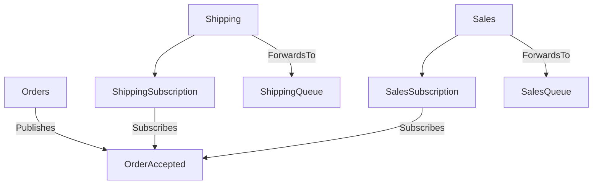

Upgrading Azure Service Bus transport from version 4 to version 5 is a major upgrade and requires careful planning. Read the entire upgrade guide before beginning the upgrade process.

Version 5 of the transport introduces the concept of choosing a topic topology. The following two topologies are supported:

- Migration topology
- Topic-per-event type topology

The topology selection must be explicitly passed into the constructor of the transport when the transport is being created.

## Topologies

### Topic-per-event type topology

This topology is the default and preferred choice for new endpoints that do not require backward compatibility with previous versions of the transport. It optimizes event routing, reduces filter overhead, aligns with industry best practices, and improves observability in the event routing path.

The topology represents each event as its own topic. Subscribers add their subscription with forwarding enabled under the topic of the events they are interested in. These subscriptions do not require any filtering rules.



#### Least-privilege

Subscribing and unsubscribing to events requires management rights to the Azure Service Bus namespace because subscriptions need to be created or deleted. It is possible to run the transport with least-privilege access by deploying the necessary subscriptions as part of the endpoint deployment. This can be done by briefly enabling installers, using the [provided tool](/transports/azure-service-bus/operational-scripting.md), or utilizing infrastructure-as-code tools such as Bicep, Terraform, or Pulumi.

### Migration topology

The migration topology is a hybrid design that allows transitioning from the previously used topology to the topic-per-event-type topology on an event-by-event basis, avoiding the need for a big-bang migration process.

The migration topology should be used by endpoints that require backward compatibility with endpoints using the previous topology.

In this topology, each event type must be explicitly mapped as either "to be migrated" or "migrated". Events yet to be migrated are published or subscribed in the backward-compatible way, while migrated events follow the topic-per-event-type topology.

#### Least-privilege

Subscribing and unsubscribing to a "to be migrated" event at runtime is supported even when connected endpoints do not have management rights to the Azure Service Bus namespace. This ensures that the migration topology remains backward-compatible from a privilege mode perspective.

For migrated events, subscribing and unsubscribing requires management rights since subscriptions need to be created or deleted. It is possible to run the transport with least-privilege access by deploying the necessary subscriptions during the endpoint deployment using the [provided tool](/transports/azure-service-bus/operational-scripting.md) or infrastructure-as-code tools such as Bicep, Terraform, or Pulumi.

## Migrating existing endpoints

While it is possible to migrate events individually, it is currently not supported to partially migrate a delivery path of a single event. This means that when an event is migrated, both the publisher and all the subscribers must migrate in one step. If a partial migration approach is necessary, be sure to reach out to support.

The following endpoint configuration snippets demonstrate how a migration could take place, assuming the following scenario:

- `Publisher1` publishes `Event1` which is subscribed by `Subscriber1` and `Subscriber2`
- `Publisher1` also publishes `Event2` which is subscribed by `Subscriber1` and `Subscriber3`
- `Publisher2` publishes `Event3` which is subscribed by `Subscriber3` and `Subscriber4`

To use the migration topology, both publishers and subscribers must be on **NServiceBus 9 or higher**. It is not required to upgrade every endpoint to the new version of the transport as long as events are correctly mapped to be published or subscribed in a backward-compatible way where necessary.

For example, if `Subscriber4` cannot be upgraded to a newer version of NServiceBus and the transport, `Publisher2` can either:
- Stay on the older version of the transport.
- Upgrade but explicitly mark `Event3` to be published in a backward-compatible way:


```csharp
var topology = TopicTopology.MigrateFromSingleDefaultTopic();
// Publishes and/or subscribes using the “old” single-topic (here bundle-1) approach.
topology.EventToMigrate<Event3>();
```

If `Subscriber3` is upgraded to the new version of the transport, it must map `Event2` and `Event3`, while `Event3` may need to remain marked as "to be migrated" until `Subscriber4` can be upgraded:

```csharp
var topology = TopicTopology.MigrateFromSingleDefaultTopic();
topology.EventToMigrate<Event2>();
topology.EventToMigrate<Event3>();
```

and the `Publisher1` configuration

```csharp
var topology = TopicTopology.MigrateFromSingleDefaultTopic();
topology.EventToMigrate<Event1>();
topology.EventToMigrate<Event2>();
```

assuming `Subscriber1` and `Subscriber2` can be migrated the `Publisher1` configuration could be switched to

```csharp
var topology = TopicTopology.MigrateFromSingleDefaultTopic();
// Publishes this event using the new “topic per event” approach (here to a Namespace.Event1 topic).
topology.MigratedPublishedEvent<Event1>();
topology.EventToMigrate<Event2>();
```

the `Subscriber1` configuration

```csharp
var topology = TopicTopology.MigrateFromSingleDefaultTopic();
topology.MigratedSubscribedEvent<Event1>();
topology.EventToMigrate<Event2>();
```

and the `Subscriber2` configuration

```csharp
var topology = TopicTopology.MigrateFromSingleDefaultTopic();
// Subscribes to this event using the new “topic per event” approach (here to a Namespace.Event1 topic)
topology.MigratedSubscribedEvent<Event1>();
```

or directly using the topic per event type topology since it only ever subscribes to `Event1` which is only published in the new way.

```csharp
var topology = TopicTopology.Default;
```

The `Subscriber3` configuration would for a period of time look like

```csharp
var topology = TopicTopology.MigrateFromSingleDefaultTopic();
topology.EventToMigrate<Event2>();
topology.EventToMigrate<Event3>();
```

until `Publisher1` switches `Event2` to be published in the new way

```csharp
var topology = TopicTopology.MigrateFromSingleDefaultTopic();
topology.MigratedPublishedEvent<Event1>();
topology.MigratedPublishedEvent<Event2>();
```

or directly using the topic per event type topology since it only ever publishes to Event1 and Event2 now in the new way.

```csharp
var topology = TopicTopology.Default;
```

### Order of migration

Generally, it does not matter whether the publisher or the subscriber is upgraded first, as long as the migration topology settings align with the subscribers' requirements. If a publisher is upgraded before all subscribers, it must be configured to publish events in a backward-compatible way. If the subscribers are upgraded first, they must subscribe to events in a backward-compatible way.

Switching the event delivery path to the new topic-per-event-type approach is a two-step process.

First, ensure that the infrastructure for the event delivery (topic and all subscriptions) is created. This can be done in a number of ways:

- If endpoints have installers enabled, the subscribers can be restarted after the event is marked as "migrated" in the topology configuration. This means that during the startup process the necessary infrastructure for the event is created. The old infrastructure (subscription on the common topic) still exists and is being used to deliver the events
- Using the [provided tool](/transports/azure-service-bus/operational-scripting.md)
- Using infrastructure-as-code tools such as Bicep, Terraform, or Pulumi

The second step is to mark the event as "migrated" in the publisher configuration and re-deploy the endpoint.

To reduce CPU and memory overhead, subscriber endpoints should disable the [AutoSubscribe feature for the specific event](/nservicebus/messaging/publish-subscribe/controlling-what-is-subscribed.md#automatic-subscriptions-exclude-event-types-from-auto-subscribe) to prevent unnecessary old subscriptions or the deletion of no-longer-used filter rules.

All endpoints using `TopicTopology.Default` can be considered fully migrated.

### Cleanup of no longer used entities on Azure Service Bus

If the migration takes a long time, it may be desirable to delete old subscriptions or rules that are no longer needed to reduce CPU and memory overhead on the single topic still used by some endpoints.

Once all events have been migrated, the old single topic can be deleted.

### Migrating from non-default topics or hierarchies

> [!NOTE]
> The methods are already obsoleted to give early notice when the migration topology will be phased out. Due to the obsoletion, the methods have `[EditorBrowsable(EditorBrowsableState.Never)]` which may hide those members depending on the IDE settings. This can be solved by explicitly typing out the method signatures as shown below or configure the IDE to show members independent of their browsable state ([Visual Studio](https://learn.microsoft.com/en-us/dotnet/api/system.componentmodel.editorbrowsableattribute#remarks) or Rider under Editor > General > Code Completion > Filter members by EditorBrowsable attribute).

Use either `TopicTopology.MigrateFromNamedSingleTopic(string topicName)` or `TopicTopology.MigrateFromTopicHierarchy(string topicToPublishTo, string topicToSubscribeOn)`.

The default topic name is `bundle-1`. In case that one is used create the migration topology with `TopicTopology.MigrateFromSingleDefaultTopic()`.

### Migrating subscription name customizations

Previous versions of the transport allowed mapping from queue names to subscription names [using function delegates](/transports/azure-service-bus/configuration.md?version=asbs_4#entity-creation-settings). While flexible, this approach made it difficult to store logic in application configuration.

```csharp
//Use the first 9 characters so QueueNameThatIsLongerThanFiftyCharactersAndStillValid becomes QueueName
transport.SubscriptionNamingConvention(x => x.Substring(0, 9));
```

Starting with v5 of the transport, subscription names can be assigned directly:

```csharp
topology.OverrideSubscriptionNameFor("QueueNameThatIsLongerThanFiftyCharactersAndStillValid", "QueueName");
```

For more advanced scenarios, mappings can be stored in configuration:

```json
{
  ...
  "QueueNameToSubscriptionNameMap": {
    "QueueNameThatIsLongerThanFiftyCharactersAndStillValid": "QueueName"
  }
}
```

The assumption is that any previous delegate invocation would needed to be idempotent to create reliable runtime behavior. Subscription names must adhere to the limits outlined in the [Microsoft documentation on subscription creation](https://docs.microsoft.com/en-us/azure/service-bus-messaging/service-bus-quotas) and are automatically validated during startup.

For example, if previously an MD5 hash was used as the sanitization function it might be required to preserve the same entity names.
For queue names that crossed the threshold of 50 characters, it would be necessary to precalculate the MD5 hash and store that as the subscription name. Alternatively simply configure the subscription name already used in production as a hardcoded value. Below is the MD5 hash as a GUID for a queue name called `QueueNameThatIsLongerThanFiftyCharactersAndStillValid`:

```csharp
topology.OverrideSubscriptionNameFor("QueueNameThatIsLongerThanFiftyCharactersAndStillValid", "7b7139c2-dd0e-2870-424a-891c84f89477")
```

the hash was calculated assuming the  known `ValidateAndHashIfNeeded` strategy.

```csharp
static string HashName(string input)
{
    var inputBytes = Encoding.Default.GetBytes(input);
    var hashBytes = MD5.HashData(inputBytes);
    return new Guid(hashBytes).ToString();
}
```

### Migrating rule name customizations

Previously, rule names could be [assigned using function delegates](/transports/azure-service-bus/configuration.md?version=asbs_4#entity-creation-settings) 

```csharp
transport.SubscriptionRuleNamingConvention(x => "MyPrefix-"+x);
```

Starting with v5, rule names [can be mapped directly](/transports/azure-service-bus/compatibility.md#conditions-sanitization-rules-must-be-aligned):

```csharp
topology.EventToMigrate<MyEvent>("MyPrefix-MyEvent")
```

Or via configuration:

```json
{
  "$type": "migration-topology-options",
  ...
  "EventsToMigrateMap": [
    "Namespace.Subnamespace.VeryLongEventName1"
  ],
  "SubscribedEventToRuleNameMap": {
    "Namespace.Subnamespace.VeryLongEventName1": "MyRuleName"
  }
}
```

The assumption is that any previous delegate invocation would needed to be idempotent to create reliable runtime behavior. Rules names must adhere to the limits outlined in the [Microsoft documentation on subscription creation](https://docs.microsoft.com/en-us/azure/service-bus-messaging/service-bus-quotas) and are automatically validated during startup.

For example, if previously an MD5 hash was used as the sanitization function it might be required to preserve the same entity names. For rule names that crossed the threshold of 50 characters, it would then be necessary to precalculate the MD5 hash and store that as the rule name. Alternatively simply configure the rule name already used in production as a hardcoded value. Below is the MD5 hash as a GUID for a rule name called `Namespace.Subnamespace.VeryLongEventName1`:

```csharp
topology.EventToMigrate<Namespace.Subnamespace.VeryLongEventName1>("76b98b1a-3a59-490a-a064-de65c0bc9aa6")
```

the hash was calculated assuming the previously known `ValidateAndHashIfNeeded` strategy.

```csharp
static string HashName(string input)
{
    var inputBytes = Encoding.Default.GetBytes(input);
    var hashBytes = MD5.HashData(inputBytes);
    return new Guid(hashBytes).ToString();
}
```
