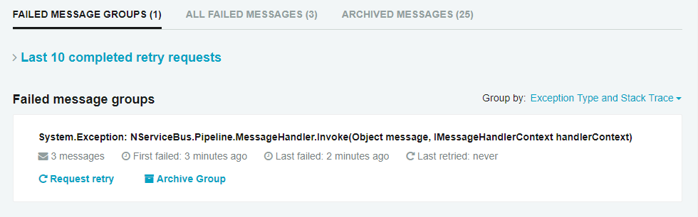
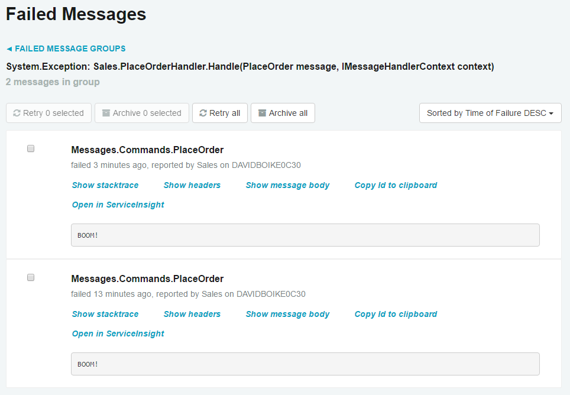

In software systems, exceptions will occur. Even with perfect, bug-free code, problems will arise when we have to deal with the issue of connectivity. If a database is overloaded, or a web service is down, we have no recourse except to try again.

It's how we respond to exceptions that is important. When a database is deadlocked, or a web service is down, do we lose data, or do we have the ability to recover? Do our users get an error message and have to figure out how to recover on their own, or can we make it appear as though nothing ever went wrong?

In the next 25-30 minutes, you will learn the different causes of errors and see how to manage them with Particular Service Platform.


## Causes of errors

In systems programming, where connectivity is a major concern, there are generally three broad categories of exceptions:


### Transient exceptions

Transient exceptions are those that, if immediately retried, would likely succeed.

Let's consider a common scenario. You have some code that updates a record in the database. Two threads attempt to lock the row at the same time, resulting in a deadlock. The database chooses one transaction to succeed and the other fails. The exception message Microsoft SQL Server returns for a deadlock is this:

WARNING: Transaction (Process ID 58) was deadlocked on lock resources with another process and has been chosen as the deadlock victim. Rerun the transaction.

This is an example of a **transient exception**. Transient exceptions appear to be caused by random quantum fluctuations in the ether. If the failing code is immediately retried, it will probably succeed. Indeed, the exception message above tells us to do exactly that.


### Semi-transient exceptions

The next category involves failures such as connecting to a web service that goes down intermittently. An immediate retry will likely not succeed, but retrying after a short time (from a few seconds up to a few minutes) might.

These are **semi-transient exceptions**. Semi-transient exceptions are persistent for a limited time but still resolve themselves relatively quickly.

Another common example involves the failover of a database cluster. If a database has enough pending transactions, it can take a minute or two for all of those transactions to resolve before the failover can complete. During this time, queries are executed without issue, but attempting to modify data will result in an exception.

It can be difficult to deal with this type of failure, as it's frequently not possible for the calling thread to wait around long enough for the failure to resolve.


### Systemic exceptions

Outright flaws in your system cause **systemic exceptions**, which are straight-up bugs. They will fail every time given the same input data. These are our good friends NullReferenceException, ArgumentException, dividing by zero, and a host of other common mistakes we've all made.

In short, these are the exceptions that a developer needs to look at, triage, and fix—preferably without all the noise from the transient and semi-transient getting in the way of our investigation.


## Automatic retries

In order to deal with exceptions that arise, the code for each handler is wrapped in a `try/catch` block, and [if the message transport supports it, a transaction as well](/transports/transactions.md). This means that only one of two things can happen:

 1. The message is processed successfully. All database calls succeed, all outgoing messages are dispatched to the message transport, and the incoming message is removed from the queue.
 1. The message fails. All database transactions are rolled back, any calls to `.Send()` or `.Publish()` are cancelled, and the incoming message remains in the queue to attempt processing again.

With this kind of protection in place, we're free to try to process a message as many times as we need, or at least as many times as makes sense.

**Immediate retries** deal with transient exceptions like deadlocks. By default, messages will be immediately retried up to 5 times. If a handler method continues to throw an exception after 5 consecutive attempts, it is clearly not a transient exception.

**Delayed retries** deal with semi-transient exceptions, like a flaky web service, or database failover. It uses a series of successively longer delays between retries in order to give the failing resource some breathing room. After immediate retries are exhausted, the message is moved aside for a short time – 10 seconds by default – and then another set of retries is attempted. If this fails, the time limit is increased and then the message handler will try again.

Between immediate and delayed retries, there can be [many attempts to process a message](/nservicebus/recoverability/#total-number-of-possible-retries) before NServiceBus gives up and moves the message to an error queue.

The last step, moving the message to an error queue, is how NServiceBus deals with **systemic exceptions**. In a messaging system, systemic exceptions are the cause of **poison messages**, messages that cannot be processed successfully under any circumstances. Poison messages have to be moved aside, otherwise they will clog up the queue and prevent valid messages from being processed.

We'll take a look at a few options for configuring retries in the exercise, but for all the details check out the [recoverability documentation](/nservicebus/recoverability/).


## Replaying messages

Once a message is sent to the error queue, this indicates that a systemic failure has occurred. When this happens, a developer needs to look at the message and figure out *why*.

For this reason, NServiceBus embeds the exception details and stack trace into the message that it forwards to the error queue, so you don't need to search through a log file to find the details. Once the underlying issue is fixed, the message can be replayed. **Replaying a message** sends it back to its original queue in order to retry message processing after an issue has been fixed.

The [Particular Service Platform](/platform/), of which NServiceBus is a part, includes tools to make this kind of operational monitoring really easy. As part of the exercise, we will be using the [Particular Platform Installer](/platform/installer/) to install the following tools used for system monitoring:

 * [ServiceControl](/servicecontrol/) is like a watchdog monitoring your system, sucking in information and making that available to other tools via a REST API. One of its functions is to monitor your error queue so that you can act on the poison messages that arrive there.
 * [ServicePulse](/servicepulse/) is a web application aimed to be an operational dashboard for your NServiceBus system. It allows you to see failed messages, including the exception details, and provides a UI to either replay or archive failed messages.

Sometimes, a new release will contain a bug in handler logic that isn't found until the code is deployed. When this happens, many errors can flood into the error queue at once. At these times, it's incredibly valuable to be able to roll back to the old version of the endpoint, and then replay the messages through proven code. Then you can take the time to properly troubleshoot and fix the issue before attempting a new deployment.


## Exercise

In this exercise we'll experiment with the different retry options we can use within an endpoint. Then we'll use the [ServiceControl](/servicecontrol/) and [ServicePulse](/servicepulse/) monitoring tools to replay a failed message.

This is an exploratory exercise without a lot of coding. We'll use the completed solution from the previous lesson.


### Throw an exception

First, let's throw an exception. For the purposes of this exercise, we'll create a specific bug in the Sales endpoint and watch what happens when we run the endpoint.

1. In the **Sales** endpoint, locate the **PlaceOrderHandler**.
1. After logging receipt of the message, throw an exception:

snippet: Throw

Now, run the solution.

 1. In Visual Studio's **Debug** menu, select **Detach All** so that the system keeps running, but does not break into the debugger when we throw our exception.
 1. In the **ClientUI** window, place an order by pressing `P`.

When we do these steps, we'll see a wall of exception messages in white text, which is log level INFO, followed by one in yellow text, which is log level WARN. The exception traces in white are the failures during immediate retries, and the last trace in yellow is the failure that hands the message over to delayed retries.

```
INFO  Sales.PlaceOrderHandler Received PlaceOrder, OrderId = e927667c-b949-47ee-8ea2-f29523909784
WARN  NServiceBus.RecoverabilityExecutor Delayed Retry will reschedule message '53ac6836-48ef-49dd-aabb-a67c0104a2a5' after a delay of 00:00:10 because of an exception:
System.Exception: BOOM
   at <stack trace>
```

10 seconds later, the retries begin again, followed by another yellow trace, sending the message back to delayed retries. 20 seconds after that, another set of traces. Finally, 30 seconds after that, the final exception trace will be shown in red, which is log level ERROR. This is where NServiceBus gives up on the message and redirects it to the error queue.

```
INFO  Sales.PlaceOrderHandler Received PlaceOrder, OrderId = e927667c-b949-47ee-8ea2-f29523909784
ERROR NServiceBus.RecoverabilityExecutor Moving message '53ac6836-48ef-49dd-aabb-a67c0104a2a5' to the error queue 'error' because processing failed due to an exception:
System.Exception: BOOM
   at < stack trace>
```


### Modify immediate retries

The only configurable option you need for immediate retries is how many of them to attempt. The default value is `5`, but you may want to set it to a higher or lower number. Many developers prefer to set it to `0` so that they can limit the "wall of text" effect when an exception is thrown, and then set it to a higher number for production use.

INFO: For further strategies to limit the "wall of text" effect in stack traces, especially with async code, check out the [Stack Trace Cleaning](/samples/logging/stack-trace-cleaning/) sample.

To configure the endpoint to disable immediate retries:

 1. In the **Sales** endpoint, locate the **Program.cs** file.
 1. Before the endpoint is started, add the following code:

snippet: ImmediateRetries

Now, re-run the solution.

Notice how delayed retries still occur (with exception traces in yellow) but no immediate retries (in white) occur between each delayed retry.

The number of retries supplied to the immediate retries API can be pulled from an appSetting to allow changing configuration between development/test/staging/production environments.


### Modify delayed retries

Now let's try modifying the delayed retries. First let's try disabling them completely, which can also be beneficial during development to remove noise.

Modify the recoverability code you wrote previously, then re-run the solution:

snippet: DelayedRetries

Notice how the message is only attempted once. The stack trace is red, and the message is immediately forwarded to the error queue.

With delayed retries, we can also modify the time increase applied to each round of retries. Let's reset the number of delayed retries back to `3`, and decrease the time increase to 3 seconds so the delayed retries will occur very quickly.

Modify the same recoverability code, and re-run the solution:

snippet: TimeIncrease

Notice how much faster the message proceeds through delayed retries, because instead of delays of 10/20/30 seconds (60 seconds total) the delays are now 3/6/9 seconds, for a total of 18 seconds wait time.


### Tools for message replay

Watching a message try to process dozens of times can be fun, but in a real-life system you will want to be able to fix the problem and then replay that message through the system. In order to do that, we need to make sure we have the [ServiceControl](/servicecontrol/) and [ServicePulse](/servicepulse/) tools installed.

To get these tools, we'll use the [Particular Platform Installer](/platform/installer/). You may have already used the installer in Lesson 1 to install MSMQ. If so, you're probably already good to go, but it doesn't hurt to run the installer again to find out if you have the most recent version of each tool installed.

If you need to install the Service Platform, or if you just aren't sure:

 1. Download the [Platform Installer](https://particular.net/start-platform-download).
 1. Launch the **ParticularPlatform.exe** you downloaded, and use it to install the Particular Service Platform [according to the instructions](/platform/installer/).

NOTE: If you are using the SQL Server transport, you can uncheck the **Configure Microsoft Message Queuing** option, if you are not allowed to install it in your environment. It is only required for the MSMQ transport. All other checkboxes should remain selected.

Now we need to install an instance of Service Control. It's possible to install multiple instances of ServiceControl for different transports, so next we need to configure a ServiceControl instance for the transport you've selected.

You can launch the **ServiceControl Management** application in one of two ways:

 * From the **Start ServiceControl Management** button on the last screen of the Platform Installer
 * By locating **ServiceControl Management** in the Windows Start menu

Next, in the **ServiceControl Management** window, click the **Add new instance** button. There are a few customizations we will need to make here to configure ServiceControl.

First and foremost, under the **General** heading, take note of the host name and port (`localhost:33333` by default) as you will need these later.

{{NOTE:
If you are using the SQL Server transport, you will need to make a few extra modifications.

If you are connecting to your database using Windows security, you'll need to modify the Windows service configuration under the **General** heading so that the service runs under your user account:

 1. Under **User Account**, select the **User** radio button.
 1. Enter your user credentials (either `username` or `domain\username`) under **Service Account* and **Password**.

Next, scroll down to the **Transport Configuration** heading:
 1. Change the **Transport** dropdown value to **SQLServer**, which will cause a **Transport Connection String** text box to appear.
 1. Add the same connection string to the **Transport Connection String** text box you're using for your NServiceBus project. (The default used in the exercise was `Server=.\sqlexpress;Initial Catalog=NServiceBusAcademy;Trusted_Connection=true;`)
}}

Last, scroll down to the **Queues Configuration** heading:

1. Change the **Audit Forwarding** dropdown value to **Off**.

{{NOTE:
This setting may seem esoteric, but serves an important purpose. [Forwarding queues](/servicecontrol/errorlog-auditlog-behavior.md) settings control what happens to messages after being processed by ServiceControl. If audit forwarding is on, then copies of all messages processed will accumulate in a queue, but not get processed, eventually consuming all available disk space. On the other hand, if you wanted to do something with those messages but turned audit forwarding off, ServiceControl would consume those messages but then effectively delete them.

Because we're just getting started with NServiceBus development, we don't need to keep copies of these messages around, so we can safely set Audit Forwarding to Off.
}}

Now, we're ready to create and start the service:

 1. Click the **Add** button to install the ServiceControl instance as a Windows service.
 1. When complete, the **ServiceControl Management** tool will display the high-level details of the ServiceControl instance, and the instance should be in the **Started** state.
     - If for any reason the instance does not start automatically, click the **Start** button (the button with the *Play* icon) in the upper right corner of the instance details. You can also start the service from the Windows Services manager.

To check that everything is working properly, you can click on the link shown under **URL**, which will return a JSON response if ServiceControl is working properly. This is the API that is used to serve information to the [ServicePulse](/servicepulse/) and [ServiceInsight](/serviceinsight/) tools.

Later in the exercise, we will be using ServicePulse to replay a failed message, so we should also check to make sure it is working. ServicePulse is installed as a Windows service named **Particular ServicePulse** and has a web-based UI, which can be accessed at `http://localhost:9090` [when default settings are used](/servicepulse/host-config.md). You can check to see if it is running from the Windows Services control panel. ServicePulse must to be able to connect to the ServiceControl API, which [can be configured](/servicepulse/host-config.md#changing-the-servicecontrol-url) if a non-default ServiceControl URL is used.


### Replay a message

Because we installed ServiceControl and ServicePulse earlier, we can attempt to replay a message:

 1. Fix the **Sales** endpoint by removing the `throw` statement.
 1. Run the solution.
 1. Open ServicePulse at `http://localhost:9090` and navigate to the **Failed Messages** page. Note how similar messages are grouped together for easier handling.
    
 1. Click anywhere in a message group box to see the individual failed messages in the group, including the exception message.
    
 1. Click on an individual message, and you will be able to see the stack trace for the exception, or switch tabs to see the message headers or message body.
 1. Click the **Retry message** button and watch what happens in the console windows.
 1. You can also back up to the Message Groups view and click **Request retry** to replay all the messages within that group at once! Note that ServiceControl executes message retry batches on a 30-second timer, so *be patient*. Eventually, the messages will be returned to their appropriate endpoints.

When the message is replayed in Sales, each endpoint picks up right where it left off. You should be able to see how useful this capability will be when failures happen in your real-life systems.

{{NOTE:
Our solution currently uses [in-memory persistence](/persistence/in-memory.md) to store subscription information. Because of this, if you restart only the Sales endpoint while the others continue to run, it will not know where to publish messages and the system will not work as intended. When using a durable persistence, this will not be an issue. When testing with in-memory persistence, restart the entire system so that subscription messages are resent as each endpoint starts up.

For more details see [Persistence in NServiceBus](/persistence/).
}}


## Summary

In this lesson, we explored different causes for exceptions and how NServiceBus makes those much easier to deal with by introducing automatic retries and message replay to make many transient and semi-transient exceptions just go away, and provide tools to deal with poison messages, all without our users noticing anything but perhaps a slight processing delay. This is a capability that will enable you to create truly resilient, self-healing systems that can keep running in the face of partial failure.

You've completed the last lesson in the [Introduction to NServiceBus](/tutorials/intro-to-nservicebus) tutorial. You've learned how to create endpoints, send and receive commands, publish events, and deal with message failures.

If you're looking for more, consider trying one of our many [sample projects](/samples/), such as the [on-premise showcase](/samples/show-case/on-premise/) showing many different NServiceBus features working together.
