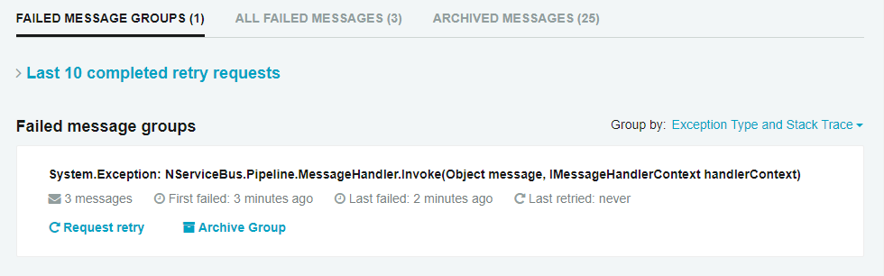
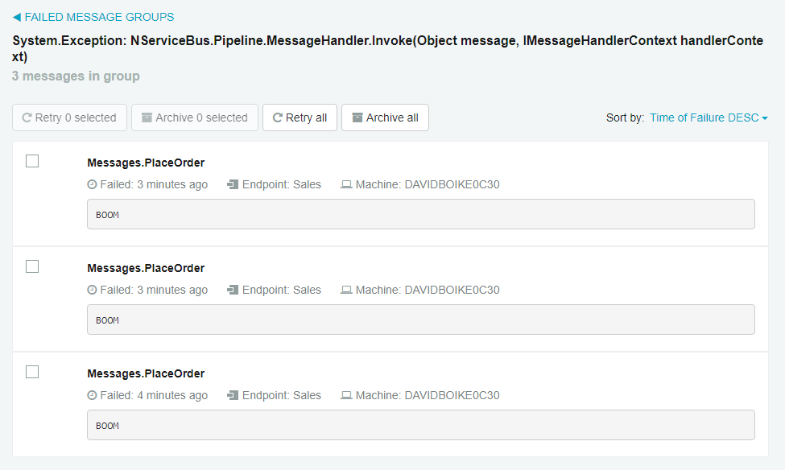

One of the most powerful features of NServiceBus is the ability to replay a message that has failed. By the time a message reaches the error queue, it will have already progressed through multiple retries via the [immediate retries](/nservicebus/recoverability/#immediate-retries) and [delayed retries](/nservicebus/recoverability/#delayed-retries) process, so you can be sure that the exception is systemic.

Often, this type of failure can be introduced by a bug that isn't found until the code is deployed. When this happens, many errors can flood into the error queue all at once. At these times, it's incredibly valuable to be able to roll back to the old version of the endpoint, and then replay the failed messages through proven code. Then you can take the time to properly troubleshoot and fix the issue before attempting a new deployment.

In this tutorial, we'll see how to use ServiceControl to monitor an NServiceBus system, and ServicePulse to replay a failed message.

To get started, download the solution, extract the archive, and then open the **RetailDemo.sln** file with [Visual Studio 2017](https://www.visualstudio.com/downloads/).

downloadbutton


## Project Structure

The solution contains six projects. Similar to the one built in the [NServiceBus Step-by-step](/tutorials/nservicebus-step-by-step/) tutorial, the **ClientUI**, **Sales**, **Billing**, and **Shipping** projects are [endpoints](/nservicebus/endpoints/) that communicate with each other using NServiceBus messages. In addition, this tutorial introduces the **PlatformTools** project which launches a portable version of ServiceControl and ServicePulse.

The **ClientUI** endpoint mimics a web application and is an entry point in our system. The **Sales**, **Billing**, and **Shipping** endpoints contain business logic related to processing and fulfilling orders. Each endpoint references the **Messages** assembly, which contains the definitions of messages as [POCO classes](https://en.wikipedia.org/wiki/Plain_old_CLR_object).

As shown in the diagram, the **ClientUI** endpoint sends a **PlaceOrder** command to the **Sales** endpoint. As a result, the **Sales** endpoint will publish an `OrderPlaced` event using the publish/subscribe pattern, which will be received by the **Billing** and **Shipping** endpoints. Additionally, the **Billing** endpoint will publish an `OrderBilled` event that will also be received by the **Shipping** endpoint.


INFO: In a real system, the **Shipping** endpoint should be able to take some action once it receives both an `OrderPlaced` and `OrderBilled` event for the same order. That is a good use case for a [Saga](/nservicebus/sagas/) and is outside of the scope of this tutorial.

## Running the solution

The solution is configured to have [multiple startup projects](https://msdn.microsoft.com/en-us/library/ms165413.aspx), so when you run the solution it should open a console window for each messaging endpoint, a console window for the Particular Platform tools, and a browser window for the ServicePulse application.

In the **ClientUI** application, press <kbd>P</kbd> to place an order, and watch what happens in other windows.

It may happen too quickly to see, but the `PlaceOrder` command will be sent to the **Sales** endpoint, which will publish events to **Billing** and **Shipping**. The **Billing** endpoint will then publish an event to **Shipping**. The entire process concludes with these two log messages displayed by the **Shipping** endpoint, hinting at the need for a [Saga](/nservicebus/sagas/):

```
INFO  Shipping.OrderPlacedHandler Received OrderPlaced, OrderId = 96dfd084-2bb0-46c3-b939-046e3b911102 - Should we ship now?
INFO  Shipping.OrderBilledHandler Received OrderBilled, OrderId = 96dfd084-2bb0-46c3-b939-046e3b911102 - Should we ship now?
```

## Throwing an exception

Now, let's throw an exception that will make its way to the error queue. For the purposes of this exercise, we'll create a specific bug in the Sales endpoint and watch what happens when we run the endpoint.

 1. In the **Sales** endpoint, locate the **PlaceOrderHandler**.
 1. Uncomment the line that throws the exception. The code in the project contains a `#pragma` directive to prevent Visual Studio from interpreting the unreachable code after the `throw` statement as a build error.

Now, run the solution.

 1. In Visual Studio's **Debug** menu, select **Detach All** so that the system keeps running, but does not break into the debugger when we throw our exception.
 1. In the **ClientUI** window, place an order by pressing <kbd>P</kbd>.

In the **Sales** window, you will see a wall of text culminating in a red error trace. This is where NServiceBus gives up on the message and sends it to the error queue.

```
INFO  Sales.PlaceOrderHandler Received PlaceOrder, OrderId = e927667c-b949-47ee-8ea2-f29523909784
ERROR NServiceBus.RecoverabilityExecutor Moving message '53ac6836-48ef-49dd-aabb-a67c0104a2a5' to the error queue 'error' because processing failed due to an exception:
System.Exception: BOOM
   at < stack trace>
```

Note that the **Sales** endpoint did not peform any delayed retries. This is because retries have been [disabled](/nservicebus/recoverability/configure-delayed-retries.md) in the **Sales** endpoint's **Program.cs** file:

snippet: NoDelayedRetries	

Since we are going to be causing a lot of messages to fail in this exercise, we'd prefer not to wait around for several rounds of delayed retries to complete.


### Replay a message

Using ServiceControl and ServicePulse we can attempt to replay a message:

 1. Fix the **Sales** endpoint by commenting the `throw` statement.
 1. Run the solution.
 1. Switch to the ServicePulse browser window and navigate to the **Failed Messages** page. Note how similar messages are grouped together for easier handling.
    
 1. Click anywhere in a message group box to see the individual failed messages in the group, including the exception message.
    
 1. Click on an individual message, and you will be able to see the stack trace for the exception, or switch tabs to see the message headers or message body.
 1. Click the **Retry message** button and watch what happens in the console windows.
 1. You can also back up to the Message Groups view and click Request retry to replay all the messages within that group at once. Note that ServiceControl executes message retry batches on a 30-second timer, so be patient. Eventually, the messages will be returned to their appropriate endpoints.

When the message is replayed in **Sales**, each endpoint picks up right where it left off. You should be able to see how useful this capability will be when failures happen in your real-life systems.

## Summary

In this tutorial, we saw how to use the Particular Service Platform tools, ServiceControl and ServicePulse, to replay a failed message. With this ability, we can see the details of failed messages in ServicePulse and begin to troubleshoot what went wrong.

Perhaps the message had a previously unexpected input value which caused the bug to go undetected until the code entered production. With this knowledge in hand, we can go fix the code to validate these inputs or take some other sort of corrective action. Once the new code is deployed with the fix, we can replay the message and everything will flow through the system as if the error had never happened.

If you haven't yet, you should check out the [NServiceBus Step-by-step](/tutorials/nservicebus-step-by-step/) tutorial, where you'll learn how to build the solution this tutorial is based on from scratch, while learning the messaging concepts you'll need to know to build even more complex software systems with NServiceBus.

SUCCESS: Now that you understand how powerful the ability to replay messages can be, take the next step and chat with one of our developers about how you can benefit from using NServiceBus in your next project. Just use the live chat in the bottom-right corner of the window.
