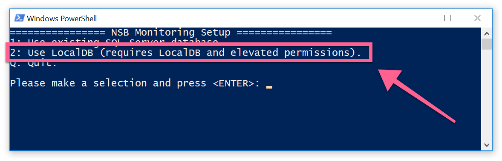

The best way to get started with the monitoring features in the Particular Service Platform is to try them out on ServicePulse with a real system. This downloadable sample contains all of the necessary parts of the platform, already configured and ready to run. It also includes 4 sample endpoints that all communicate by exchanging messages over the SQL Transport.

<a id='download-demo' href='https://github.com/particular/monitoringdemo/zipball/master' class="btn btn-primary btn-lg"> Download demo</a>

## System requirements

In order to run the demo your system needs to meet the following requirements:

- Windows 8 or higher
- LocalDB (installed automatically during demo, if needed and allowed) or SQL Server 2012 and higher to use existing database
- .NET Framework 4.6.1 and higher

## Running the sample

Once you have downloaded and extracted the zip package, open the extracted folder and double-click on `run.bat`. 

Choose option 2 (uses a LocalDB instance, removed during demo shutdown) to get started quickly. To use an existing SQL Server instance instead, see the [detailed setup instructions](/walthrough-setup).

## Demo walk through

Once everything is running, you will have 4 endpoints which are configured like this:

By default, the ClientUI endpoint sends a steady stream of 1 `PlaceOrder` messages every second. 

The endpoints are also configured to send monitoring data to the Particular Software Platform which you can see in ServicePulse. 

## Explore the demo further

See how monitoring tools in ServicePulse help answer the following questions:

- **[Which message types take the longest to process?](walkthrough-1.md)** - take a look at individual endpoint performance and decide where to optimize.

- **[Which endpoints have the most work to do?](walkthrough-2.md)** - look for peaks of traffic and decide when to scale out. 

- **[Are any of the endpoints struggling?](walkthrough-3.md)** - find hidden problems in them system and fix them before messages start to fail.

include: next-steps
