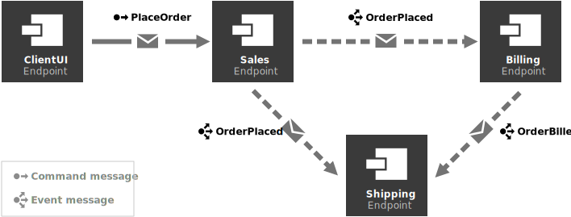
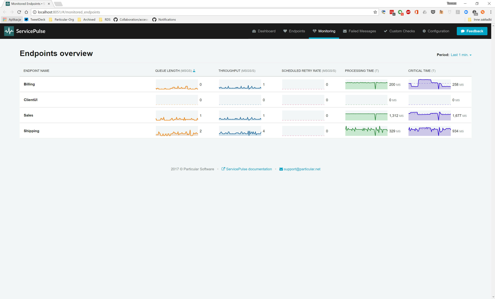

The best way to get started with the monitoring features in the Particular Service Platform is to try them out on ServicePulse with a real system. This downloadable sample contains all of the necessary parts of the platform, already configured and ready to run including four sample endpoints that communicate with each other by exchanging messages.

<a id='download-demo' href='https://s3.amazonaws.com/particular.downloads/MonitoringDemo/Particular.MonitoringDemo.zip' class="btn btn-primary btn-lg"> Download demo</a>

## System requirements

In order to run the demo your system needs to meet the following requirements:

- Windows 8 or higher
- .NET Framework 4.6.1 and higher

## Running the sample

Once you have downloaded and extracted the zip package, open the extracted folder and double-click on `MonitoringDemo.exe`.

The details on how the demo is setup can be found in the demo [setup walkthrough](walkthrough-setup.md).

## Demo walk-through

Once everything is running, you will have 4 endpoints which are configured like this:

By default, the ClientUI endpoint sends a steady stream of 1 `PlaceOrder` message every second.

The endpoints are also configured to send monitoring data to the Particular Software Platform which you can see in ServicePulse.

## Explore the demo further

See how monitoring tools in ServicePulse help answer the following questions:

- **[Which message types take the longest to process?](walkthrough-1.md)** Take a look at individual endpoint performance and decide where to optimize.
- **[Which endpoints have the most work to do?](walkthrough-2.md)** Look for peaks of traffic and decide when to scale out. 
- **[Are any of the endpoints struggling?](walkthrough-3.md)** Find hidden problems and fix them before messages start to fail.

include: monitoring-demo-next-steps
