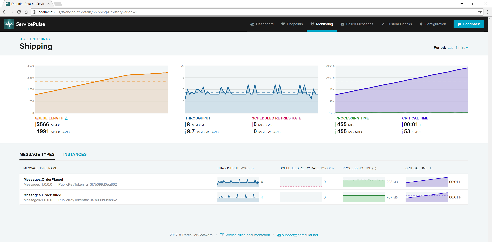
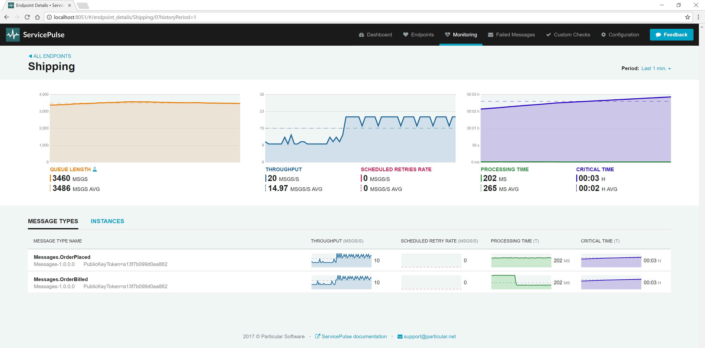

_Which message types are taking the longest to process?_

This is the first question to ask when setting up monitoring on an NServiceBus system. The handlers for these message types are the slowest part of a system, and if you want to spend time optimizing code, these message handlers are the best candidates to see improvements in your system.

This part of the tutorial guides you through finding the message types that take the longest to process.

include: monitoring-demo-walkthrough-solution

## Metrics

Finding the message type that takes the longest to process requires two metrics: *throughput* and *processing time*.

_Throughput_ is a measure of how much work an endpoint is doing. It is the rate at which an endpoint can process messages from its input queue. While throughput can reflect endpoint performance, it is also heavily influenced by how much work there is to do. A highly optimized endpoint with only a few messages per second to process will still have low throughput.

_Processing time_ is the time it takes for the endpoint to process a single message. A higher processing time indicates a slower endpoint and a lower processing time indicates a faster endpoint. The amount of work assigned to an endpoint has less impact on processing time than it does on throughput. This makes it a better gauge for individual endpoint performance.

## Sample walkthrough

The following walkthrough shows how to find the message types that take the longest to process and demonstrates the effect of reducing that time on processing time and throughput.

**Run the sample solution. Open ServicePulse and select the Monitoring tab.**

Look at the processing time and throughput for each endpoint. By default, the Sales endpoint is processing one message every second (throughput), and it takes around 1.3 seconds to process each message (processing time).

Notice that the Sales endpoint has the highest processing time, so it is taking the longest to process messages. At low volumes of traffic, it's difficult to see the impact that this has on the rest of the system. Let's add some more traffic.

**Find the ClientUI endpoint window and toggle *High-Throughput* mode. Now go back to the ServicePulse Monitoring tab.**

In high throughput mode, the ClientUI endpoint sends 20 orders to Sales every second. Now look at the processing time and throughput of each endpoint. The throughput of Sales will increase and then plateau at around three messages / second. This is as fast Sales can currently process messages. It can process four messages in parallel, but each message takes 1.3 seconds to process.

Notice that the throughput of Billing mirrors the throughput of Sales. Billing is processing messages that are produced by Sales. Although the Billing endpoint can process messages faster than Sales can (it has a lower processing time), it can only process messages as quickly as Sales is producing them. If we can make Sales run faster, then our throughput for Sales _and_ Billing can be increased.

Let's see what the impact of optimizing the sales endpoint is.  

**Find the Sales endpoint window and reduce the time to process messages from 1.3 seconds down 0.2 seconds. Now go back to the ServicePulse Monitoring tab.**

As the time to process each order goes down, the throughput for Sales goes up (to somewhere around 20). So does the throughput for Billing which is now receiving work faster and keeping up with the new load. By optimizing a single message handler, you can make more than one endpoint process work faster.

Optimizing the Sales endpoint was simple because Sales only processes a single message type. Now that we've optimized that endpoint, let's look at the next slowest endpoint, Shipping. 

The Shipping endpoint handles two different types of messages: `OrderPlaced` (which comes from Sales), and `OrderBilled` (which comes from Shipping). The value shown for processing time on the ServicePulse monitoring tab is an average of all of the samples taken in a short period. For processing time, this might mean a mix of different message types are used to come up with a single value displayed. If we want to make the endpoint go faster, where do we focus our efforts?

**In ServicePulse, click the Shipping endpoint to open the Details view.**

In the details view, we see a breakdown of processing time and throughput for each message type. The throughput for the two messages types should be roughly equivalent. The Shipping endpoint can process four of each message type per second. The processing time for these message types differs though. Processing an `OrderPlaced` event takes roughly 200 ms but processing an `OrderBilled` event takes closer to 700 ms. If you average these values, you get the processing time for the whole endpoint, roughly 450 ms.

The slowest type of message to process is `OrderBilled`. If we can speed up the processing of `OrderBilled` message, we can increase the throughput for the whole Shipping endpoint which will allow us to process _both_ message types faster.

**Find the Shipping endpoint window and reduce the time to process `OrderBilled` events to 0.2 seconds.**

As the processing time for one message type goes down, the overall endpoint processing time goes down. When that happens, just as with Sales, the throughput goes up. It should hover close to 20 messages per second, and that throughput is divided about equally between the two message types. This is because for every `OrderBilled` event in the input queue, there is also an `OrderPlaced` event and they are evenly distributed. 

### The throughput on my message types is not an even split

In the previous example, we looked at the Shipping endpoint which handled two different message types. These message types had roughly even throughput but different processing times. When that happens, you can quickly boost overall endpoint performance by reducing the processing time on the slowest handler. When there is a bigger gap in throughput, the answer is not so clear.

Let's start with the simplest case, where the processing time for each message type is about the same. In this case, you should look at the message type with the highest throughput and optimize the handler for that message type. As the endpoint is processing more messages of that type, optimizing that handler will have the greatest impact on overall endpoint performance. Before doing this, remember that the throughput is impacted by how fast messages of that type are being generated, not just by how fast they can be processed. You might get more benefit by optimizing a process in the endpoint that _sends_ messages of this type. 

When the processing time and throughput are different, both figures must be taken into account. If a message type is being processed more (higher throughput), then the endpoint becomes more sensitive to how long it takes to process messages of that type (processing time).  

### I have a slow message handler that cannot be further optimized

Sometimes, you are faced with a message handler that is still slow, even after optimizing it as much as you can. These message handlers have a negative impact on the processing time and throughput of the endpoints in which they run, which means the throughput of other message types handled by the same endpoint is also impacted.

When this happens, a good option is to move the slow message handler to its own dedicated endpoint. The new endpoint will have its own queue of slow-to-process message types and will start processing them as soon as they arrive rather than having the slow messages waiting in the queue for other message types to be handled.

The original endpoint will also get a boost in productivity as it will process the remaining message types faster on average. This results in that endpoint's throughput going up.

#### Increasing maximum concurrency

Another option is to increase the maximum concurrency level and allow for a higher degree of parallel processing. The default maximum concurrency level of an endpoint is the number of cores of the host machine. Increasing this by a factor of two, three, or even more can increase throughput if your handlers are often waiting on remote calls to complete.

#### Move endpoint to another host

If an endpoint is affecting the performance of other endpoints, it can be moved to its own dedicated host.

### Scale-out over multiple machines

If moving an endpoint to its dedicated machine isn't sufficient, it can be scaled out and run on multiple machines. 

## Keep exploring the demo

- **[Which endpoints have the most work to do?](./walkthrough-2.md):** look for peaks of traffic and decide when to scale out.
- **[Are any of the endpoints struggling?](./walkthrough-3.md):** find hidden problems and fix them before messages start to fail.

include: monitoring-demo-next-steps
