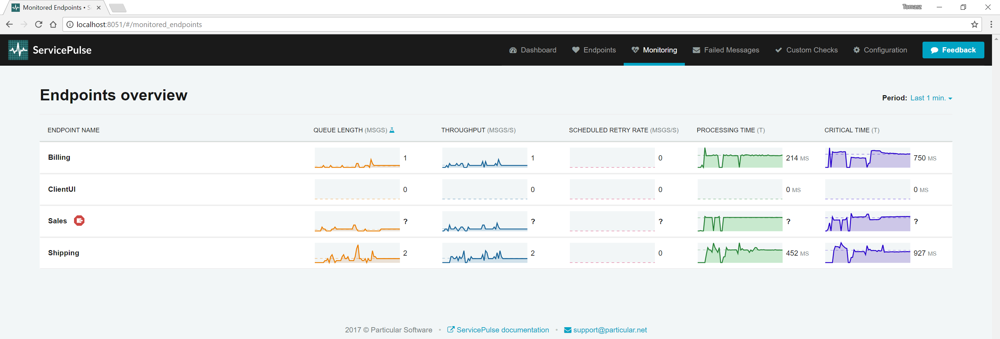

_Which endpoints have the most work to do?_

Each endpoint has a backlog of messages to process in its input queue. As each endpoint processes its backlog, it is also generating new messages that go into the backlog of other endpoints in the system. When a spike in traffic occurs, either due to increased activity by end users or because a large batch process kicks off, it can be useful to monitor the changes to backlog load across the system. Using this information, you can decide to scale some of your endpoints out to meet the increased demand.

This part of the tutorial guides you to the endpoints with the greatest backlog of work to do.

include: monitoring-demo-walkthrough-solution

## Metrics

To measure endpoint backlogs we're going to use two metrics: queue length and critical time.

_Queue length_ is an estimate of how many messages are in the input queue of an endpoint, representing the backlog of messages to be processed. If an endpoint is processing messages faster than it is receiving them, then queue length will decrease. Conversely, when an endpoint is receiving messages faster than it can process them, queue length will increase.

_Critical time_ is the time between when a message is initially sent and when it has been completely processed. Critical time includes the time it takes for a message to get from a sending endpoint to the destination queue, the time the message spends waiting to get to the front of that queue to be processed, and the time it takes the receiving endpoint to process the message. Critical time is the time it takes for your system to react to a specific message.

Queue length and critical time are related. As queue length increases, messages spend more time waiting in an endpoint's input queue, increasing the endpoint's critical time.

DANGER: Both critical time and queue length are approximations and are not exact measurements.

Critical time is calculated using timestamps generated by two different machines (sender and receiver). If there is a significant difference in clocks on these machines, it will introduce an error into the critical time calculation. 

Queue length is approximated by having sending and receiving endpoints report how many messages of a specific type they have sent or received respectively. If reports are received out of order or if there is a significant delay in either of these reports arriving, it can introduce an error into the queue length calculation.

## Sample walkthrough

The following walkthrough shows how to identify changes in an endpoint's backlog and how to use that information to scale out an endpoint to handle the load.

**Run the sample solution. Open ServicePulse to the Monitoring tab.**

Look at the queue length and critical times for each endpoint. By default, the ClientUI endpoint is sending one order per second into the system, and the system can keep up. Queue lengths are hovering around zero as messages are not waiting around in input queues. Critical times remain very similar to processing times since most of a message's critical time is the amount of time it takes to process. 

Let's see what happens when we apply more pressure to the system.

**Find the ClientUI endpoint window and toggle High-Throughput mode. Now go back to the ServicePulse Monitoring tab.**

Now, look at the queue length and critical time for each endpoint. Notice that there isn't that much change for the Billing and Shipping endpoints. The Sales endpoint is quickly running into difficulties though. Once it hits its throughput limit, the Sales queue length starts to ramp up. As it does, the critical time also starts to climb. The Sales endpoint is becoming less responsive as its backlog of work increases.

NOTE: The sample endpoint included in the demo has been artificially limited so that it can handle only four messages concurrently. 

**Once there are 1,000 messages in the backlog, turn off High-Throughput mode.**

Now that the spike in traffic is over, there is still a large backlog of messages to get through. At a throughput of 4 messages per second, it's going to take 250 seconds (just over 4 minutes) to get through the backlog. That doesn't account for the new messages still being added to the Sales input queue by the ClientUI endpoint.

To handle this load of traffic, we are going to scale out the Sales endpoint.

**In the MonitoringDemo executable, press `up arrow` to scale out.**

Every time the key `up arrow` is pressed, one more instance of the Sales endpoint is started. Press the `up arrow` key three times to start three new instances (for a total of 4). As each new instance comes online, the critical time for the Sales endpoint comes down, and the throughput increases. It is also possible to scale in again by pressing the `down arrow` key.

As the throughput of the Sales endpoint increases, watch what happens to the Billing and Shipping endpoints. As these endpoints are waiting for `OrderPlaced` events from the Sales endpoint, increasing the throughput of Sales also increases the throughput of these downstream endpoints. Neither of them seems to be building up a considerable queue length or critical time, so we don't need to scale them out.

NOTE: This scale-out example is a simulation, and works only on a single machine because the message handlers are using little or no system resources (simulating message processing latency with `Task.Delay`). In a production scenario, you'd likely run a second instance of the endpoint on a different machine.

Once you have more than one instance of an endpoint running, ServicePulse will show a count of how many instances are running in the overview screen.

**In the ServicePulse monitoring tab, click the Sales endpoint to open a detailed view.**

In this view, you can see all of the instances that are running.

Each instance provides its own breakdown of metric data. If one particular instance is having a problem, you'll be able to see it here. 

**Find the window for instance-2 of the Sales endpoint. Close it.**

When an endpoint instance stops sending data, it will be displayed with an error icon in ServicePulse.

### Critical time is going up, but so is processing time

Critical time covers the entire lifetime of a message, from when it is first sent to when it has been completely processed. This includes the length of time it takes for the endpoint to process the message, which is already measured by processing time.

As processing time is a component of critical time, if processing time increases, so will critical time. Not only that, but an increase in processing time is often accompanied by a decrease in throughput (see [Which message types take the longest to process?](walkthrough-1.md) to find out why). This decrease in throughput can result in a backlog of messages (increased queue length) meaning that messages spend more time waiting to be processed, and that also increases the critical time.

If processing time is increasing, it is often a sign that there is some resource that is failing and the endpoint relies on that resource to process its messages; for example, a database server or remote web server that is taking longer to process requests. If this is the case, scaling out your endpoint might make the problem worse as you'll put additional pressure on these resources which may slow down even further, or in the worst case, start to break.

More in-depth investigation is required to resolve this type of issue. First, use the details view to find the message types that are taking the longest to process. Look at the handler code for these message types and try to identify any calls that are I/O-bound. Identify which resources are being accessed. Look at the behavior of these resources and see why they might be slowing down. Is there any way to prevent that from happening? Should you reduce your concurrency or even throttle your requests to the resource to ensure it stays up and running?

### The queue length on my endpoint has started going down but critical time is still increasing

Critical time is a delayed measurement. It measures the amount of time a message _took_ to get processed after it was sent. When queue length, network latency, and processing time are relatively stable, then critical time can be used to predict how long a new message will take to get processed. If any of those factors change significantly, then critical time is less useful as a predictive measurement.

## Keep exploring the demo

- **[Which message types take the longest to process?](./walkthrough-1.md):** take a look at individual endpoint performance and decide where to optimize.
- **[Are any of the endpoints struggling?](./walkthrough-3.md):** find hidden problems and fix them before messages start to fail.

include: monitoring-demo-next-steps
