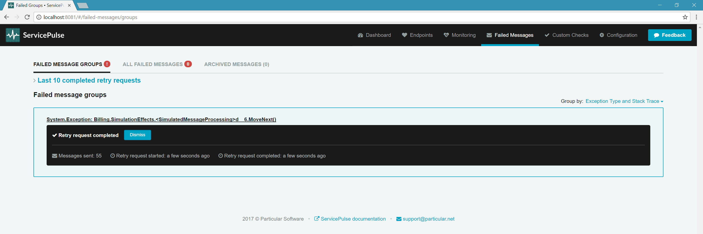

_Are any of the endpoints struggling?_

This tutorial demonstrates how to use monitoring data in the Particular Service Platform to detect early warning signs and hidden issues in your NServiceBus system. You will learn how to spot struggling endpoints before they become critical problems.

include: monitoring-demo-walkthrough-solution

## Key metrics

NServiceBus is designed to handle transient errors automatically. For example, if a network switch is restarted or a web server is temporarily unavailable, the endpoint will roll back the message to its input queue and retry later. If the issue is resolved quickly, the message will process successfully on retry. If the problem persists, the message will eventually be forwarded to the error queue.

- **Scheduled retry rate**: Measures how often messages fail and are scheduled for retry.
- **Processing time**: The time taken to process a single message. Higher processing times may indicate a struggling endpoint, while lower times suggest healthy performance. Only successfully processed messages are measured.

## Walkthrough: Identifying struggling endpoints

Follow these steps to simulate and observe endpoint issues using the sample solution:

1. Run the sample solution.
2. Open ServicePulse and navigate to the Monitoring tab.

   

Endpoints often depend on external resources, such as databases or web APIs. While endpoints are resilient to failures, monitoring can reveal early indicators of trouble.

### Detecting slow message processing

A common early warning sign is an increase in message processing time. This may indicate that database queries or web API calls are taking longer than usual, signaling potential issues with dependent resources.

**Simulate resource degradation:**

Find the Shipping endpoint window and toggle the resource degradation simulation.

As the (simulated) third-party resources slow down, processing time for the Shipping endpoint increases. To diagnose the root cause, it's essential to identify which message types are affected.

**Analyze processing time by message type:**

In the ServicePulse UI, click the Shipping endpoint to open a detailed view.

This view breaks down processing time by message type. In this case, only the `OrderPlaced` events are experiencing increased processing times, indicating an issue specific to that message type.

> [!NOTE]
> This example uses simulation to mimic resource degradation (e.g., `Task.Delay`).

**Observe recovery:**

Find the Shipping endpoint window and toggle the resource degradation simulation off. Return to the ServicePulse Monitoring tab.

Once the remote resource is simulated to recover, the processing time for the Shipping endpoint should return to normal, demonstrating the impact of the failing resource.

### Monitoring scheduled retry rate

Another critical metric is the scheduled retry rate, which indicates how often messages are failing and being retried. A sudden increase in this rate may suggest that an endpoint is struggling to process messages successfully.

**Simulate increased failure rate:**

Find the Billing endpoint UI and increase the failure rate to 30%.

Monitor the scheduled retry rate for the Billing endpoint in the ServicePulse monitoring tab. Despite the increased failure rate, the endpoint may still process messages successfully after a few retries.

> [!NOTE]
> A higher failure rate can lead to decreased throughput, as the endpoint spends resources retrying failed messages. This may also impact queue length and critical time, as explained in [Which endpoints have the most work to do?](./walkthrough-2.md).

Check the endpoint logs for detailed information about retried messages, including the message content and the nature of the failure.

### Identifying failed messages

The final indicator of a struggling endpoint is when messages consistently fail to process, even after being retried. NServiceBus will forward these messages to ServiceControl for manual intervention.

**Increase the failure rate to 90%:**

Find the Billing endpoint UI and increase the failure rate to 90%.

With a high failure rate, messages will quickly exceed the configured retry attempts and appear in the Failed Messages tab in ServicePulse.

ServiceControl groups failed messages by exception type and the location in the code where the exception occurred. In ServicePulse, you can examine each failed message individually, including the stack trace, message headers, and body.

Once the underlying issue is resolved, you can retry all failed messages in bulk from ServicePulse.

**Retry failed messages:**

Find the Billing endpoint UI and decrease the failure rate back down to 0%. In the ServicePulse Failed Messages tab, click the Request retry button. Confirm that you are ready to retry the messages.

ServiceControl will stage the messages for retry and return them to the Billing endpoint for successful processing.

## Next Steps

After identifying and resolving issues with struggling endpoints, consider exploring the following:

- **[Which message types are taking the longest to process?](./walkthrough-1.md):** Analyze individual endpoint performance to identify optimization opportunities.
- **[Which endpoints have the most work to do?](./walkthrough-2.md):** Examine traffic patterns and determine optimal scaling strategies.

include: monitoring-demo-next-steps
