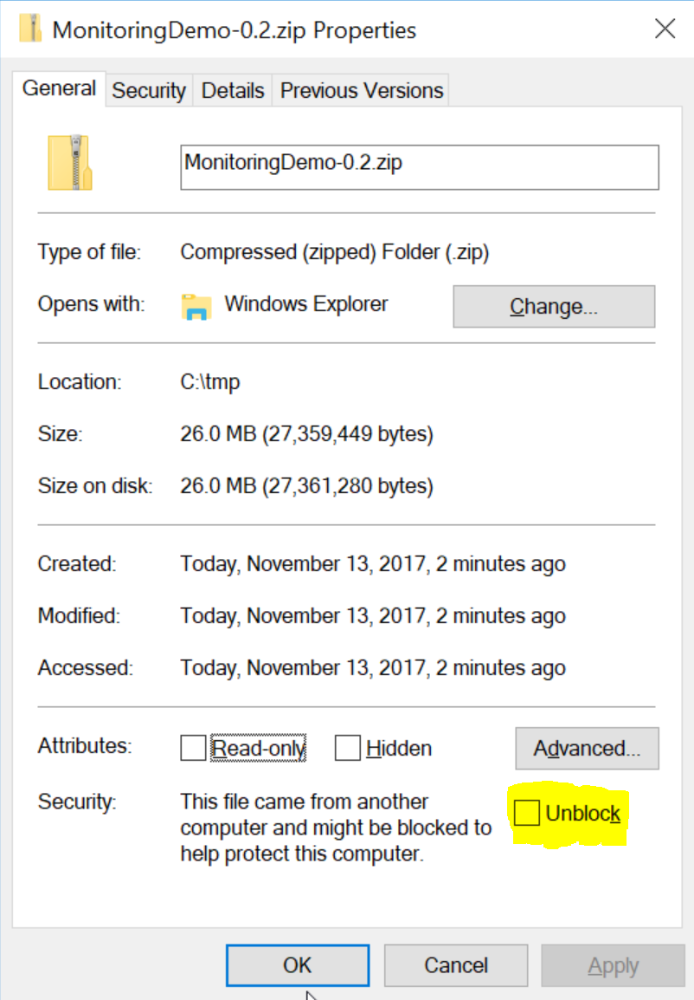

This document explains how to set up the [NServiceBus monitoring demo])(./) in detail.

## Prerequisites

In order to run the demo your system needs to meet the following requirements:

- Windows 8 or higher
- LocalDB (installed automatically during demo, if needed and allowed) or SQL Server 2012 and higher to use existing database
- .NET Framework 4.6.1 and higher

## Running the sample

The sample zip file includes 4 endpoints and the Particular Software Platform components, all of which have been configured to talk to each other using a SQL Server instance.

Once you have downloaded the zip package make sure to **unblock** it in the file properties, if needed:

After unblocking the zip file, extract its contents into a folder. For the rest of this tutorial, we will refer to this folder as `MonitoringDemo`.

Open the `MonitoringDemo` folder and double-click on `run.bat`. This script will:

1. Ask you to select a SQL Server to use as a transport. All of the components of the demo communicate by using a shared SQL Server database. You will be prompted to *use an existing SQL Server instance* or have the demo create it's *own dedicated SQL LocalDB instance*.
2. You will be prompted to run the remaining steps with elevated privileges. This is needed so that processes can bind to their network ports and for SQL database creation.
2. Create a LocalDB instance if required.
2. Create the SQL database catalog with all of the necessary tables that the demo components will use.
3. Update the configuration files for all of the components with the correct connection string details.
4. Run ServiceControl components, each in their own window.
    - A ServiceControl instance (binds to port 33533)
    - A Monitoring instance (binds to port 33833)
5. Run the sample endpoints, each in their own window
6. Run ServicePulse, in it's own window (binds to port 8051)
7. Open your default browser to the ServicePulse monitoring tab.
8. Wait for ENTER key, and will quit all processes and optionally removes the created SQL LocalDB instance.

### Selecting a SQL Server instance

In order to communicate, all of the components in the sample need access to a shared SQL Server database instance. If you have an existing SQL Server instance available, select the first option and the demo will use it. 

After selecting a database instance (default is `localhost`), you will be prompted for the name of the database to use (default is `ParticularMonitoringDemo`). This creates the specified database catalog if it does not exist. It is already exists, the database will not be dropped.

After you have selected a database instance, you will be asked to provide credentials. You can opt to use Integrated Security or to supply a user name and password to use a SQL login. The credentials that you supply will be used check connectivity and to create the database catalog if needed, so they must have enough privileges on the selected SQL Server instance.

If you do not have your own SQL Server instance, or you would prefer to keep the demo pieces separate, select the 2nd option. This requires a SQL Server LocalDB installation (2012 or newer).

## Explore the demo

Once you have the demo up and running, [begin exploring the demo](/tutorials/monitoring-demo/walkthrough-setup.md#demo-walk-through).
