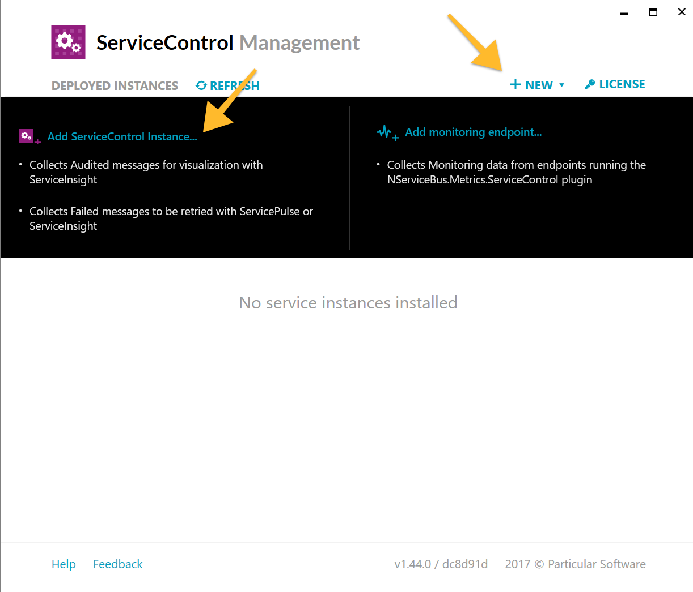
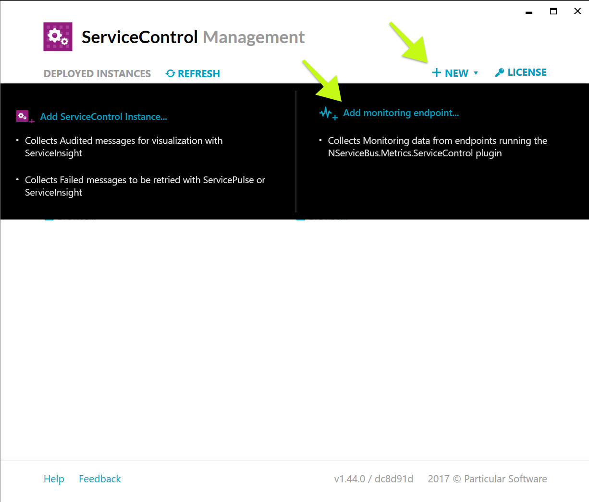
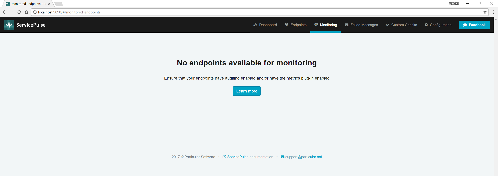

This tutorial will guide you through the steps required to set up your NServiceBus solution for monitoring with the Particular Service Platform. The tutorial assumes that you're configuring monitoring for an existing solution and doesn't explain how to create a new application. See the [quick start tutorial](/tutorials/quickstart/) for details on how to do that.

Note: If you are not yet sure which transport to choose and are looking to see the monitoring capabilities of the Particular platform, try the [monitoring demo](/tutorials/monitoring-demo/).

- [Component overview](/tutorials/monitoring-setup/#component-overview)
- [Setting up Particular Service Platform](/tutorials/monitoring-setup/#setting-up-the-particular-service-platform)
  - [Install ServiceControl](/tutorials/monitoring-setup/#setting-up-the-particular-service-platform-install-servicecontrol)
  - [Create ServiceControl instance](/tutorials/monitoring-setup/#setting-up-the-particular-service-platform-create-a-servicecontrol-instance)
  - [Create ServiceControl Monitoring Instance](/tutorials/monitoring-setup/#setting-up-the-particular-service-platform-create-a-servicecontrol-monitoring-instance)
- [Configure NServiceBus endpoints](/tutorials/monitoring-setup/#configure-nservicebus-endpoints)
  - [Error](/tutorials/monitoring-setup/#configure-nservicebus-endpoints-error)
  - [Audit](/tutorials/monitoring-setup/#configure-nservicebus-endpoints-audit)
  - [Monitoring](/tutorials/monitoring-setup/#configure-nservicebus-endpoints-monitoring)

## Component overview

A running NServiceBus system can be configured to send data about its operation to three main queues:

- `Monitoring`: Each endpoint will gather and send metric data to this queue. This data holds information about the health and performance of an endpoint.
- `Audit`: When an endpoint successfully processes a message, a copy of the message will be forwarded to this queue. The audited message will have additional headers which contain data about the processing of the message.
- `Error`: When an endpoint fails to process a message (after exhausting automated retry attempts), a copy of the message is forwarded to this queue. The failed message will have additional headers which contain data about the failed attempt to process the message.

Any solution using the `NServiceBus` package can be configured to send messages to the `Audit` and `Error` queues. In order to send data to the monitoring queue, two additional packages are required:

- `NServiceBus.Metrics`: hooks into the NServiceBus pipeline to gather and expose metrics.
- `NServiceBus.Metrics.ServiceControl`: buffers the data generated by NServiceBus.Metrics and periodically sends it to the monitoring queue. This package also instruments outgoing messages with additional headers that are used to estimate queue length.

[ServiceControl](/servicecontrol/) is a suite of back-end tools that collect useful information about your running system. A monitoring system back-end consists of two different components:

- [ServiceControl instance](/servicecontrol/servicecontrol-instances/): collects messages from the audit and error queues.
- [Monitoring instance](/servicecontrol/monitoring-instances/): collects data from the monitoring queue about all of the endpoints in an NServiceBus system.

Both of these instance types can be set-up and managed with the `ServiceControl Management Utility`.

[ServicePulse](/servicepulse/) is a web application that connects to ServiceControl and provides production monitoring and recoverability. It contains pages to visualize the monitoring data in a monitoring instance. It can also be used to review and manage failed messages that are managed by a ServiceControl instance.

## Setting up the Particular Service Platform

In order to configure an environment for monitoring with the Particular Service Platform you will need to install and configure the components in the order listed.

### Install ServiceControl

The main ServiceControl installer includes a desktop utility called the `ServiceControl Management Utility` which can create and manage both types of instance.

Download and run the latest [ServiceControl installer](https://particular.net/start-servicecontrol-download).

NOTE: You should run the latest version of the installer, even if you already have ServiceControl installed. Only versions 1.43 and above of the ServiceControl Management Utility can create and manage monitoring instances.

Once it has finished installing, run the ServiceControl Management Utility.

### Create a ServiceControl instance

NOTE: You can use an existing ServiceControl instance if it is version 1.43 or higher.

In the `ServiceControl Management Utility`, click **+ New** and select **ServiceControl instance** from the list of options.

Scroll down to the **Transport Configuration** section. Select the transport that your NServiceBus system uses. Depending on the transport you may need to add an additional connection string.

Under **Audit Forwarding** select either On or Off. If you are not currently using an audit queue, you can safely turn this off. See [audit forwarding](/servicecontrol/errorlog-auditlog-behavior.md) for more information.

Click the Add button. Your ServiceControl instance will start and appear on the main page of the `ServiceControl Management Utility`.

The listing for the ServiceControl instance includes a URL. This URL will be needed when installing ServicePulse below.

NOTE: Creating the ServiceControl instance will also create the audit and error queues if they did not already exist. By default these are called _audit_ and _error_ respectively.

### Create a ServiceControl monitoring instance

A monitoring instance collects data from the monitoring queue and aggregates information from all of the endpoints in the system.

In the `ServiceControl Management Utility`, click **+ New** and select **monitoring endpoint** from the list of options.

Scroll down to the **Transport Configuration** section. Select the transport that your NServiceBus system uses. Depending on the transport selected you may need to add an additional connection string.

Click the Add button. Your monitoring instance will start and be listed on the main page of the `ServiceControl Management Utility`.

The listing for the monitoring instance includes a URL. This URL will be needed when installing ServicePulse below.

NOTE: Creating the monitoring instance will also create the monitoring queue if it did not already exist. By default this queue is called _Particular.Monitoring_.

### Install ServicePulse

NOTE: Make sure that ServiceControl and ServiceControl monitoring instances are added first.

[ServicePulse](/servicepulse/) is a web application for production monitoring and recoverability. It connects to a monitoring instance to display monitoring data and to a ServiceControl instance to display recoverability data.

Download and run the latest [ServicePulse installer](https://github.com/Particular/ServicePulse/releases/).

NOTE: In order to configure ServicePulse to connect to a ServiceControl monitoring instance you must download the latest version, then uninstall your current version and install the downloaded version.

On the ServicePulse Configuration screen ensure that Recoverability is enabled and enter the URL of the ServiceControl instance API. Check the box marked Monitoring and enter the URL of the monitoring instance API.

You can find the URLs for each instance API in the `ServiceControl Management Utility`.

Launch ServicePulse and navigate to the **Monitoring** tab.

NOTE: If monitoring was not enabled during installation, the monitoring tab will not be visible.

## Configure NServiceBus endpoints

In order to be monitored by the Particular Service Platform, each endpoint must be configured to send data to three different queues: error, audit, and monitoring.

It is recommended to go through this entire process for a single endpoint and ensure that it is working before continuing on to the next endpoint.

### Error

Whenever an NServiceBus endpoint is unable to process a message (even after several attempts) it will forward the message to the error queue. Each environment (such as dev, test, QA, production) should contain a single error queue and should not share an error queue with another environment.

The error queue is created with a new ServiceControl instance. By default, it is named `error`.

Configure your endpoint to send failed messages to the error queue.

partial: error-config

NOTE: If you are using the MSMQ transport then you also need to specify the machine where the error queue is located. i.e. `error@MACHINENAME`. This should be the same machine where your ServiceControl instance is installed.

### Audit

Whenever an NServiceBus endpoint successfully processes a message, it can be configured to send a copy to a centralized audit queue. Each environment should contain a single audit queue and should not share an audit queue with another environment.

The audit queue is created with a new ServiceControl instance. By default, it is named `audit`.

Configure your endpoint to send processed messages to an audit queue.

partial: audit-config

NOTE: If you are using the MSMQ transport then you also need to specify the machine where the audit queue is located. i.e. `audit@MACHINENAME`. This should be the same machine where your ServiceControl instance is installed.

### Monitoring

An NServiceBus endpoint can be configured to send data about its health and performance to a centralized monitoring queue. Each environment should contain a single monitoring queue and should not share a monitoring queue with another environment.

The monitoring queue is created with a new monitoring instance. By default, it is named `Particular.Monitoring`.

To get an NServiceBus endpoint to send metric data to the monitoring queue, install the `NServiceBus.Metrics.ServiceControl` NuGet package. From the Visual Studio **Package Manager Console** window, execute the following:

snippet: SetupMonitoring-InstallPackage

You can then enable monitoring and configure the location of the monitoring queue. Add the following code to your endpoint configuration:

snippet: SetupMonitoring-ConfigureMetrics

NOTE: If you are using the MSMQ transport then you also need to specify the machine where the monitoring queue is located. i.e. `Particular.Monitoring@MACHINENAME`. This should be the same machine where your monitoring instance is installed.

NOTE: When using the MSMQ transport it is also necessary to install queue length metrics [reporter](/monitoring/metrics/msmq-queue-length.md) package. The queue length troubleshooting [guide](/monitoring/metrics/queue-length-troubleshooting.md) contains more details on possible problems with the monitoring setup.

## Smoke Test

Now that everything is installed, run the system and open ServicePulse. In the monitoring tab, you should see a list of running endpoints.

## Next Steps

- Learn more about [ServiceControl](/servicecontrol/)
- Learn more about [ServicePulse](/servicepulse/)
- Learn more about the [NServiceBus.Metrics](/monitoring/metrics/) plugin
