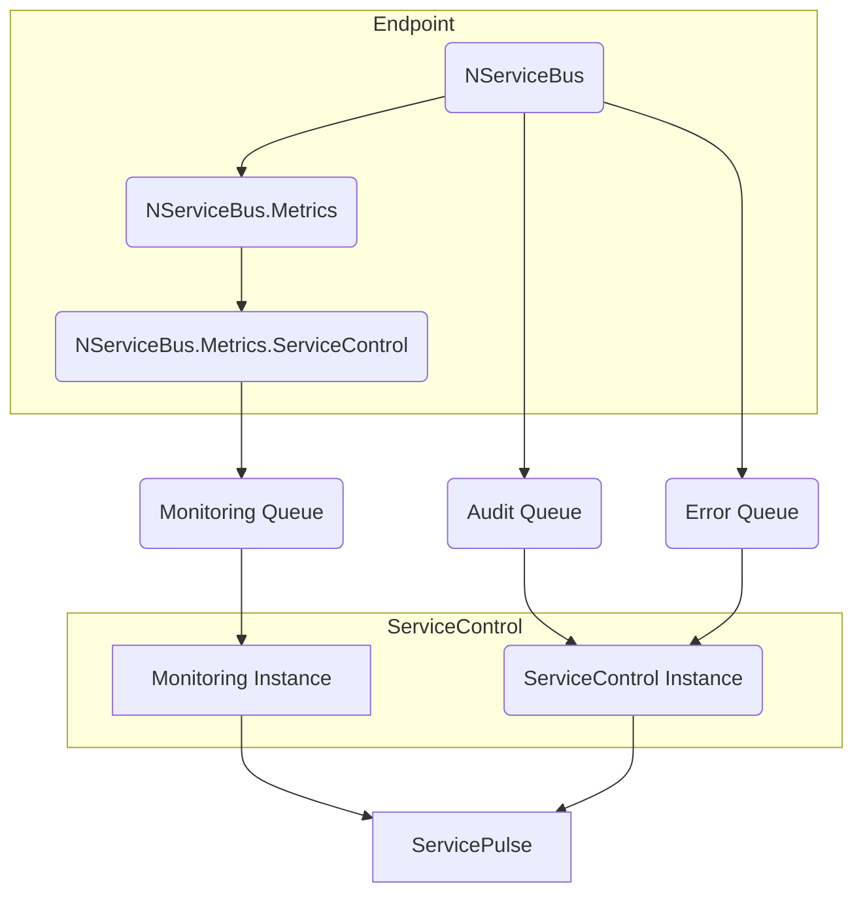
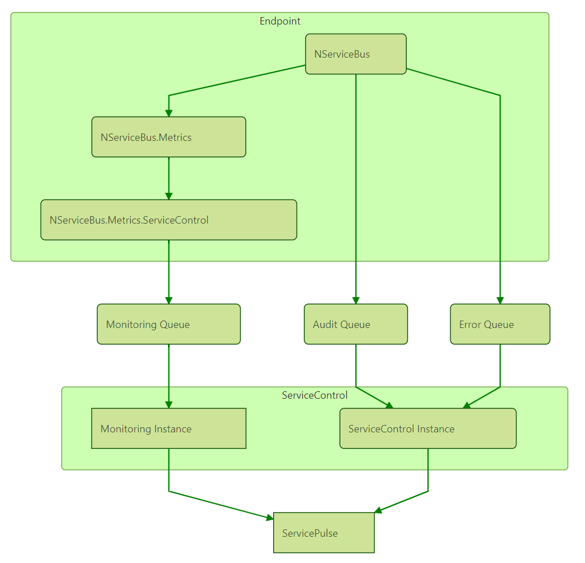

include: monitoring-intro-paragraph

[Sample monitoring solution](tutorials/monitoring/0-sample-solution)

This first lesson explains all of the components involved in monitoring an NServiceBus solution with the Particular Service Platform.

## Component overview

Each system being monitored will push data to three main queues:

- Monitoring: Each endpoint will calculate and send metric data to this queue. This data can tell us about the health and performance of an endpoint.
- Audit: When an endpoint successfully processes a message, a copy of the message will be forwarded to this queue. The audited message will have additional headers which contain data about the processing of the message.
- Error: When an endpoint fails to process a message (after exhausting automated retry attenpts), a copy of the message is fowarded to this queue. The failed message will have additional headers which contain data about the failed attempt to process the message.

The core NServiceBus package can be configured to send messages to the Audit and Error queues. In order to send data to the Monitoring queue, two additional packages are required:

- NServiceBus.Metrics: hooks into the NServiceBus pipeline to calculate and expose metrics.
- NServiceBus.Metrics.ServiceControl: collects the metric data generated by NServiceBus.Metrics and periodically sends it to the monitoring queue. This package also instruments outgoing messages with additional headers that are used to estimate queue length.

ServiceControl is a suite of back-end tools that collect useful information about your running system. A monitoring solution will contain two different instances:

- ServiceControl instance: collects messages from the audit and error queues. Error messages are grouped together and can be retried in bulk.
- Monitoring instance: a new type of ServiceControl instance that collects data from the monitoring queue about all of the endpoints in an NServiceBus system. 

Both of these instance types can be created and managed with the ServiceControl Management Utility.

ServicePulse is a web application that connects to ServiceControl and provides production monitoring and recoverability. It contains pages to visualize the monitoring data in a Monitoring instance. It can also be used to review and manage failed messages that are managed by a ServiceControl instance.