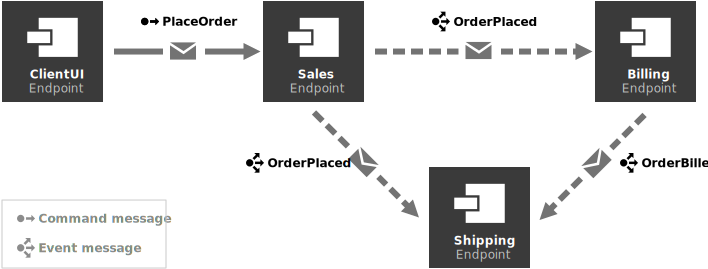

The best way to get started with the monitoring features in the Particular Service Platform is to try them out with a real system. This downloadable sample contains all of the necessary parts of the platform, already configured and ready to run. It also includes a Visual Studio solution with 4 running endpoints that all communicate by exchanging messages over the SQL Transport.


TODO: Add link to download which will be on S3 somewhere


## Prerequisites

TODO: Decide on Docker vs LocalDB


## Running the sample

Once you have downloaded the sample zip, unzip it's contents into a folder. For the rest of this tutorial, we will refer to this folder as `MonitoringDemo`.

Open a powerhsell prompt to the demo folder and execute the following:

```ps
.\Run.ps1
```

This script will:
- Start up and configure a SQL Database server (using LocalDB or Docker, see above) for all of the Particular Software Platform components and the sample solution to communicate through.
- Start up all of the Particular Software Platform components
- Open a browser window to open the new ServicePulse instance


### Solution walktrhough

Once the environment is up and running you can run the sample solution that is included in the download package. Open the `MonitoringDemo\Solution\MonitoringDemo.sln` solution in Visual Studio. Once the solution has loaded, run it.

The solution contains 4 endpoints which communicate by exchanging messages use the SQL Transport.



These endpoints are also configured to send monitoring data to the Particular Software Platform which you can see in ServicePulse. 

By default, the ClientUI endpoint sends a steady stream of 1 `PlaceOrder` message every second. Open the ServicePulse Monitoring tab. You should see all 4 endpoints with graphs indicating some of the most important metrics. 

The rest of this tutorial is divided up into sub-sections. Each sub-section explains a few of the metrics and explain how to use the sample solution to explore these metrics.

- **[Throughput and processing time](walkthrough-1.md)** - dives into measuring individual endpoint performance with the throughput and processing time metrics.

- **[Queue length and critical time](walkthrough-2.md)** - learn how to mesaure inter-endpoint performance and look for congestion with the queue length and critical time metrics.

- **[Scheduled retry rates](walkthrough-3.md)** - talks about how to find hidden problems in your solution by watching scheduled retry rates.


include: next-steps
