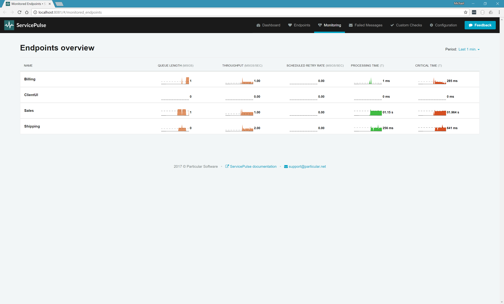
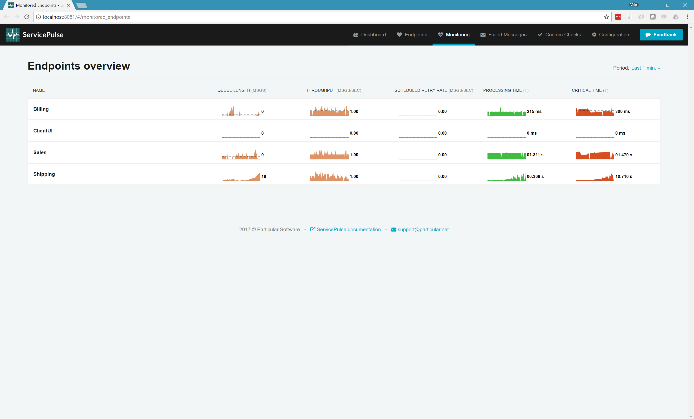
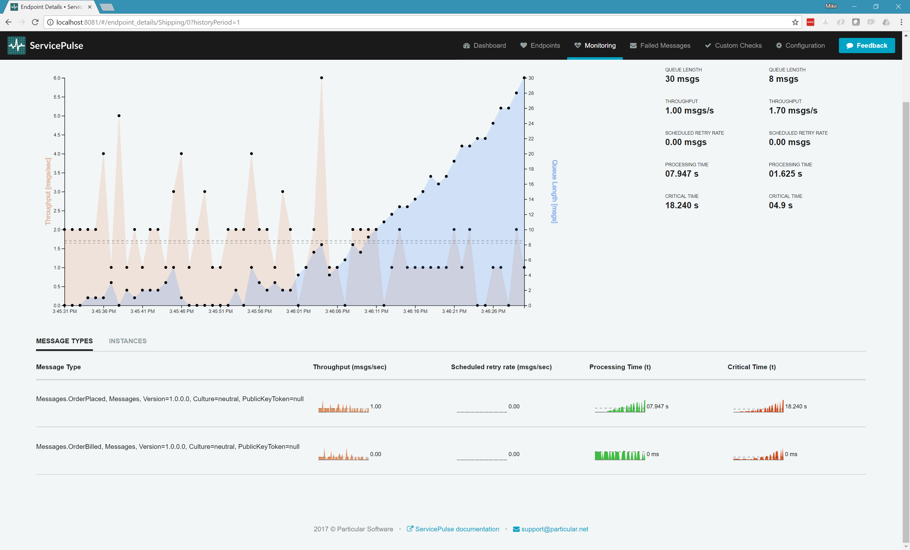
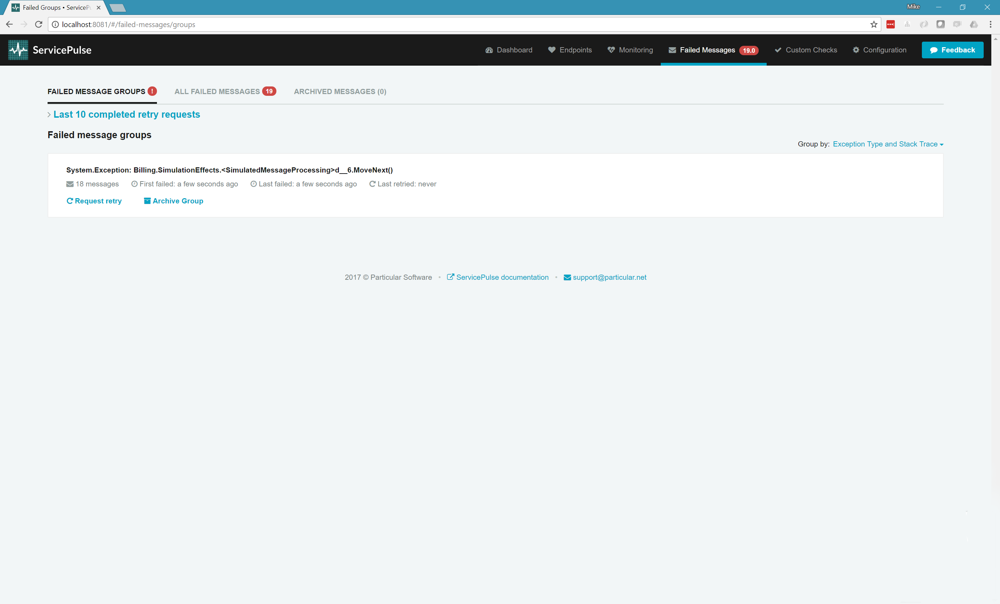
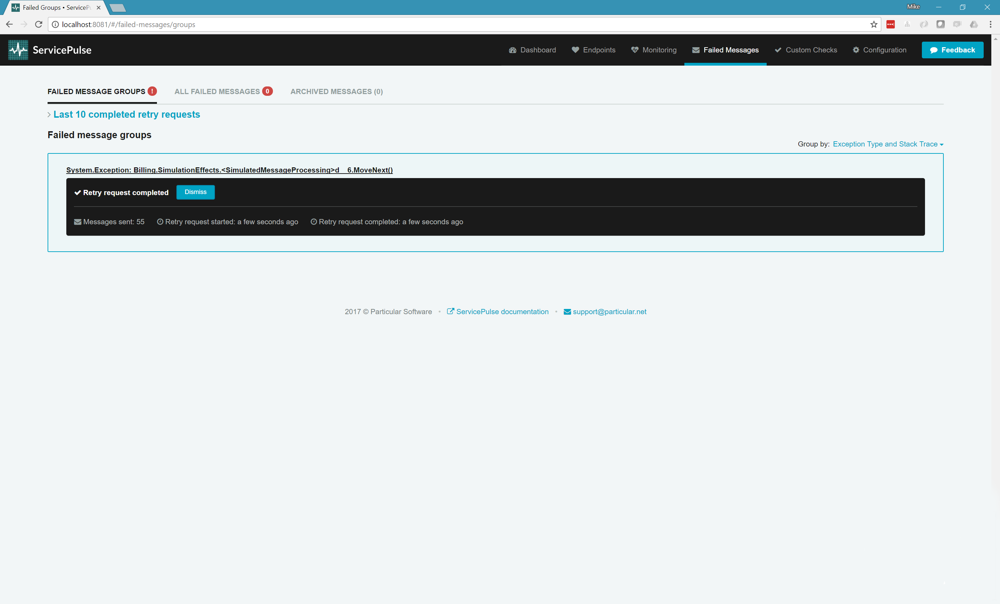

_Are any of the endpoints struggling?_

NServiceBus endpoints are designed to tolerate some types of failure. There are some early warning signs that you should be aware of that indicate that an endpoint is going to have a problem.

This part of the tutorial guides you through how to use monitoring data to spot hidden problems in your NServiceBus system.

include: walkthrough-solution

## Metrics

One of the benefits of NServiceBus is that it can handle transient errors for you. If a network switch is being restarted or a web server is temporarily too busy to service requests then an NServiceBus endpoint will roll the message it is processing back to it's input queue and try again later. If the problem was short-lived and has since been corrected, then the message will process successfully. If the problem is more permanent then the endpoint will eventually forward the message to the error queue.

Scheduled retry rate measures how often messages are failing and are marked to be retried. 

Processing time is the time it takes for the endpoint to process a single message. A higher processing time indicates a slower endpoint and a lower processing time indicates a faster endpoint. Processing time is only measured for messages that are successfully processed.

## Sample walkthrough

The following walk through uses the sample solution to simulate problems with endpoints.

**Run the sample solution. Open ServicePulse to the Monitoring tab.**

NServiceBus endpoints frequently rely on other resources to do their work. This might take the form of a database server that holds persisted data or a web server that hosts an API that the endpoint needs to call. The endpoints themselves are designed to tolerate failure but there are some early indicators that failure is coming.

### Processing messages is getting slower

The first indication that an endpoint is going to run into trouble is when processing messages starts to slow down. This is indicated by an increase in processing time. This means that database queries and web api calls are taking longer to process than they were before.

**Find the Shipping endpoint windows and toggle the resource degradation simulation.**

Watch the processing time on the shipping endpoint. As the (simulated) third-party resources slow down, processing the messages takes longer and processing time goes up. To find the root cause, you need to know which message types are causing the problem.

**In the ServicePulse UI, click the Shipping endpoint to open a detailed view.**

Here you can see a breakdown of processing time by message type. Even though the Shipping endpoint processes two types of message, only one of them is slowing down. There is something that is slowing down the processing of `OrderPlaced` events that is not affecting the processing of `OrderBilled` events.

NOTE: This example is a simulation, and there isn't really a 3rd party resource that is failing.  We're just simulating it with `Task.Delay`. 

**Find the Shipping endpoint window and toggle the resource degradation simulation off. Return the ServicePulse monitoring tab.**

Now look at the processing time for the Shipping endpoint again. As soon as the remote resource recovers, the processing time snaps back to where it was before. This is what it looks like when a failing resource is restarted. 

### Messages are being retried

The second indication that an endpoint is running into problems is that message processing starts to fail and the endpoint starts scheduling messages to be retried. When an exception is thrown in a message handler, NServiceBus will not remove the message being processed from the queue that it came from and try to handle that message again at a later time. If the exception is caused by a temporary problem, then waiting a small period of time and re-processing the message will succeed.

If there are occasional network outages or database deadlocks, this works perfectly. The message still gets processed successfully and the system continues on as if nothing happened. When the rate of these errors starts to increase, it might be masking a deeper issue.

**Find the Billing endpoint UI and increase the failure rate to 30%.**

Now look at the scheduled retry rate for the Billing endpoint in the ServicePulse monitoring tab. Notice that even though the endpoint is encountering difficulties processing roughly a third of it's messages, it is still able to process every message successfully after a couple of retries. 

NOTE: As the endpoint is wasting resources attempting to process a message that fails, the number of successfully processed messages (throughput) goes down. This has the effect of forcing messages to spend longer in the input queue which can impact queue length and critical time as well (to find out why, see [Which endpoints have the most work to do?](./walkthrough-2.md)).

If you are concerned about the number of messages that are being retried then you can always check the endpoint logs. When messages are scheduled to be retried, details about the message and the failure are logged at the WARN log level.

### Messages are failing, even after being retried

The final indication that an endpoint is having problems is when messages actually fail to process. If, after a number of retry attempts, NServiceBus is still not able to succesfully process a message, it will send the message to ServiceControl for manual intervention in ServicePulse.

**Find the Billing endpoint UI and increase the failure rate to 90%.**

With such a high failure rate, it won't take long before messages begin exceeding the number of retries configured for the Billing endpoint. When this happens these failed messages will appear in the Failed Messages tab in ServicePulse.

When ServiceControl receives failed messages from an endpoint it will group them together according to the Exception Type and the place in the code where the exception is thrown. In ServicePulse you can open up an exception group and look at each failed individually. This includes a full stack-trace, as well as access to the message headers and the body of the message.

Once the conditions that led to the error are resolved, you can retry all of the messages in bulk, from ServicePulse.

**Find the Billing endpoint UI and decrease the failure rate back down to 0%. In the ServicePulse Failed Messages tab, click the Request retry button. Confirm that you are ready to retry the messages.**

ServiceControl will stage the messages to be retried and then return them to the Billing endpoint where they will be successfully processed.

## Next steps

Explore the demo
- [Which message types are taking the longest to process?](./walkthrough-1.md)
- [Which endpoints have the most work to do?](./walkthrough-2.md)

include: next-steps
