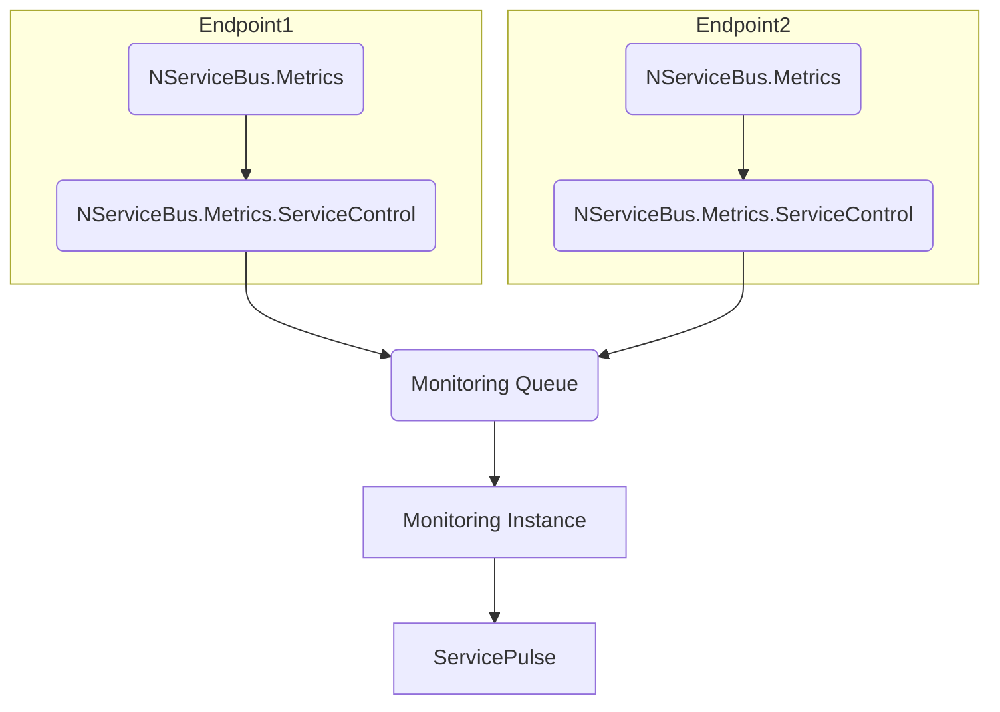
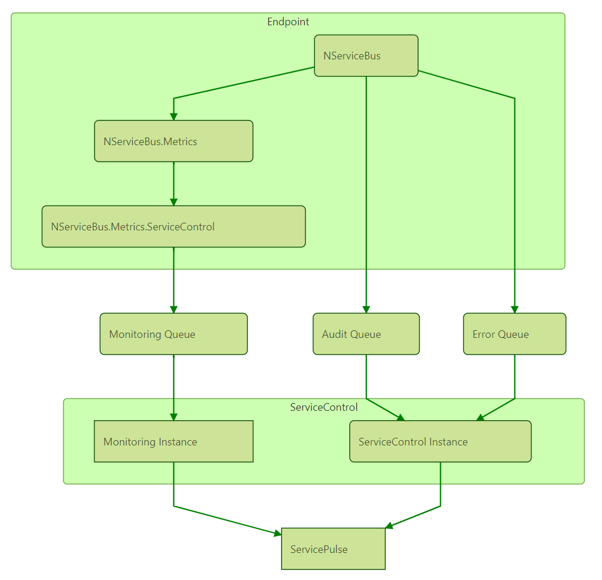

This tutorial will guide you through getting started with the monitoring capabilities built in to the Particular Platform.

You can follow along with this tutorial to configure any solution for monitoring with the Particular Platform. If you do not have a solution to monitor just yet, you can get started by downloading our sample solution.

downloadbutton


## Component overview

The following diagram shows all of the components that are involved in monitoring an NServiceBus solution.





Each endpoint in the solution is configured to collect metrics about it's own operation using the NServiceBus.Metrics NuGet package. This package hooks into the NServiceBus pipeline and calculates key metric data. It also adds headers to outgoing messages to track queue length.

The NServiceBus.Metrics.ServiceControl NuGet package collects the generated metric data and periodically sends it to a centralized monitoring queue. It does this with the same transport that the endpoints use to exchange business messages.

A ServiceControl Monitoring Instance reads the messages from the monitoring queue and aggregates monitoring data for all of your endpoints. Each environment should have it's own Monitoring Instance. Monitoring Instances are created and managed with the ServiceControl Management Utility. 

ServicePulse connects to a ServiceControl Monitoring Instance and visualizes the monitoring data for all of the endpoints in your environment.


## Setting up

In order to configure an environment for monitoring with the Particular Platform you will need to install and configure the components in the order listed.


### Create Monitoring Instance

ServiceControl is a suite of back-end tools that collect useful information about your running system.

Download and run the latest ServiceControl installer. This installer contains the ServiceControl Management Utility which can be used to create and manage Monitoring Instances. 

SCREENSHOT - ServiceControl Installer

TODO: For the pre-release version it is currently required to add a config file with a feature toggle to the SCMU. We should either document this step or remove it.

Once the Management Utility is installed, run it.

TODO: For the pre-release version it is currently required to install a valid license. We should either document this step or remove it.

Click the **+ NEW INSTANCE** button and select **NEW MONITORING INSTANCE**.

SCREENSHOT - SCMU Main Page with Drop-down open and NEW MONITOING INSTANCE selected

Select a transport that the monitoring instance will use. This should be the same transport as your endpoints are running.

NOTE: If you are using the sample solution, select the _Learning transport_ and in the _Connection String_ text box enter the folder that contains  the downloaded solution file.

TODO: The Monitoring Instance currently cannot be configured to run with the Learning Transport. This feature needs to be implemented or the step above fixed.

Click **Add** and the new monitoring instance will start.

SCREENSHOT - SCMU Main Page with monitoring instance running


### Install ServicePulse

ServicePulse is a web application for production monitoring and recoverability. To enable it's monitoring features, you must connect ServicePule to a ServiceControl Monitoring Instance.

Download and run the latest ServicePulse installer. On the ServicePulse Configuration screen check the Monitoring option and enter the location of the monitoring instance API.

SCREENSHOT - ServicePulse Setup - ServicePuse Configuration screen - Monitoring checked and filled in

You can find the location of the monitoring instance API from within the ServiceControl Management Utility

SCREENSHOT - SCMU - Monitoring Instance API highlighted

Launch ServicePulse and navigate to the Monitoring tab.

SCREENSHOT - ServicePulse Monitoring Tab - Empty

NOTE: If Monitoring was not enabled during installation, the monitoring tab will not be visible.

The final step is to configure some endpoints to send monitoring data.


### Configure endpoints

There are two NuGet packages to install into each endpoint. 

TODO: Should the endpoints in the sample solution for this tutorial be already configured to send monitoring data OR should we explain how to do it?

The first package is **NServiceBus.Metrics**. This package hooks into the NServiceBus pipeline to collect key metric data. It also augments outgoing messages with additional headers that are used in the Queue Length metric calculation.

```ps
Install-Package NServiceBus.Metrics
```

Once this package is installed the collection of metrics needs to be enabled.

snippet: enable-metrics

The second package to be installed in the endpoint is **NServiceBus.Metrics.ServiceControl**. This package gathers the data generated by NServiceBus.Metrics and periodically sends it to the centralised monitoring queue.

```ps
Install-Package NServiceBus.Metrics.ServiceControl
```

Once this package is installed, it needs to be configured to send monitoring data to the centralised monitoring queue. 

snippet: send-metric-data-to-servicecontrol

The monitoring queue is created by the ServiceControl Management Utility when you create the monitoring instance. It will have the same name as the monitoring instance.

SCREENSHOT - SCMU Main Page - Monitoring Instance name highlighted

NOTE: If using MSMQ as a transport, you will need to append the machine name of the monitoring instance to this address. i.e. `Particular.Monitoring@MONITORING-MACHINE`.

Run the endpoint and return to the ServicePulse monitoring page. The endpoint will now appear in the list of running endpoints.

SCREENSHOT - ServicePulse Monitoring tab - list of endpoints happily sending data

TODO: Section outlining how to use the sample solution to manipulate the monitored values