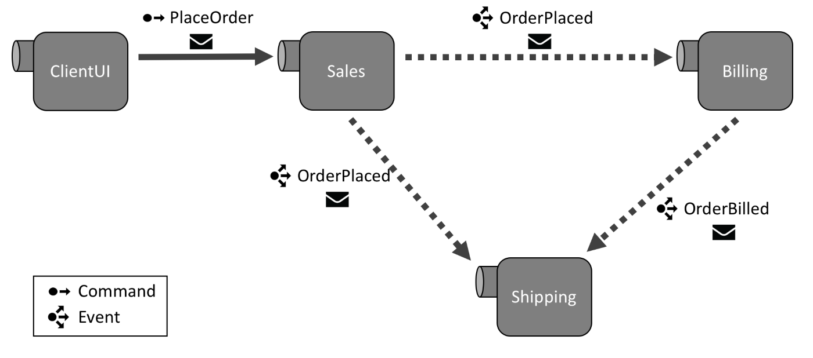

partial: nsb101-intro-paragraph

In [Lesson 1: Getting started](lesson-1/) (10-15 minutes) you will learn how to set up your development environment and create your very first messaging endpoint.

In [Lesson 2: Sending a command](lesson-2/) (15-20 minutes) you will learn how to define messages and message handlers, and send your first message.

In [Lesson 3: Multiple endpoints](lesson-3/) (15-20 minutes) you will learn how to create multiple endpoints and send messages between them.

In [Lesson 4: Publishing events](lesson-4/) (25-30 minutes) you will learn about the Publish/Subscribe pattern, how to publish events to multiple subscribers, and about the benefits of using this pattern to decouple business processes.

In [Lesson 5: Retrying errors](lesson-5/) (25-30 minutes) you will learn how to use the Particular Service Platform tools to gracefully recover from exceptions in your code, allowing you to build systems that are resistant to failure.

When you've completed all the exercises, your solution will look like this:

**Go to [**Lesson 1: Getting started**](lesson-1/) to begin.**
